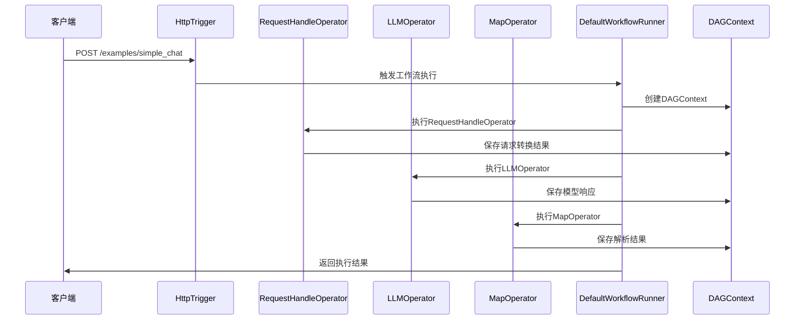
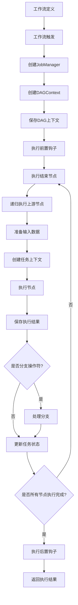
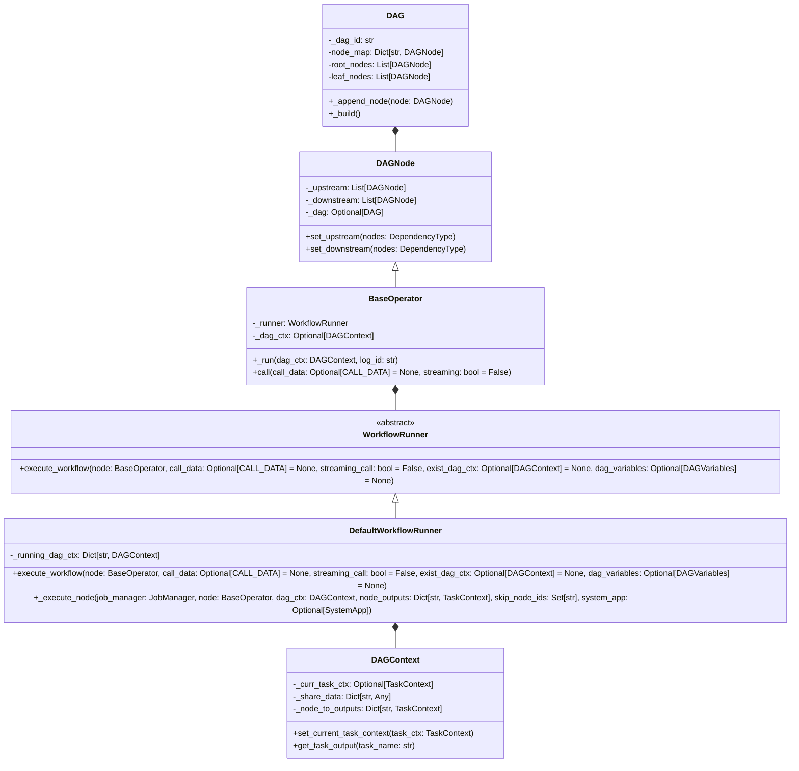

# AWEL执行过程分析

## 1. 概述

AWEL（Agentic Workflow Expression Language）是DB-GPT项目中专为大模型应用开发设计的智能体工作流表达语言。它提供了一种声明式的方式来定义和执行复杂的工作流，支持链式计算、条件分支、并行执行和分布式处理等功能。

## 2. 核心组件

### 2.1 DAG（有向无环图）

DAG是AWEL工作流的核心表示形式，它由节点和边组成，用于描述工作流的执行顺序和依赖关系。

```python
with DAG("simple_dag_example") as dag:
    trigger = HttpTrigger("/examples/hello", request_body=TriggerReqBody)
    map_node = RequestHandleOperator()
    trigger >> map_node
```

### 2.2 DAGNode

DAGNode是DAG中节点的基类，所有操作符都继承自它。它负责管理节点的上下游关系、节点ID、名称等基本属性。

### 2.3 BaseOperator

BaseOperator是所有操作符的基类，它提供了操作符的基本实现和执行接口。每个操作符都需要实现`_do_run`方法来定义其具体的执行逻辑。

### 2.4 WorkflowRunner

WorkflowRunner是工作流运行器的接口，负责执行整个工作流。DefaultWorkflowRunner是其默认实现，负责实际的工作流执行逻辑。

### 2.5 TriggerOperator

TriggerOperator是触发器操作符的基类，用于启动工作流执行。常见的触发器包括HttpTrigger（HTTP请求触发器）、IteratorTrigger（迭代器触发器）等。

### 2.6 DAGContext

DAGContext是工作流执行的上下文，包含执行过程中的共享数据、任务输出、流式调用标志等信息。

### 2.7 DAGVar

DAGVar是一个线程本地变量，用于管理当前DAG上下文。它提供了进入和退出DAG上下文的方法，以及获取当前DAG的方法。

## 3. AWEL执行流程

### 3.1 工作流定义

用户使用DAG上下文管理器定义工作流，添加各种操作符并建立依赖关系。

```python
with DAG("dbgpt_awel_simple_dag_example", tags={"label": "example"}) as dag:
    # Receive http request and trigger dag to run.
    trigger = HttpTrigger(
        "/examples/simple_chat", methods="POST", request_body=TriggerReqBody
    )
    request_handle_task = RequestHandleOperator()
    llm_task = LLMOperator(task_name="llm_task")
    model_parse_task = MapOperator(lambda out: out.to_dict())
    trigger >> request_handle_task >> llm_task >> model_parse_task
```

### 3.2 工作流触发

通过触发器（如HttpTrigger）接收外部请求，启动工作流执行。

### 3.3 工作流初始化

1. **创建DAGContext**：当工作流被触发时，会创建一个DAGContext对象，包含执行上下文信息。

```python
dag_ctx = DAGContext(
    event_loop_task_id=event_loop_task_id,
    node_to_outputs=node_outputs,
    share_data=share_data,
    streaming_call=streaming_call,
    node_name_to_ids=job_manager._node_name_to_ids,
    dag_variables=dag_variables,
)
```

2. **保存DAG上下文**：将创建的DAGContext保存到DAG中，以便在执行过程中使用。

```python
if node.dag:
    # Save dag context
    await node.dag._save_dag_ctx(dag_ctx)
```

3. **执行前置钩子**：执行DAG中所有节点的`before_dag_run`方法。

```python
await job_manager.before_dag_run()
```

### 3.4 节点执行

按照依赖关系从根节点到叶子节点依次执行各个操作符。

1. **递归执行上游节点**：在执行当前节点之前，先递归执行所有上游节点。

```python
# Run all upstream nodes
for upstream_node in node.upstream:
    if isinstance(upstream_node, BaseOperator):
        await self._execute_node(
            job_manager,
            upstream_node,
            dag_ctx,
            node_outputs,
            skip_node_ids,
            system_app,
        )
```

2. **准备输入数据**：收集所有上游节点的输出作为当前节点的输入。

```python
inputs = [
    node_outputs[upstream_node.node_id] for upstream_node in node.upstream
]
input_ctx = DefaultInputContext(inputs)
```

3. **创建任务上下文**：为当前节点创建任务上下文，包含任务ID、状态、输入等信息。

```python
task_ctx: DefaultTaskContext = DefaultTaskContext(
    node.node_id, TaskState.INIT, task_output=None, log_index=log_index
)
```

4. **执行节点**：调用节点的`_run`方法执行具体逻辑。

```python
await node._run(dag_ctx, task_ctx.log_id)
```

5. **保存执行结果**：将节点的执行结果保存到DAGContext中。

```python
node_outputs[node.node_id] = dag_ctx.current_task_context
task_ctx.set_current_state(TaskState.SUCCESS)
```

### 3.5 上下文管理

1. **DAGVar管理**：使用DAGVar管理当前DAG上下文，提供进入和退出DAG上下文的方法。

```python
def __enter__(self):
    """Enter a DAG context."""
    DAGVar.enter_dag(self)
    return self

def __exit__(self, exc_type, exc_val, exc_tb):
    """Exit a DAG context."""
    DAGVar.exit_dag()
```

2. **DAGContext管理**：使用DAGContext管理任务上下文，包含执行过程中的共享数据、任务输出等信息。

```python
def set_current_task_context(self, _curr_task_ctx: TaskContext) -> None:
    """Set the current task context."""
    self._curr_task_ctx = _curr_task_ctx
```

### 3.6 结果返回

将执行结果返回给调用者。对于HTTP触发器，会将结果封装成HTTP响应返回。

## 4. 实际执行示例

### 4.1 简单聊天工作流

下面是一个简单的聊天工作流示例，展示了AWEL的完整执行过程：

```python
with DAG("dbgpt_awel_simple_dag_example", tags={"label": "example"}) as dag:
    # 1. 定义HTTP触发器，接收聊天请求
    trigger = HttpTrigger(
        "/examples/simple_chat", methods="POST", request_body=TriggerReqBody
    )
    
    # 2. 定义请求处理操作符，将请求转换为模型请求
    request_handle_task = RequestHandleOperator()
    
    # 3. 定义LLM操作符，调用大模型生成响应
    llm_task = LLMOperator(task_name="llm_task")
    
    # 4. 定义结果解析操作符，将模型响应转换为字典
    model_parse_task = MapOperator(lambda out: out.to_dict())
    
    # 5. 建立依赖关系
    trigger >> request_handle_task >> llm_task >> model_parse_task
```

#### 执行流程

1. **请求接收**：HttpTrigger接收HTTP POST请求，解析请求体为TriggerReqBody对象
2. **请求转换**：RequestHandleOperator将TriggerReqBody转换为ModelRequest对象
3. **模型调用**：LLMOperator调用大模型，生成聊天响应
4. **结果解析**：MapOperator将模型响应转换为字典格式
5. **结果返回**：将字典格式的结果封装为HTTP响应返回给客户端

### 4.2 执行时序图



## 5. 高级特性

### 5.1 条件分支

AWEL支持条件分支，可以根据输入数据的不同选择不同的执行路径。

```python
with DAG("branch_dag_example") as dag:
    trigger = HttpTrigger("/examples/branch", request_body=BranchReqBody)
    branch_task = BranchOperator(branch_func=lambda x: x.condition)
    
    # 分支1
    branch1_task = MapOperator(lambda x: f"Branch 1: {x.data}")
    
    # 分支2
    branch2_task = MapOperator(lambda x: f"Branch 2: {x.data}")
    
    # 分支合并
    join_task = JoinOperator()
    
    trigger >> branch_task
    branch_task >> branch1_task >> join_task
    branch_task >> branch2_task >> join_task
```

### 5.2 并行执行

AWEL支持并行执行，可以同时执行多个独立的操作符，提高执行效率。

### 5.3 流式执行

AWEL支持流式执行，可以处理大模型的流式输出，实时返回结果给客户端。

```python
with DAG("streaming_dag_example") as dag:
    trigger = HttpTrigger("/examples/streaming", request_body=StreamingReqBody)
    streaming_llm_task = StreamingLLMOperator()
    output_task = OpenAIStreamingOutputOperator()
    
    trigger >> streaming_llm_task >> output_task
```

## 6. 技术特点

### 6.1 声明式编程

AWEL采用声明式编程方式，用户只需要定义工作流的结构和逻辑，不需要关心具体的执行细节。

### 6.2 组件化设计

AWEL采用组件化设计，提供了丰富的操作符组件，可以灵活组合使用。

### 6.3 异步执行

AWEL支持异步执行，可以充分利用系统资源，提高执行效率。

### 6.4 可扩展性

AWEL具有良好的可扩展性，用户可以自定义操作符和触发器，满足特定的业务需求。

### 6.5 可视化支持

AWEL提供了可视化支持，可以直观地查看工作流的结构和执行状态。

```python
dag.visualize_dag(view=True)
```

## 7. 总结

AWEL是DB-GPT项目中一个功能强大的工作流引擎，它提供了一种声明式的方式来定义和执行复杂的工作流。AWEL的执行过程包括工作流定义、触发、初始化、节点执行、上下文管理和结果返回等步骤。通过AWEL，用户可以快速构建复杂的大模型应用，提高开发效率和代码质量。

AWEL的核心优势在于其声明式编程模型、组件化设计、异步执行能力和良好的可扩展性。它为大模型应用开发提供了一种强大而灵活的工作流解决方案。


# AWEL详细执行过程分析

## 1. 概述

AWEL（Agentic Workflow Expression Language）是DB-GPT项目中专为大模型应用开发设计的智能体工作流表达语言。它提供了一种声明式的方式来定义和执行复杂的工作流，支持链式计算、条件分支、并行执行和分布式处理等功能。

## 2. 执行流程详解

### 2.1 工作流定义阶段

#### 步骤1：创建DAG对象
```python
with DAG("simple_chat_dag_example", tags={"label": "example"}) as dag:
    # 定义操作符和依赖关系
```

**内部实现**：
- 调用`DAG.__init__()`创建DAG对象
- 设置DAG ID、标签和默认变量等属性
- 调用`DAGVar.enter_dag(self)`进入DAG上下文

#### 步骤2：定义操作符
```python
trigger = HttpTrigger("/examples/simple_chat", methods="POST", request_body=TriggerReqBody)
request_handle_task = RequestHandleOperator()
llm_task = LLMOperator(task_name="llm_task")
model_parse_task = MapOperator(lambda out: out.to_dict())
```

**内部实现**：
- 调用操作符的构造函数（如`HttpTrigger.__init__()`）
- 继承自`BaseOperator`的操作符会自动应用默认设置：
  - 从DAGVar获取当前DAG对象
  - 生成或获取任务ID
  - 设置工作流运行器（默认使用`DefaultWorkflowRunner`）
  - 配置执行器和变量提供者
- 将操作符添加到DAG中

#### 步骤3：建立依赖关系
```python
trigger >> request_handle_task >> llm_task >> model_parse_task
```

**内部实现**：
- 调用`__rshift__()`方法建立节点间的依赖关系
- 为每个节点设置上游和下游节点
- DAG会自动跟踪节点的添加和依赖关系

### 2.2 工作流触发阶段

#### 步骤4：接收外部请求
当使用`HttpTrigger`时，它会作为FastAPI路由接收HTTP请求：
```python
# HttpTrigger内部会注册路由
@app.post("/examples/simple_chat")
async def handle_request(request: Request):
    # 解析请求并触发DAG
```

#### 步骤5：触发工作流执行
```python
# 在触发器内部调用
await end_operator.call(call_data=request_data)
```

**内部实现**：
- 调用`BaseOperator.call()`方法
- 设置调用数据（如果需要）
- 调用工作流运行器的`execute_workflow()`方法

### 2.3 工作流初始化阶段

#### 步骤6：创建JobManager
在`DefaultWorkflowRunner.execute_workflow()`方法中：
```python
job_manager = JobManager.build_from_end_node(node, call_data)
```

**内部实现**：
- 从结束节点开始递归构建所有上游节点
- 获取根节点列表
- 保存调用数据到根节点
- 建立节点名称到ID的映射

#### 步骤7：创建DAGContext
```python
dag_ctx = DAGContext(
    event_loop_task_id=event_loop_task_id,
    node_to_outputs=node_outputs,
    share_data=share_data,
    streaming_call=streaming_call,
    node_name_to_ids=job_manager._node_name_to_ids,
    dag_variables=dag_variables,
)
```

**内部实现**：
- 初始化执行上下文
- 设置事件循环任务ID
- 准备节点输出存储
- 配置共享数据和流式调用标志
- 添加DAG变量

#### 步骤8：保存DAG上下文
```python
if node.dag:
    await node.dag._save_dag_ctx(dag_ctx)
```

**内部实现**：
- 将DAGContext保存到DAG对象中
- 用于在执行过程中访问上下文信息

#### 步骤9：执行前置钩子
```python
await job_manager.before_dag_run()
```

**内部实现**：
- 并行执行所有节点的`before_dag_run()`方法
- 用于初始化节点状态或资源

### 2.4 节点执行阶段

#### 步骤10：递归执行上游节点
在`DefaultWorkflowRunner._execute_node()`方法中：
```python
for upstream_node in node.upstream:
    if isinstance(upstream_node, BaseOperator):
        await self._execute_node(
            job_manager,
            upstream_node,
            dag_ctx,
            node_outputs,
            skip_node_ids,
            system_app,
        )
```

**内部实现**：
- 深度优先遍历执行所有上游节点
- 确保所有依赖节点先执行完成

#### 步骤11：准备输入数据
```python
inputs = [
    node_outputs[upstream_node.node_id] for upstream_node in node.upstream
]
input_ctx = DefaultInputContext(inputs)
```

**内部实现**：
- 收集所有上游节点的输出结果
- 创建输入上下文对象

#### 步骤12：创建任务上下文
```python
log_index = await self._log_task(node.node_id)
task_ctx: DefaultTaskContext = DefaultTaskContext(
    node.node_id, TaskState.INIT, task_output=None, log_index=log_index
)
```

**内部实现**：
- 生成日志索引
- 初始化任务上下文，包含节点ID、初始状态、输出等
- 设置调用数据和输入信息

#### 步骤13：执行节点
```python
await node._run(dag_ctx, task_ctx.log_id)
```

**内部实现**：
- 设置当前DAG上下文
- 解析变量（如果有）
- 调用`_do_run()`方法执行具体逻辑
- 保存执行结果到任务上下文

#### 步骤14：保存执行结果
```python
node_outputs[node.node_id] = dag_ctx.current_task_context
task_ctx.set_current_state(TaskState.SUCCESS)
```

**内部实现**：
- 将执行结果保存到节点输出映射中
- 更新任务状态为成功

#### 步骤15：处理分支操作符
```python
if isinstance(node, BranchOperator):
    skip_nodes = task_ctx.metadata.get("skip_node_names", [])
    _skip_current_downstream_by_node_name(node, skip_nodes, skip_node_ids)
```

**内部实现**：
- 如果是分支操作符，获取需要跳过的节点
- 更新跳过节点ID集合

### 2.5 结果返回阶段

#### 步骤16：执行后置钩子
```python
if not streaming_call and node.dag and exist_dag_ctx is None:
    await node.dag._after_dag_end(dag_ctx._event_loop_task_id)
```

**内部实现**：
- 并行执行所有节点的`after_dag_end()`方法
- 用于清理资源或执行后续操作

#### 步骤17：返回执行结果
在`BaseOperator.call()`方法中：
```python
out_ctx = await self._runner.execute_workflow(...)
return out_ctx.current_task_context.task_output.output
```

**内部实现**：
- 从DAGContext获取最终任务上下文
- 提取任务输出
- 返回给调用者

## 3. 核心方法详解

### 3.1 DefaultWorkflowRunner.execute_workflow()
```python
async def execute_workflow(
    self,
    node: BaseOperator,
    call_data: Optional[CALL_DATA] = None,
    streaming_call: bool = False,
    exist_dag_ctx: Optional[DAGContext] = None,
    dag_variables: Optional[DAGVariables] = None,
) -> DAGContext:
    # 1. 创建JobManager
    # 2. 创建DAGContext
    # 3. 保存DAG上下文
    # 4. 执行前置钩子
    # 5. 执行结束节点（递归执行所有上游节点）
    # 6. 执行后置钩子
    # 7. 返回DAGContext
```

### 3.2 DefaultWorkflowRunner._execute_node()
```python
async def _execute_node(
    self,
    job_manager: JobManager,
    node: BaseOperator,
    dag_ctx: DAGContext,
    node_outputs: Dict[str, TaskContext],
    skip_node_ids: Set[str],
    system_app: Optional[SystemApp],
):
    # 1. 递归执行上游节点
    # 2. 准备输入数据
    # 3. 创建任务上下文
    # 4. 设置任务状态为运行中
    # 5. 执行节点
    # 6. 保存执行结果
    # 7. 更新任务状态为成功
    # 8. 处理分支操作符
```

### 3.3 BaseOperator._run()
```python
async def _run(self, dag_ctx: DAGContext, task_log_id: str) -> TaskOutput[OUT]:
    # 1. 检查节点ID和任务日志ID
    # 2. 设置当前DAG上下文
    # 3. 解析变量
    # 4. 调用_do_run()方法执行具体逻辑
    # 5. 返回执行结果
```

### 3.4 JobManager.build_from_end_node()
```python
@staticmethod
def build_from_end_node(
    end_node: BaseOperator,
    call_data: Optional[CALL_DATA] = None
) -> "JobManager":
    # 1. 从结束节点开始构建所有节点
    # 2. 获取根节点列表
    # 3. 保存调用数据到根节点
    # 4. 建立节点名称到ID的映射
    # 5. 创建JobManager实例
```

## 4. 执行流程图



## 5. 实际执行示例

让我们通过一个简单的聊天工作流来详细了解执行过程：

### 5.1 工作流定义
```python
with DAG("simple_chat_dag_example") as dag:
    trigger = HttpTrigger("/examples/simple_chat", methods="POST", request_body=TriggerReqBody)
    request_handle = RequestHandleOperator()
    llm_task = LLMOperator(task_name="llm_task")
    output_parse = MapOperator(lambda out: out.to_dict())
    
    trigger >> request_handle >> llm_task >> output_parse
```

### 5.2 执行步骤

1. **工作流定义**：创建DAG和各个操作符，建立依赖关系
2. **HTTP请求**：客户端发送POST请求到`/examples/simple_chat`
3. **触发工作流**：HttpTrigger解析请求并调用`output_parse.call()`
4. **创建JobManager**：从`output_parse`节点开始构建所有节点
5. **创建DAGContext**：初始化执行上下文
6. **执行上游节点**：
   - 先执行`llm_task`
     - 先执行`request_handle`
       - 先执行`trigger`
         - 执行`trigger._do_run()`，处理HTTP请求
         - 保存结果
       - 执行`request_handle._do_run()`，转换请求格式
       - 保存结果
     - 执行`llm_task._do_run()`，调用LLM
     - 保存结果
   - 执行`output_parse._do_run()`，解析输出格式
   - 保存结果
7. **执行后置钩子**：清理资源
8. **返回结果**：将解析后的结果返回给客户端

## 6. 关键技术点

### 6.1 异步执行
AWEL完全基于异步编程模型：
- 所有核心方法都是异步的
- 使用asyncio进行并发控制
- 支持并行执行独立节点

### 6.2 上下文管理
- 使用DAGVar管理当前DAG上下文
- 使用DAGContext存储执行过程中的共享数据
- 使用TaskContext管理单个任务的状态和输入输出

### 6.3 变量解析
- 支持在执行前解析变量占位符
- 可以从DAG变量或变量提供者中解析变量
- 支持异步变量解析

### 6.4 错误处理
- 捕获节点执行过程中的异常
- 更新任务状态为失败
- 记录详细错误信息

### 6.5 可视化支持
- 提供DAG可视化功能
- 可以查看节点依赖关系
- 支持导出DAG图

## 7. 总结

AWEL的执行过程可以概括为以下几个主要阶段：

1. **定义阶段**：用户使用DAG上下文管理器定义工作流结构和依赖关系
2. **触发阶段**：通过触发器（如HTTP请求）启动工作流执行
3. **初始化阶段**：创建执行环境，包括JobManager、DAGContext等
4. **执行阶段**：按照依赖关系递归执行所有节点，处理输入输出
5. **结果阶段**：执行后置处理，返回最终结果

AWEL采用了模块化、异步、声明式的设计理念，使得用户可以方便地定义和执行复杂的工作流，同时提供了良好的可扩展性和灵活性。


# AWEL 触发器分析

## 1. 触发器概述

AWEL (Agentic Workflow Expression Language) 中的触发器是工作流的入口点，用于启动和触发DAG的执行。触发器负责接收外部输入或定时事件，并将其传递给DAG中的操作符。

根据触发源的不同，AWEL支持多种类型的触发器，每种触发器都有其特定的使用场景和触发方式。

## 2. 触发器基类

所有触发器都继承自 `Trigger` 基类，它定义了触发器的基本接口和行为：

```python
class Trigger(TriggerOperator[OUT], ABC, Generic[OUT]):
    """所有触发器类的基类。

    目前仅支持http触发器。
    """

    @abstractmethod
    async def trigger(self, **kwargs) -> Any:
        """触发工作流或工作流中的特定操作。"""
```

`Trigger` 类继承自 `TriggerOperator`，而 `TriggerOperator` 又继承自 `InputOperator`，这意味着所有触发器都是输入操作符，负责将外部数据引入到工作流中。

## 3. HTTP 触发器系列

HTTP 触发器是 AWEL 中最常用的触发器类型，用于通过 HTTP 请求触发工作流。AWEL 提供了多种 HTTP 触发器实现，以满足不同的需求。

### 3.1 基础 HTTP 触发器 (HttpTrigger)

`HttpTrigger` 是所有 HTTP 触发器的基础类，它实现了将 HTTP 请求转换为工作流输入的核心逻辑。

**主要特性：**
- 支持多种 HTTP 方法 (GET, POST, PUT, DELETE)
- 可配置 API 端点
- 支持不同类型的请求体
- 支持流式响应

**初始化参数：**
```python
def __init__(
    self,
    endpoint: str,
    methods: Optional[Union[str, List[str]]] = "GET",
    streaming_response: bool = False,
    request_body: Optional[RequestBody] = None,
    http_response_body: Optional[Type[BaseHttpBody]] = None,
    response_media_type: Optional[str] = None,
    status_code: Optional[int] = 200,
    router_tags: Optional[List[str | Enum]] = None,
    register_to_app: bool = False,
    **kwargs,
):
    # 初始化逻辑
```

**触发流程：**
1. 将触发器注册到 FastAPI 应用或路由器
2. 当 HTTP 请求到达指定端点时，调用 `_create_route_func` 创建的路由函数
3. 路由函数调用 `_trigger_dag_func` 处理请求
4. `_trigger_dag_func` 调用 `_trigger_dag` 函数执行 DAG

**核心实现：**
```python
async def _trigger_dag(
    body: Any,
    dag: DAG,
    streaming_response: Optional[bool] = False,
    response_headers: Optional[Dict[str, str]] = None,
    response_media_type: Optional[str] = None,
) -> Any:
    # 获取 DAG 的叶子节点
    leaf_nodes = dag.leaf_nodes
    if len(leaf_nodes) != 1:
        raise ValueError("HttpTrigger 仅支持 DAG 中只有一个叶子节点")
    end_node = cast(BaseOperator, leaf_nodes[0])
    
    # 非流式响应
    if not streaming_response:
        return await end_node.call(call_data=body)
    # 流式响应
    else:
        _generator = await end_node.call_stream(call_data=body)
        return StreamingResponse(
            trace_generator,
            headers=headers,
            media_type=media_type,
            background=background_tasks,
        )
```

### 3.2 字典 HTTP 触发器 (DictHttpTrigger)

`DictHttpTrigger` 是 `HttpTrigger` 的子类，专门用于将 HTTP 请求体解析为字典类型：

```python
class DictHttpTrigger(HttpTrigger):
    """AWEL 的字典 HTTP 触发器。

    将请求体解析为字典。
    """
    # 初始化逻辑默认将请求体解析为字典
```

### 3.3 字符串 HTTP 触发器 (StringHttpTrigger)

`StringHttpTrigger` 是 `HttpTrigger` 的子类，专门用于将 HTTP 请求体解析为字符串：

```python
class StringHttpTrigger(HttpTrigger):
    """AWEL 的字符串 HTTP 触发器。

    将请求体解析为字符串。
    """
    def __init__(self, *args, **kwargs):
        # 初始化时设置 request_body=str
```

### 3.4 通用 LLM HTTP 触发器 (CommonLLMHttpTrigger)

`CommonLLMHttpTrigger` 是 `HttpTrigger` 的子类，专门用于 LLM 应用场景，支持通用的 LLM 请求体格式：

```python
class CommonLLMHttpTrigger(HttpTrigger):
    """AWEL 的通用 LLM HTTP 触发器。

    通过 HTTP 请求触发工作流，并将请求体解析为通用的 LLM HTTP 体。
    """
    # 支持 CommonLLMHttpRequestBody 格式的请求体
    # 提供消息映射功能
```

### 3.5 请求 HTTP 触发器 (RequestHttpTrigger)

`RequestHttpTrigger` 是 `HttpTrigger` 的子类，将整个 FastAPI 请求作为触发器输入：

```python
class RequestHttpTrigger(HttpTrigger):
    """AWEL 的请求 HTTP 触发器。

    通过 HTTP 请求触发工作流，并将请求体解析为 starlette Request。
    """
    def __init__(self, *args, **kwargs):
        # 初始化时设置 request_body=Request
```

## 4. 迭代器触发器 (IteratorTrigger)

`IteratorTrigger` 是一种基于迭代器的触发器，用于批量处理数据，支持并行执行和缓存：

### 4.1 主要特性

- 支持多种数据来源：迭代器、异步迭代器、InputSource 或普通数据
- 支持并行执行，可配置并行数量
- 支持流式调用和非流式调用
- 支持结果缓存，避免重复计算
- 支持超时设置和重试机制

### 4.2 初始化参数

```python
def __init__(
    self,
    data: IterDataType,
    parallel_num: int = 1,
    streaming_call: bool = False,
    show_progress: bool = True,
    max_retries: int = 0,
    retry_delay: float = 1.0,
    timeout: Optional[float] = None,
    # 缓存相关参数
    cache_storage: Optional[CacheStorage] = None,
    cache_key_fn: Optional[Callable[[Any], str]] = None,
    cache_ttl: Optional[int] = None,
    cache_enabled: bool = False,
    **kwargs,
):
    # 初始化逻辑
```

### 4.3 触发流程

1. 将输入数据转换为异步迭代器
2. 为每个数据项创建一个任务，使用信号量控制并行数量
3. 对于每个任务，调用 DAG 的叶子节点执行
4. 支持缓存机制，避免重复计算
5. 收集所有任务的结果并返回

### 4.4 核心实现

```python
async def trigger(
    self, parallel_num: Optional[int] = None, **kwargs
) -> List[Tuple[Any, Any]]:
    # 获取 DAG 和叶子节点
    dag = self.dag
    if not dag:
        raise ValueError("IteratorTrigger 的 DAG 未设置")
    leaf_nodes = dag.leaf_nodes
    if len(leaf_nodes) != 1:
        raise ValueError("IteratorTrigger 仅支持 DAG 中只有一个叶子节点")
    end_node = cast(BaseOperator, leaf_nodes[0])
    
    # 设置并行控制
    semaphore = asyncio.Semaphore(parallel_num or self._parallel_num)
    
    async def run_node_with_control(call_data: Any) -> Tuple[Any, Any]:
        async with semaphore:
            # 生成缓存键
            cache_key = await self._get_cache_key(call_data)
            
            # 流式调用
            if streaming_call:
                # 处理流式调用逻辑
                return call_data, call_stream(call_data, cache_key)
            # 非流式调用
            else:
                # 处理非流式调用逻辑，支持缓存和重试
                if cache_key is not None:
                    cached_result = await self._get_cached_result(cache_key)
                    if cached_result is not None:
                        return call_data, cached_result
                
                # 执行调用，支持重试
                attempts = 0
                while True:
                    try:
                        if self._timeout:
                            task_output = await asyncio.wait_for(
                                end_node.call(call_data), timeout=self._timeout
                            )
                        else:
                            task_output = await end_node.call(call_data)
                        
                        # 缓存结果
                        if cache_key is not None:
                            await self._store_in_cache(cache_key, task_output)
                        
                        return call_data, task_output
                    except Exception as e:
                        attempts += 1
                        if attempts > max_retries:
                            raise
                        await asyncio.sleep(self._retry_delay)
    
    # 处理所有数据项
    tasks = []
    async for data in _to_async_iterator(self._iter_data, task_id):
        tasks.append(run_node_with_control(data))
    
    # 并行执行所有任务
    results: List[Tuple[Any, Any]] = await asyncio.gather(*tasks)
    return results
```

## 5. 触发器管理器

AWEL 提供了触发器管理器来统一管理和注册触发器：

### 5.1 HttpTriggerManager

`HttpTriggerManager` 专门用于管理 HTTP 触发器，负责将触发器注册到 FastAPI 路由器：

```python
class HttpTriggerManager(TriggerManager):
    """HTTP 触发器管理器。

    将所有 HTTP 触发器注册到路由器。
    """
    def __init__(
        self,
        router: Optional["APIRouter"] = None,
        router_prefix: str = "/api/v1/awel/trigger",
    ) -> None:
        # 初始化逻辑
    
    def register_trigger(
        self, trigger: Any, system_app: SystemApp
    ) -> Optional[TriggerMetadata]:
        # 注册触发器到路由器
```

### 5.2 DefaultTriggerManager

`DefaultTriggerManager` 是默认的触发器管理器，负责管理所有类型的触发器：

```python
class DefaultTriggerManager(TriggerManager, BaseComponent):
    """AWEL 的默认触发器管理器。

    管理所有触发器管理器。目前仅支持 http 触发器。
    """
    def __init__(self, system_app: SystemApp | None = None):
        # 初始化逻辑
    
    def register_trigger(
        self, trigger: Any, system_app: SystemApp
    ) -> Optional[TriggerMetadata]:
        # 根据触发器类型注册到相应的管理器
```

## 6. 触发器使用示例

### 6.1 HTTP 触发器示例

```python
from dbgpt.core.awel import DAG, HttpTrigger, MapOperator

with DAG("simple_dag") as dag:
    # 创建 HTTP 触发器，监听 /hello 端点
    trigger = HttpTrigger(endpoint="/hello", methods=["GET"])
    # 创建映射操作符，处理请求数据
    map_op = MapOperator(lambda x: {"message": f"Hello {x.get('name', 'World')}!"})
    # 连接触发器和操作符
    trigger >> map_op

# 当访问 /hello?name=John 时，将返回 {"message": "Hello John!"}
```

### 6.2 IteratorTrigger 示例

```python
from dbgpt.core.awel import DAG, IteratorTrigger, MapOperator

# 定义缓存键函数
def cache_key_fn(data):
    return f"calculation_{data}"

with DAG("batch_processing_dag") as dag:
    # 创建 IteratorTrigger，处理批量数据
    trigger = IteratorTrigger(
        data=[1, 2, 3, 4, 5],
        parallel_num=2,  # 并行处理 2 个数据项
        cache_enabled=True,
        cache_key_fn=cache_key_fn,
        cache_storage=MemoryCacheStorage()
    )
    # 创建映射操作符，计算平方
    map_op = MapOperator(lambda x: x * x)
    # 连接触发器和操作符
    trigger >> map_op

# 执行触发器，处理所有数据项
results = asyncio.run(trigger.trigger())
# 结果将是 [(1, 1), (2, 4), (3, 9), (4, 16), (5, 25)]
```

## 7. 触发器对比

| 触发器类型 | 触发源 | 适用场景 | 特点 |
|------------|--------|----------|------|
| HttpTrigger | HTTP 请求 | Web 服务、API 接口 | 支持多种 HTTP 方法和请求体格式 |
| DictHttpTrigger | HTTP 请求 | 需要字典格式输入的场景 | 将请求体自动解析为字典 |
| StringHttpTrigger | HTTP 请求 | 需要字符串格式输入的场景 | 将请求体自动解析为字符串 |
| CommonLLMHttpTrigger | HTTP 请求 | LLM 应用场景 | 支持通用的 LLM 请求体格式 |
| RequestHttpTrigger | HTTP 请求 | 需要访问完整请求信息的场景 | 将整个 FastAPI 请求作为输入 |
| IteratorTrigger | 迭代器数据 | 批量处理、数据管道 | 支持并行执行和缓存，适合大规模数据处理 |

## 8. 总结

AWEL 提供了多种类型的触发器，以满足不同的工作流触发需求：

1. **HTTP 触发器系列**：适用于 Web 服务和 API 接口场景，支持多种 HTTP 方法和请求体格式
2. **IteratorTrigger**：适用于批量数据处理场景，支持并行执行和结果缓存

每种触发器都有其特定的使用场景和优势，开发者可以根据实际需求选择合适的触发器类型。触发器作为工作流的入口点，负责接收外部输入并启动工作流的执行，是 AWEL 工作流中不可或缺的重要组件。

# AWEL Workflow 和 Runner 类详细分析

## 1. 概述

AWEL (Agentic Workflow Execution Language) 是 DB-GPT 中的工作流执行引擎，提供了声明式的工作流定义和执行框架。本文将详细分析 AWEL 中的核心组件：**Workflow**（工作流）和 **Runner**（执行器）的设计与实现。

## 2. Workflow 核心组件

### 2.1 DAG 类

**DAG** (Directed Acyclic Graph) 是工作流的核心数据结构，用于定义任务之间的依赖关系和执行顺序。

#### 2.1.1 核心属性

```python
class DAG:
    def __init__(
        self,
        dag_id: str,
        resource_group: Optional[ResourceGroup] = None,
        tags: Optional[Dict[str, str]] = None,
        description: Optional[str] = None,
        default_dag_variables: Optional[DAGVariables] = None,
    ) -> None:
        self._dag_id = dag_id
        self._tags: Dict[str, str] = tags or {}
        self._description = description
        self.node_map: Dict[str, DAGNode] = {}  # 节点ID到节点的映射
        self.node_name_to_node: Dict[str, DAGNode] = {}  # 节点名称到节点的映射
        self._root_nodes: List[DAGNode] = []  # 根节点列表
        self._leaf_nodes: List[DAGNode] = []  # 叶节点列表
        self._trigger_nodes: List[DAGNode] = []  # 触发节点列表
        self._resource_group: Optional[ResourceGroup] = resource_group
        self._lock = asyncio.Lock()
        self._event_loop_task_id_to_ctx: Dict[int, DAGContext] = {}  # 上下文管理
        self._default_dag_variables = default_dag_variables  # 默认DAG变量
```

#### 2.1.2 核心方法

- **_append_node(node: DAGNode)**：将节点添加到DAG中，管理节点ID和名称的唯一性
- **_new_node_id()**：生成新的节点ID（使用UUID）
- **_build()**：构建DAG的根节点、叶节点和触发节点列表
- **root_nodes**：获取DAG的根节点（没有上游节点的节点）
- **leaf_nodes**：获取DAG的叶节点（没有下游节点的节点）
- **trigger_nodes**：获取DAG的触发节点（TriggerOperator类型的节点）

### 2.2 DAGNode 类

**DAGNode** 是DAG中所有节点的基类，实现了依赖关系管理和节点生命周期管理。

#### 2.2.1 核心属性

```python
class DAGNode(DAGLifecycle, DependencyMixin, ViewMixin, ABC):
    def __init__(
        self,
        dag: Optional["DAG"] = None,
        node_id: Optional[str] = None,
        node_name: Optional[str] = None,
        system_app: Optional[SystemApp] = None,
        executor: Optional[Executor] = None,
        check_serializable: Optional[bool] = None,
        **kwargs,
    ) -> None:
        self._upstream: List["DAGNode"] = []  # 上游节点列表
        self._downstream: List["DAGNode"] = []  # 下游节点列表
        self._dag: Optional["DAG"] = dag or DAGVar.get_current_dag()  # 所属DAG
        self._system_app: Optional[SystemApp] = system_app or DAGVar.get_current_system_app()
        self._executor: Optional[Executor] = executor or DAGVar.get_executor()
        self._node_id: Optional[str] = node_id  # 节点ID
        self._node_name: Optional[str] = node_name  # 节点名称
        self._check_serializable = check_serializable  # 是否检查可序列化
```

#### 2.2.2 核心方法

- **set_upstream(nodes: DependencyType)**：设置上游节点
- **set_downstream(nodes: DependencyType)**：设置下游节点
- **__lshift__(nodes: DependencyType)**：重载 << 运算符，用于设置上游节点
- **__rshift__(nodes: DependencyType)**：重载 >> 运算符，用于设置下游节点

### 2.3 BaseOperator 类

**BaseOperator** 继承自DAGNode，是所有操作符的基类，实现了工作流节点的执行逻辑。

#### 2.3.1 核心属性

```python
class BaseOperator(DAGNode, ABC, Generic[OUT]):
    def __init__(
        self,
        task_id: Optional[str] = None,
        task_name: Optional[str] = None,
        dag: Optional[DAG] = None,
        runner: Optional[WorkflowRunner] = None,
        can_skip_in_branch: bool = True,
        variables_provider: Optional["VariablesProvider"] = None,
        **kwargs,
    ) -> None:
        super().__init__(node_id=task_id, node_name=task_name, dag=dag, **kwargs)
        if not runner:
            from dbgpt.core.awel import DefaultWorkflowRunner
            runner = DefaultWorkflowRunner()
        self._runner: WorkflowRunner = runner  # 工作流执行器
        self._dag_ctx: Optional[DAGContext] = None  # DAG上下文
        self._can_skip_in_branch = can_skip_in_branch  # 是否可以在分支中跳过
        self._variables_provider = variables_provider  # 变量提供器
```

#### 2.3.2 核心方法

- **_run(dag_ctx: DAGContext, log_id: str)**：执行操作符的核心方法，处理变量解析并调用 _do_run
- **_do_run(dag_ctx: DAGContext, log_id: str)**：抽象方法，子类需要实现具体的执行逻辑
- **call(call_data: Optional[CALL_DATA] = None, streaming: bool = False)**：通过WorkflowRunner执行工作流
- **_blocking_call(call_data: Optional[CALL_DATA] = None)**：阻塞调用工作流

### 2.4 DAGContext 类

**DAGContext** 是工作流执行时的上下文，管理任务状态和共享数据。

#### 2.4.1 核心属性

```python
class DAGContext:
    def __init__(
        self,
        node_to_outputs: Dict[str, TaskContext],
        share_data: Dict[str, Any],
        event_loop_task_id: int,
        streaming_call: bool = False,
        node_name_to_ids: Optional[Dict[str, str]] = None,
        dag_variables: Optional[DAGVariables] = None,
    ) -> None:
        self._streaming_call = streaming_call  # 是否为流式调用
        self._curr_task_ctx: Optional[TaskContext] = None  # 当前任务上下文
        self._share_data: Dict[str, Any] = share_data  # 共享数据
        self._node_to_outputs: Dict[str, TaskContext] = node_to_outputs  # 节点输出映射
        self._node_name_to_ids: Dict[str, str] = node_name_to_ids or {}  # 节点名称到ID的映射
        self._event_loop_task_id = event_loop_task_id  # 事件循环任务ID
        self._dag_variables = dag_variables  # DAG变量
        self._share_data_lock = asyncio.Lock()  # 共享数据锁
```

#### 2.4.2 核心方法

- **set_current_task_context(task_ctx: TaskContext)**：设置当前任务上下文
- **get_task_output(task_name: str)**：通过任务名称获取任务输出
- **get_from_share_data(key: str)**：从共享数据中获取数据
- **save_to_share_data(key: str, data: Any, overwrite: bool = False)**：保存数据到共享数据

## 3. Runner 核心组件

### 3.1 WorkflowRunner 类

**WorkflowRunner** 是工作流执行器的抽象基类，定义了执行工作流的接口。

```python
class WorkflowRunner(ABC, Generic[T]):
    @abstractmethod
    async def execute_workflow(
        self,
        node: "BaseOperator",
        call_data: Optional[CALL_DATA] = None,
        streaming_call: bool = False,
        exist_dag_ctx: Optional[DAGContext] = None,
        dag_variables: Optional[DAGVariables] = None,
    ) -> DAGContext:
        """执行工作流"""
```

### 3.2 DefaultWorkflowRunner 类

**DefaultWorkflowRunner** 是WorkflowRunner的默认实现，负责执行工作流的核心逻辑。

#### 3.2.1 核心属性

```python
class DefaultWorkflowRunner(WorkflowRunner):
    def __init__(self):
        self._running_dag_ctx: Dict[str, DAGContext] = {}  # 运行中的DAG上下文
        self._task_log_index_map: Dict[str, int] = {}  # 任务日志索引映射
        self._lock = asyncio.Lock()  # 锁
```

#### 3.2.2 核心方法

##### 3.2.2.1 execute_workflow

```python
async def execute_workflow(
    self,
    node: BaseOperator,
    call_data: Optional[CALL_DATA] = None,
    streaming_call: bool = False,
    exist_dag_ctx: Optional[DAGContext] = None,
    dag_variables: Optional[DAGVariables] = None,
) -> DAGContext:
    # 1. 创建或获取JobManager
    job_manager = JobManager.build_from_end_node(node, call_data)
    
    # 2. 创建或复用DAGContext
    if not exist_dag_ctx:
        node_outputs: Dict[str, TaskContext] = {}
        share_data: Dict[str, Any] = {}
        event_loop_task_id = id(asyncio.current_task())
    else:
        node_outputs = exist_dag_ctx._node_to_outputs
        share_data = exist_dag_ctx._share_data
        event_loop_task_id = exist_dag_ctx._event_loop_task_id
        # 合并DAG变量
        if dag_variables and exist_dag_ctx._dag_variables:
            dag_variables = dag_variables.merge(exist_dag_ctx._dag_variables)
    
    # 3. 使用默认DAG变量（如果未设置）
    if node.dag and not dag_variables and node.dag._default_dag_variables:
        dag_variables = node.dag._default_dag_variables
    
    # 4. 创建DAGContext
    dag_ctx = DAGContext(
        event_loop_task_id=event_loop_task_id,
        node_to_outputs=node_outputs,
        share_data=share_data,
        streaming_call=streaming_call,
        node_name_to_ids=job_manager._node_name_to_ids,
        dag_variables=dag_variables,
    )
    
    # 5. 保存DAG上下文并调用DAG生命周期方法
    if node.dag:
        await node.dag._save_dag_ctx(dag_ctx)
    await job_manager.before_dag_run()
    
    # 6. 执行工作流（从指定节点开始）
    with root_tracer.start_span("dbgpt.awel.workflow.run_workflow"):
        await self._execute_node(
            job_manager, node, dag_ctx, node_outputs, skip_node_ids, system_app
        )
    
    # 7. 调用DAG结束生命周期方法
    if not streaming_call and node.dag and exist_dag_ctx is None:
        await node.dag._after_dag_end(dag_ctx._event_loop_task_id)
    
    return dag_ctx
```

##### 3.2.2.2 _execute_node

```python
async def _execute_node(
    self,
    job_manager: JobManager,
    node: BaseOperator,
    dag_ctx: DAGContext,
    node_outputs: Dict[str, TaskContext],
    skip_node_ids: Set[str],
    system_app: Optional[SystemApp],
):
    # 1. 如果节点已经执行过，直接返回
    if node.node_id in node_outputs:
        return
    
    # 2. 递归执行所有上游节点
    for upstream_node in node.upstream:
        if isinstance(upstream_node, BaseOperator):
            await self._execute_node(
                job_manager,
                upstream_node,
                dag_ctx,
                node_outputs,
                skip_node_ids,
                system_app,
            )
    
    # 3. 准备输入上下文
    inputs = [node_outputs[upstream_node.node_id] for upstream_node in node.upstream]
    input_ctx = DefaultInputContext(inputs)
    
    # 4. 创建任务上下文
    log_index = await self._log_task(node.node_id)
    task_ctx: DefaultTaskContext = DefaultTaskContext(
        node.node_id, TaskState.INIT, task_output=None, log_index=log_index
    )
    
    # 5. 设置任务上下文并执行节点
    task_ctx.set_task_input(input_ctx)
    dag_ctx.set_current_task_context(task_ctx)
    task_ctx.set_current_state(TaskState.RUNNING)
    
    # 6. 如果节点需要跳过，设置跳过状态
    if node.node_id in skip_node_ids:
        task_ctx.set_current_state(TaskState.SKIP)
        task_ctx.set_task_output(SimpleTaskOutput(SKIP_DATA))
        node_outputs[node.node_id] = task_ctx
        return
    
    # 7. 执行节点
    try:
        # 设置系统应用
        if system_app is not None and node.system_app is None:
            node.set_system_app(system_app)
        
        # 执行节点
        await node._run(dag_ctx, task_ctx.log_id)
        node_outputs[node.node_id] = dag_ctx.current_task_context
        task_ctx.set_current_state(TaskState.SUCCESS)
        
        # 处理分支节点的跳过逻辑
        if isinstance(node, BranchOperator):
            skip_nodes = task_ctx.metadata.get("skip_node_names", [])
            _skip_current_downstream_by_node_name(node, skip_nodes, skip_node_ids)
    except Exception as e:
        # 处理执行错误
        task_ctx.set_current_state(TaskState.FAILED)
        raise e
```

### 3.3 JobManager 类

**JobManager** 负责从结束节点构建工作流，管理节点调用数据和DAG生命周期回调。

#### 3.3.1 核心功能

- **build_from_end_node(node: BaseOperator, call_data: Optional[CALL_DATA] = None)**：从结束节点构建工作流
- **get_call_data_by_id(node_id: str)**：获取节点的调用数据
- **before_dag_run()**：DAG运行前的回调
- **after_dag_end(event_loop_task_id: int)**：DAG结束后的回调

## 4. Workflow 和 Runner 的关系

### 4.1 类关系图



### 4.2 工作流执行流程

1. **工作流定义**：用户通过创建DAG对象和添加BaseOperator子类来定义工作流
2. **工作流触发**：通过调用BaseOperator的call方法或通过触发器触发工作流
3. **工作流执行**：
   - DefaultWorkflowRunner.execute_workflow被调用
   - 创建JobManager和DAGContext
   - 递归执行上游节点（深度优先）
   - 执行当前节点的_run方法
   - 处理节点输出和状态
4. **工作流结束**：调用DAG生命周期方法，返回执行结果

## 5. 核心功能详解

### 5.1 依赖管理

AWEL通过DAGNode的set_upstream和set_downstream方法管理节点之间的依赖关系，也可以使用<<和>>运算符：

```python
# 使用方法设置依赖
node1.set_downstream(node2)
node2.set_upstream(node1)

# 使用运算符设置依赖
node1 >> node2  # node1是node2的上游
node2 << node1  # node2是node1的下游
```

### 5.2 上下文管理

DAGContext管理工作流执行时的上下文信息，包括：

- 当前任务上下文
- 节点输出映射
- 共享数据
- 流式调用标识
- DAG变量

### 5.3 异步执行

AWEL使用异步IO（asyncio）来执行工作流，DefaultWorkflowRunner的execute_workflow和_execute_node方法都是异步的，可以高效处理IO密集型任务。

### 5.4 并行执行

虽然当前版本的DefaultWorkflowRunner是按顺序执行上游节点（注释中提到了并行执行的TODO），但AWEL的设计支持将来扩展为并行执行。

### 5.5 分支处理

AWEL支持分支执行，通过BranchOperator和_skip_current_downstream_by_node_name函数实现条件分支和节点跳过。

### 5.6 变量解析

BaseOperator的_run方法会解析DAGVariables中的变量，并在执行前替换到任务中。

## 6. 使用示例

### 6.1 定义简单工作流

```python
from dbgpt.core.awel import DAG, MapOperator, InputOperator

# 定义工作流
with DAG(dag_id="simple_workflow") as dag:
    # 输入节点
    input_node = InputOperator()
    
    # 处理节点
    def process_data(data):
        return data.upper()
    
    map_node = MapOperator(map_func=process_data)
    
    # 设置依赖关系
    input_node >> map_node

# 执行工作流
result = map_node.call("hello world")
print(result)  # 输出: HELLO WORLD
```

### 6.2 使用HTTP触发器

```python
from dbgpt.core.awel import DAG, HttpTrigger, MapOperator

# 定义工作流
with DAG(dag_id="http_workflow") as dag:
    # HTTP触发节点
    http_trigger = HttpTrigger("/api/process", methods=["POST"])
    
    # 处理节点
    def process_request(data):
        return {"result": data["message"].upper()}
    
    map_node = MapOperator(map_func=process_request)
    
    # 设置依赖关系
    http_trigger >> map_node
```

## 7. 技术特点

### 7.1 声明式编程

AWEL采用声明式编程模型，用户只需要定义工作流的结构和节点之间的关系，不需要关心执行细节。

### 7.2 组件化设计

AWEL提供了丰富的组件（Operator），用户可以根据需要组合这些组件来构建复杂的工作流。

### 7.3 异步执行

AWEL使用异步IO来执行工作流，可以高效处理IO密集型任务。

### 7.4 灵活的触发器

AWEL支持多种触发器，包括HTTP触发器和IteratorTrigger，可以满足不同的触发需求。

### 7.5 可扩展性

AWEL的设计支持扩展，可以添加自定义的Operator、Trigger和WorkflowRunner。

## 8. 总结

AWEL中的workflow和runner是工作流执行引擎的核心组件：

- **Workflow** 负责定义工作流的结构和节点之间的关系，主要由DAG、DAGNode、BaseOperator和DAGContext组成。
- **Runner** 负责执行工作流，主要由WorkflowRunner和DefaultWorkflowRunner组成。

AWEL的设计体现了声明式编程、组件化设计和异步执行等现代软件工程理念，为大模型应用开发提供了强大的工作流支持。