# DB-GPT dbgpt-app 包分析

## 1. 包概述

dbgpt-app是DB-GPT项目的应用层包，负责提供Web服务器、API接口和各种聊天场景的实现。它是DB-GPT项目的核心应用组件，连接底层模型和上层用户界面。

## 2. 包结构

```
dbgpt-app/
├── src/
│   └── dbgpt_app/
│       ├── __init__.py            # 包初始化
│       ├── _cli.py                # CLI工具
│       ├── _version.py            # 版本信息
│       ├── base.py                # 基础功能
│       ├── component_configs.py   # 组件配置
│       ├── config.py              # 应用配置
│       ├── dbgpt_server.py        # Web服务器入口
│       ├── initialization/        # 初始化模块
│       │   ├── __init__.py
│       │   ├── app_initialization.py
│       │   ├── db_model_initialization.py
│       │   ├── embedding_component.py
│       │   ├── scheduler.py
│       │   └── serve_initialization.py
│       ├── knowledge/             # 知识管理模块
│       │   ├── __init__.py
│       │   ├── _cli/
│       │   ├── api.py
│       │   ├── request/
│       │   └── service.py
│       ├── openapi/               # API接口模块
│       │   ├── __init__.py
│       │   ├── api_v1/
│       │   ├── api_v2.py
│       │   ├── api_view_model.py
│       │   └── editor_view_model.py
│       ├── operators/             # 操作符模块
│       │   ├── __init__.py
│       │   ├── code.py
│       │   ├── converter.py
│       │   ├── datasource.py
│       │   ├── llm.py
│       │   ├── rag.py
│       │   └── report.py
│       ├── scene/                 # 聊天场景模块
│       │   ├── __init__.py
│       │   ├── base.py
│       │   ├── base_chat.py
│       │   ├── chat_dashboard/    # 仪表盘聊天
│       │   ├── chat_data/         # 数据聊天
│       │   ├── chat_db/           # 数据库聊天
│       │   ├── chat_factory.py
│       │   ├── chat_knowledge/    # 知识聊天
│       │   ├── chat_normal/       # 普通聊天
│       │   ├── exceptions.py
│       │   └── operators/
│       ├── static/                # 静态文件
│       │   ├── old_web/
│       │   └── web/
│       └── tests/                 # 测试模块
│           ├── __init__.py
│           └── test_base.py
├── .gitignore
├── README.md
└── pyproject.toml
```

## 3. 核心功能

### 3.1 Web服务器

dbgpt_server.py是应用的主入口文件，负责启动Web服务器并提供API接口。它使用FastAPI框架构建，支持CORS跨域请求，并提供了多种API版本（v1、v2）。

主要功能：
- 初始化应用配置
- 注册API路由
- 启动Web服务器
- 管理模型服务

### 3.2 配置系统

config.py定义了应用的所有配置参数，使用dataclass实现，支持类型检查和默认值设置。

主要配置类：
- `ApplicationConfig`：主配置类，包含系统、服务、模型、RAG等配置
- `SystemParameters`：系统级配置（语言、日志级别、API密钥等）
- `ServiceConfig`：服务配置（Web服务器、模型服务等）
- `RagParameters`：RAG相关配置（分块大小、相似度阈值等）
- `ModelsDeployParameters`：模型部署配置

### 3.3 组件初始化

component_configs.py负责初始化应用的各个组件，包括：

- 嵌入模型（Embedding Model）
- 重排序模型（Rerank Model）
- 模型缓存（Model Cache）
- AWEL（自动工作流执行语言）
- 资源管理器（Resource Manager）
- 代理（Agent）
- OpenAPI服务
- 操作符（Operators）
- 代码服务器（Code Server）
- 提示模板（Prompt Templates）
- 基准数据（Benchmark Data）

### 3.4 聊天场景

scene/目录包含了各种聊天场景的实现，每种场景都有自己的配置、提示模板和处理逻辑。

主要场景：

1. **普通聊天**（chat_normal）：基础的文本聊天功能
2. **数据库聊天**（chat_db）：
   - 自动执行（auto_execute）：自动执行SQL查询
   - 专业问答（professional_qa）：数据库专业知识问答
3. **知识聊天**（chat_knowledge）：
   - 精炼摘要（refine_summary）：生成精炼的文档摘要
   - v1版本：知识问答的第一个版本
4. **数据聊天**（chat_data）：
   - Excel分析（excel_analyze）：分析Excel数据
   - Excel学习（excel_learning）：学习Excel知识
5. **仪表盘聊天**（chat_dashboard）：仪表盘相关的聊天功能

每个场景都遵循相同的结构：
- chat.py：场景的主要实现
- config.py：场景的配置
- prompt.py：场景的提示模板
- out_parser.py：输出解析器

### 3.5 知识管理

knowledge/目录提供了知识管理相关的功能，包括：

- 知识API接口
- 知识服务
- 知识请求处理

### 3.6 OpenAPI接口

openapi/目录定义了应用的API接口，包括：

- API v1：第一个版本的API接口
- API v2：第二个版本的API接口
- API视图模型：API请求和响应的模型
- 编辑器视图模型：编辑器相关的API模型

## 4. 核心实现细节

### 4.1 应用初始化流程

1. **加载配置**：从配置文件加载应用配置
2. **初始化系统应用**：创建SystemApp实例
3. **注册组件**：注册各种组件（执行器工厂、调度器、控制器等）
4. **初始化模型**：初始化嵌入模型和重排序模型
5. **初始化缓存**：初始化模型缓存
6. **初始化AWEL**：初始化自动工作流执行语言
7. **初始化资源管理器**：初始化代理资源管理器
8. **初始化代理**：初始化代理系统
9. **初始化OpenAPI**：初始化OpenAPI服务
10. **注册服务应用**：注册各种服务应用
11. **初始化操作符**：初始化各种操作符
12. **初始化代码服务器**：初始化代码服务器
13. **初始化提示模板**：初始化各种场景的提示模板
14. **初始化基准数据**：初始化基准测试数据
15. **注册API路由**：注册各种API路由
16. **启动Web服务器**：启动FastAPI Web服务器

### 4.2 场景工厂模式

chat_factory.py实现了工厂模式，用于创建不同类型的聊天场景实例。它根据场景类型动态加载和实例化对应的场景类，支持灵活的场景扩展。

### 4.3 组件注册机制

系统使用SystemApp作为组件容器，通过register()方法注册各种组件。组件可以是类或实例，系统会自动管理组件的生命周期和依赖注入。

### 4.4 延迟导入机制

为了提高应用启动速度，系统广泛使用延迟导入（Lazy Import）机制，只在需要时才导入相关模块。

## 5. 依赖关系

dbgpt-app依赖于以下主要包：

- dbgpt：DB-GPT核心包
- dbgpt-acc-auto：自动加速包
- dbgpt-ext：扩展包
- dbgpt-serve：服务包
- dbgpt-client：客户端包
- aiofiles：异步文件操作
- pyparsing：解析库
- fastapi：Web框架
- uvicorn：ASGI服务器

## 6. 配置和部署

### 6.1 配置文件

应用使用TOML格式的配置文件，默认配置文件路径为：
`configs/dbgpt-proxy-siliconflow.toml`

### 6.2 启动方式

可以通过以下命令启动应用：
```bash
python -m dbgpt_app.dbgpt_server --config <config_file>
```

### 6.3 部署模式

应用支持两种部署模式：

1. **统一部署模式**：所有服务（Web服务器、模型服务等）在同一个进程中运行
2. **轻量级模式**：只运行Web服务器，模型服务通过远程控制器访问

## 7. 扩展性

### 7.1 场景扩展

可以通过继承BaseChat类来创建新的聊天场景，需要实现以下方法：
- `chat()`：处理聊天请求
- `generate_stream()`：生成流式响应

### 7.2 组件扩展

可以通过继承BaseOperator类来创建新的操作符，用于扩展系统功能。

### 7.3 存储扩展

支持多种向量存储和图存储后端，可以通过扩展StorageManager来支持新的存储后端。

## 8. 性能优化

### 8.1 模型缓存

应用支持模型缓存，可以将模型结果缓存到内存或磁盘中，提高重复查询的响应速度。

### 8.2 线程池管理

使用DefaultExecutorFactory管理线程池，根据配置的最大工作线程数来控制并发请求的处理。

### 8.3 延迟加载

广泛使用延迟加载机制，只在需要时才导入相关模块，提高应用启动速度。

## 9. 总结

dbgpt-app是DB-GPT项目的核心应用层包，提供了完整的Web服务器、API接口和聊天场景实现。它采用模块化设计，支持灵活的配置和扩展，具有良好的性能和可维护性。

主要特点：
1. **模块化设计**：各个功能模块之间松耦合，便于扩展和维护
2. **灵活的配置系统**：支持多种配置参数和配置文件格式
3. **丰富的聊天场景**：支持普通聊天、数据库聊天、知识聊天等多种场景
4. **组件化架构**：采用组件化架构，便于组件的注册和管理
5. **高性能**：通过模型缓存、线程池管理等机制提高性能
6. **易扩展**：支持场景扩展、组件扩展和存储扩展

dbgpt-app为DB-GPT项目提供了完整的应用层支持，是连接底层模型和上层用户界面的重要桥梁。

# API调用chat的工作流和核心代码分析

## 1. API定义与路由

### 1.1 API接口定义
API调用chat的主要入口位于`/packages/dbgpt-app/src/dbgpt_app/openapi/api_v1/api_v1.py`文件中的`/v1/chat/completions`路由：

```python
@router.post("/v1/chat/completions")
async def chat_completions(
    dialogue: ConversationVo = Body(),
    flow_service: FlowService = Depends(get_chat_flow),
    user_token: UserRequest = Depends(get_user_from_headers),
):
    # 处理聊天请求，返回流式响应
```

### 1.2 请求参数
API接收`ConversationVo`对象作为请求体，包含以下关键参数：
- `conv_uid`: 对话ID
- `chat_mode`: 聊天模式（如ChatNormal、ChatKnowledge、ChatFlow等）
- `user_input`: 用户输入内容
- `model_name`: 使用的LLM模型名称
- `temperature`: 生成温度
- `max_new_tokens`: 最大生成令牌数
- `incremental`: 是否增量返回结果
- `app_code`: 应用代码（用于GPTs应用）

## 2. 核心组件与类

### 2.1 ChatFactory
聊天工厂类，负责根据聊天模式创建对应的聊天实例：

```python
class ChatFactory(metaclass=Singleton):
    @staticmethod
    def get_implementation(chat_mode: str, system_app: SystemApp, chat_param: ChatParam, **kwargs):
        # 动态导入所有聊天模式类
        # 查找与chat_mode匹配的实现类
        # 创建并返回聊天实例
```

### 2.2 BaseChat
所有聊天模式的基类，提供核心聊天功能：

```python
class BaseChat(ABC):
    @abstractmethod
    def param_class(cls) -> Type[GPTsAppCommonConfig]:
        pass
    
    def __init__(self, chat_param: ChatParam, system_app: SystemApp):
        # 初始化聊天实例
    
    async def stream_call(self, text_output: bool = True, incremental: bool = False) -> AsyncIterator[Union[ModelOutput, str]]:
        # 流式调用LLM，返回异步迭代器
    
    async def nostream_call(self) -> str:
        # 非流式调用LLM，返回完整结果
```

### 2.3 AppChatComposerOperator
用于构建LLM模型请求的操作符：

```python
class AppChatComposerOperator(BaseOperator):
    async def call(self, call_data: ChatComposerInput) -> ModelRequest:
        # 构建模型请求，包含消息、参数等
```

## 3. API调用chat的工作流

### 3.1 整体流程

```
客户端 → /v1/chat/completions API → ChatFactory → BaseChat实例 → LLM调用 → 流式响应
```

### 3.2 详细步骤

#### 步骤1：接收请求
客户端发送POST请求到`/v1/chat/completions`，包含对话信息和用户输入。

#### 步骤2：参数处理
API解析请求参数，验证用户身份，设置默认值：
```python
dialogue.user_name = user_token.user_id if user_token else dialogue.user_name
dialogue = adapt_native_app_model(dialogue)
```

#### 步骤3：选择处理逻辑
根据聊天模式选择不同的处理逻辑：

```python
if dialogue.chat_mode == ChatScene.ChatAgent.value():
    # Agent模式处理
elif dialogue.chat_mode == ChatScene.ChatFlow.value():
    # Flow模式处理
else:
    # 普通聊天模式处理
```

#### 步骤4：创建聊天实例
通过`ChatFactory`获取对应的聊天实例：

```python
chat: BaseChat = await get_chat_instance(dialogue)
```

#### 步骤5：准备输入数据
调用`prepare_input_values()`方法准备输入数据：

```python
input_values = await self.prepare_input_values()
```

#### 步骤6：构建模型请求
调用`_build_model_request()`方法构建LLM模型请求：

```python
model_request: ModelRequest = await node.call(call_data=node_input)
```

#### 步骤7：调用LLM模型
调用`call_streaming_operator()`方法调用LLM模型，获取流式响应：

```python
async for output in self.call_streaming_operator(payload):
    # 处理流式输出
```

#### 步骤8：处理响应
处理LLM响应，应用prompt模板，生成最终结果：

```python
model_output = self.prompt_template.output_parser.parse_model_stream_resp_ex(output, text_output=False)
```

#### 步骤9：返回流式响应
返回`StreamingResponse`，支持客户端流式接收结果：

```python
return StreamingResponse(
    stream_generator(chat, dialogue.incremental, dialogue.model_name),
    headers=headers,
    media_type="text/event-stream",
)
```

## 4. 核心代码分析

### 4.1 get_chat_instance方法

```python
async def get_chat_instance(dialogue: ConversationVo = Body()) -> BaseChat:
    # 验证聊天模式
    # 创建聊天参数
    # 通过ChatFactory获取聊天实例
    chat_param = ChatParam(...)
    chat: BaseChat = await blocking_func_to_async(
        CFG.SYSTEM_APP,
        CHAT_FACTORY.get_implementation,
        dialogue.chat_mode,
        CFG.SYSTEM_APP,
        **{"chat_param": chat_param},
    )
    return chat
```

### 4.2 stream_call方法

```python
async def stream_call(
    self, text_output: bool = True, incremental: bool = False
) -> AsyncIterator[Union[ModelOutput, str]]:
    # 构建模型请求
    payload = await self._build_model_request()
    
    # 调用LLM模型
    async for output in self.call_streaming_operator(payload):
        # 处理流式输出
        model_output = self.prompt_template.output_parser.parse_model_stream_resp_ex(output, text_output=False)
        # 应用插件和增强函数
        view_msg = self.stream_plugin_call(model_output.text)
        view_msg = self.stream_call_reinforce_fn(view_msg)
        # 返回结果
        yield delta_text if incremental else full_text
    
    # 处理最终结果
    ai_response_text, view_message = await self._handle_final_output(final_output, incremental=incremental)
```

### 4.3 _build_model_request方法

```python
async def _build_model_request(self) -> ModelRequest:
    # 准备输入值
    input_values = await self.prepare_input_values()
    
    # 加载历史消息
    self.history_messages = self.current_message.get_history_message()
    self.current_message.start_new_round()
    self.current_message.add_user_message(self.current_user_input.content)
    
    # 创建请求上下文
    req_ctx = ModelRequestContext(...)
    
    # 创建聊天操作符
    node = AppChatComposerOperator(...)
    node_input = ChatComposerInput(messages=self.history_messages, prompt_dict=input_values)
    
    # 构建模型请求
    model_request: ModelRequest = await node.call(call_data=node_input)
    
    # 设置缓存
    model_request.context.cache_enable = self.model_cache_enable
    
    return model_request
```

## 5. 关键技术点

### 5.1 流式输出
使用FastAPI的`StreamingResponse`实现流式输出，提高用户体验：

```python
return StreamingResponse(
    stream_generator(chat, dialogue.incremental, dialogue.model_name),
    headers=headers,
    media_type="text/event-stream",
)
```

### 5.2 多模式支持
支持多种聊天模式，如普通聊天、知识聊天、Agent聊天、Flow聊天等：

```python
if dialogue.chat_mode == ChatScene.ChatAgent.value():
    # Agent模式处理
elif dialogue.chat_mode == ChatScene.ChatFlow.value():
    # Flow模式处理
else:
    # 普通聊天模式处理
```

### 5.3 模板系统
使用prompt模板定制不同场景的对话，支持动态调整：

```python
self.prompt_template: AppScenePromptTemplateAdapter = CFG.prompt_template_registry.get_prompt_template(
    self.chat_mode.value(),
    language=self.system_app.config.configs.get("dbgpt.app.global.language"),
    model_name=self.llm_model,
)
```

### 5.4 重试机制
使用`async_retry`处理模型调用失败，提高系统稳定性：

```python
@async_retry(max_retries=3, exceptions=(Exception,), retry_interval=1)
async def call_streaming_operator(self, payload: ModelRequest) -> AsyncIterator[ModelOutput]:
    # 调用LLM模型
```

### 5.5 缓存支持
支持模型输出缓存，提高响应速度，减少重复计算：

```python
model_request.context.cache_enable = self.model_cache_enable
```

## 6. 代码优化建议

### 6.1 错误处理增强
当前代码在模型调用失败时的处理较为简单，可以增强错误处理逻辑，提供更详细的错误信息：

```python
@async_retry(max_retries=3, exceptions=(Exception,), retry_interval=1)
async def call_streaming_operator(self, payload: ModelRequest) -> AsyncIterator[ModelOutput]:
    try:
        async for output in self.llm_client.generate_stream(payload):
            yield output
    except Exception as e:
        logger.error(f"LLM调用失败: {str(e)}", exc_info=True)
        # 返回友好的错误信息
        yield ModelOutput.build("抱歉，模型调用失败，请稍后重试。", error_code="E0001", error_msg=str(e))
```

### 6.2 性能优化
对于高频请求，可以考虑增加请求队列和限流机制：

```python
# 使用令牌桶算法实现限流
from dbgpt.util.rate_limit import TokenBucket

# 在模块级别初始化限流桶
rate_limiter = TokenBucket(capacity=100, rate=50)  # 容量100，每秒生成50个令牌

@router.post("/v1/chat/completions")
async def chat_completions(...):
    if not rate_limiter.consume(1):
        return Result.failed(code="E0002", msg="请求过于频繁，请稍后重试。")
    # 处理请求
```

### 6.3 日志增强
增加更详细的日志记录，便于问题排查：

```python
async def stream_call(...):
    payload = await self._build_model_request()
    logger.info(f"LLM请求参数: chat_mode={self.chat_mode.value()}, conv_uid={self.chat_session_id}, model={self.llm_model}")
    
    try:
        async for output in self.call_streaming_operator(payload):
            # 处理输出
            logger.debug(f"LLM响应片段: conv_uid={self.chat_session_id}, text={output.text[:100]}...")
    except Exception as e:
        logger.error(f"LLM调用失败: conv_uid={self.chat_session_id}, error={str(e)}", exc_info=True)
```

## 7. 总结

API调用chat的工作流遵循以下核心原则：

1. **分层设计**：API层、业务层、模型调用层分离，提高代码可维护性
2. **多模式支持**：不同的聊天模式对应不同的处理逻辑，提高系统灵活性
3. **流式输出**：支持流式响应，提高用户体验
4. **模板系统**：使用prompt模板定制不同场景的对话，提高系统可扩展性
5. **错误处理**：包含重试机制和错误处理，提高系统稳定性

核心代码位于`/packages/dbgpt-app/src/dbgpt_app/openapi/api_v1/api_v1.py`和`/packages/dbgpt-app/src/dbgpt_app/scene/base_chat.py`文件中，通过`ChatFactory`和`BaseChat`等核心组件实现了灵活、高效的聊天功能。

# API调用chat的时序图与对象管理分析

## 1. API调用chat的时序图

### 1.1 整体时序流程图

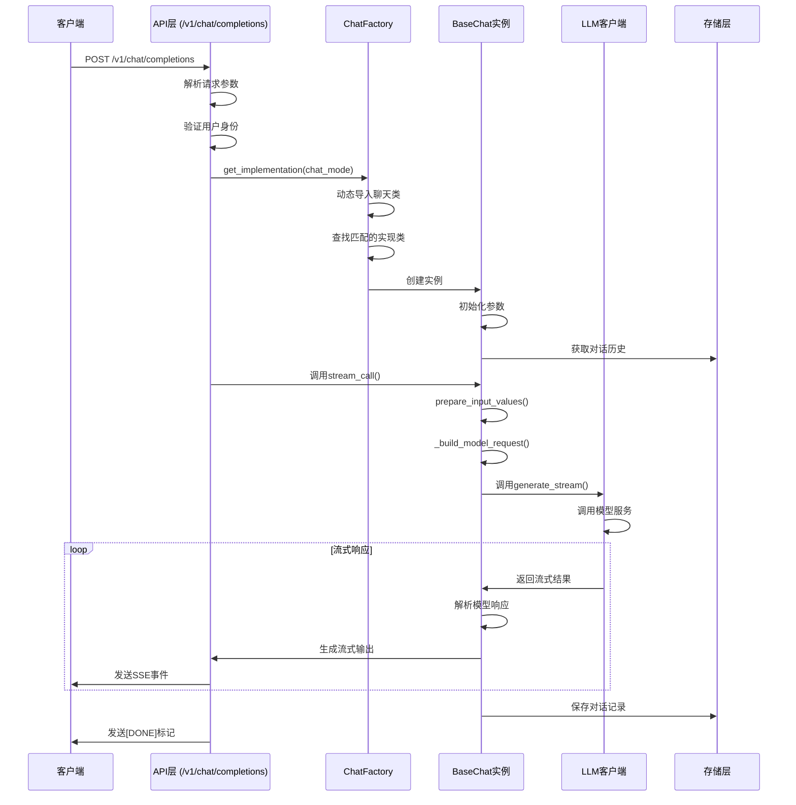

### 1.2 详细时序说明

#### 1.2.1 请求处理阶段
1. **客户端发起请求**：客户端向`/v1/chat/completions`发送POST请求，携带对话参数
2. **API参数处理**：API层解析请求体，验证用户身份和权限
3. **创建聊天实例**：通过`ChatFactory`创建对应的聊天实例
4. **初始化聊天对象**：聊天实例初始化，加载配置和对话历史

#### 1.2.2 处理与生成阶段
5. **准备输入数据**：调用`prepare_input_values()`准备输入数据
6. **构建模型请求**：调用`_build_model_request()`构建LLM模型请求
7. **调用LLM模型**：调用`call_streaming_operator()`调用LLM模型
8. **流式响应处理**：处理LLM的流式响应，应用prompt模板解析

#### 1.2.3 响应返回阶段
9. **生成流式输出**：生成符合SSE格式的流式输出
10. **客户端接收**：客户端接收流式响应
11. **保存对话历史**：将对话记录保存到存储层
12. **结束响应**：发送[DONE]标记，结束对话

## 2. Chat对象的管理机制

### 2.1 Chat对象的生命周期

#### 2.1.1 创建阶段
- **创建时机**：每次API调用`/v1/chat/completions`时创建
- **创建方式**：通过`ChatFactory.get_implementation()`静态方法创建
- **创建参数**：
  - `chat_mode`: 聊天模式
  - `chat_param`: 聊天参数（包含对话ID、用户输入等）
  - `system_app`: 系统应用实例

```python
# Chat对象创建代码
def get_chat_instance(dialogue: ConversationVo = Body()) -> BaseChat:
    # 验证聊天模式
    # 创建聊天参数
    chat_param = ChatParam(...)
    chat: BaseChat = await blocking_func_to_async(
        CFG.SYSTEM_APP,
        CHAT_FACTORY.get_implementation,
        dialogue.chat_mode,
        CFG.SYSTEM_APP,
        **{"chat_param": chat_param},
    )
    return chat
```

#### 2.1.2 使用阶段
- **主要方法**：
  - `stream_call()`: 流式调用LLM，返回异步迭代器
  - `nostream_call()`: 非流式调用LLM，返回完整结果
  - `prepare()`: 准备聊天环境
  - `current_ai_response()`: 获取当前AI响应

#### 2.1.3 销毁阶段
- **销毁时机**：API请求处理完成后自动销毁
- **资源释放**：
  - 聊天实例引用计数归零
  - Python垃圾回收器自动回收
  - 对话历史已保存到存储层，不占用内存

### 2.2 Chat对象的关联与标识

#### 2.2.1 对话ID关联
- 每个Chat对象与唯一的对话ID（`conv_uid`）关联
- 对话ID由客户端生成或API自动生成
- 用于标识和管理对话历史

#### 2.2.2 聊天模式关联
- Chat对象与特定的聊天模式（`chat_mode`）关联
- 聊天模式决定了Chat对象的行为和功能
- 支持多种聊天模式：普通聊天、知识聊天、数据库聊天等

### 2.3 ChatFactory的管理机制

#### 2.3.1 工厂模式实现
- 使用单例模式实现ChatFactory
- 动态导入所有聊天类
- 支持热插拔新的聊天模式

```python
class ChatFactory(metaclass=Singleton):
    @staticmethod
    def get_implementation(chat_mode: str, system_app: SystemApp, chat_param: ChatParam, **kwargs):
        # 动态导入所有聊天模式类
        from dbgpt_app.scene.chat_normal.chat import ChatNormal  # noqa: F401
        from dbgpt_app.scene.chat_knowledge.v1.chat import ChatKnowledge  # noqa: F401
        # ... 其他聊天模式
        
        # 查找与chat_mode匹配的实现类
        chat_classes = BaseChat.__subclasses__()
        for cls in chat_classes:
            if cls.chat_scene == chat_mode:
                # 创建并返回聊天实例
                return cls(**kwargs, chat_param=chat_param, system_app=system_app)
        
        raise Exception(f"Invalid implementation name:{chat_mode}")
```

#### 2.3.2 动态加载机制
- 使用`from ... import ...`动态导入聊天类
- 避免一次性导入所有聊天类，减少启动时间
- 支持插件化扩展新的聊天模式

### 2.4 会话管理

#### 2.4.1 对话历史存储
- 使用`StorageConversation`管理对话历史
- 通过`ConversationServe`与存储层交互
- 支持多种存储后端：内存、数据库等

```python
def _build_conversation(
    chat_mode: ChatScene,
    chat_param: ChatParam,
    model_name: str,
    conv_serve: ConversationServe,
) -> StorageConversation:
    # 创建StorageConversation实例
    return StorageConversation(
        chat_param.chat_session_id,
        chat_mode=chat_mode.value(),
        user_name=chat_param.user_name,
        sys_code=chat_param.sys_code,
        app_code=chat_param.app_code,
        model_name=model_name,
        param_type=param_type,
        param_value=param_value,
        conv_storage=conv_serve.conv_storage,
        message_storage=conv_serve.message_storage,
    )
```

#### 2.4.2 对话历史管理
- 获取历史消息：`self.current_message.get_history_message()`
- 添加用户消息：`self.current_message.add_user_message()`
- 添加AI消息：`self.current_message.add_ai_message()`
- 添加视图消息：`self.current_message.add_view_message()`

## 3. 关键组件与交互

### 3.1 BaseChat类

#### 3.1.1 核心属性
- `chat_session_id`: 对话ID
- `chat_mode`: 聊天模式
- `current_user_input`: 当前用户输入
- `llm_model`: 使用的LLM模型
- `prompt_template`: 提示模板
- `current_message`: 当前对话对象

#### 3.1.2 核心方法
- `stream_call()`: 流式调用LLM
- `nostream_call()`: 非流式调用LLM
- `_build_model_request()`: 构建模型请求
- `prepare_input_values()`: 准备输入值
- `call_streaming_operator()`: 调用流式操作符

### 3.2 ChatParam类

#### 3.2.1 主要参数
- `chat_session_id`: 对话ID
- `current_user_input`: 用户输入内容
- `model_name`: 使用的LLM模型
- `select_param`: 选择参数
- `chat_mode`: 聊天模式
- `user_name`: 用户名
- `sys_code`: 系统代码
- `app_code`: 应用代码

### 3.3 AppScenePromptTemplateAdapter

#### 3.3.1 功能
- 管理提示模板
- 解析模型响应
- 生成最终输出

#### 3.3.2 使用方式
```python
self.prompt_template: AppScenePromptTemplateAdapter = CFG.prompt_template_registry.get_prompt_template(
    self.chat_mode.value(),
    language=self.system_app.config.configs.get("dbgpt.app.global.language"),
    model_name=self.llm_model,
)
```

## 4. 代码优化建议

### 4.1 Chat对象缓存机制

**问题**：每次API调用都创建新的Chat对象，存在重复初始化的开销。

**解决方案**：实现Chat对象缓存机制，减少重复创建的开销。

```python
from functools import lru_cache

class ChatFactory(metaclass=Singleton):
    @staticmethod
    @lru_cache(maxsize=100)  # 设置缓存大小
    def get_implementation(chat_mode: str, system_app: SystemApp, chat_param: ChatParam, **kwargs):
        # 原有实现...
```

### 4.2 异步初始化优化

**问题**：当前初始化过程是同步的，可能导致API响应延迟。

**解决方案**：将耗时的初始化操作改为异步执行。

```python
class BaseChat(ABC):
    @trace("BaseChat.__init__")
    def __init__(self, chat_param: ChatParam, system_app: SystemApp):
        # 原有同步初始化...
        
    async def async_init(self):
        """异步初始化方法"""
        # 耗时的初始化操作
        self.history_messages = await self._load_history_messages()
        self.embeddings = await self._load_embeddings()
```

### 4.3 资源池管理

**问题**：LLM客户端每次调用都创建新的连接，存在资源浪费。

**解决方案**：实现LLM客户端资源池，重用连接。

```python
from dbgpt.util.pool import ConnectionPool

class LLMClientPool:
    def __init__(self, max_connections=10):
        self.pool = ConnectionPool(
            create_func=lambda: DefaultLLMClient(),
            max_size=max_connections,
            validate_func=lambda client: client.is_healthy(),
        )
    
    async def get_client(self):
        return await self.pool.acquire()
    
    async def release_client(self, client):
        await self.pool.release(client)
```

### 4.4 会话超时管理

**问题**：长时间未活跃的会话占用存储资源。

**解决方案**：实现会话超时清理机制。

```python
class ConversationCleanupService:
    @staticmethod
    async def cleanup_expired_conversations(timeout_hours=24):
        """清理超时会话"""
        from dbgpt_serve.conversation.service.service import Service as ConversationService
        
        conv_service = ConversationService.get_instance(CFG.SYSTEM_APP)
        expired_conv_uids = await conv_service.get_expired_conversations(timeout_hours)
        
        for conv_uid in expired_conv_uids:
            await conv_service.delete_conversation(conv_uid)
```

## 5. 总结

### 5.1 时序图总结
- API调用chat的时序流程清晰，从请求接收、参数解析、实例创建、模型调用到流式响应返回
- 采用了工厂模式创建聊天实例，支持多种聊天模式
- 使用异步流式响应提高用户体验

### 5.2 Chat对象管理总结
- Chat对象的生命周期由API请求决定，请求处理完成后自动销毁
- 使用对话ID（conv_uid）标识和管理对话
- 通过StorageConversation管理对话历史
- 采用工厂模式创建聊天实例，支持插件化扩展

### 5.3 技术特点
- **工厂模式**：动态创建聊天实例，支持多种聊天模式
- **异步编程**：提高系统并发性能
- **流式输出**：提升用户体验
- **可扩展性**：支持插件化扩展新的聊天模式
- **存储分离**：对话历史存储与业务逻辑分离

通过以上分析，我们清晰地了解了API调用chat的时序流程和chat对象的管理机制，这对于理解DB-GPT的聊天功能实现和进行后续优化具有重要意义。


# DB-GPT Scene 文件夹分析

## 1. 概述

`scene` 文件夹是 DB-GPT 项目中 `dbgpt-app` 包的核心模块之一，负责实现各种聊天场景的业务逻辑。该模块采用了模块化、可扩展的设计模式，支持多种聊天场景（如普通聊天、知识聊天、数据库聊天等），并提供了统一的接口和基类供开发者扩展。

## 2. 文件夹结构

```
scene/
├── __init__.py              # 模块初始化文件
├── base.py                  # 场景基础定义（Scene类、ChatScene枚举）
├── base_chat.py             # 聊天基类（BaseChat抽象类、ChatParam数据类）
├── chat_factory.py          # 聊天工厂类（创建不同聊天场景实例）
├── chat_dashboard/          # 仪表板聊天场景
│   ├── __init__.py
│   ├── chat.py              # 聊天实现
│   ├── config.py            # 配置定义
│   ├── data_loader.py       # 数据加载器
│   ├── data_preparation/    # 数据准备模块
│   ├── out_parser.py        # 输出解析器
│   ├── prompt.py            # 提示模板
│   └── template/            # 报告模板
├── chat_data/               # 数据聊天场景
│   ├── __init__.py
│   └── chat_excel/          # Excel聊天子场景
│       ├── __init__.py
│       ├── config.py
│       ├── excel_analyze/   # Excel分析模块
│       ├── excel_learning/  # Excel学习模块
│       └── excel_reader.py  # Excel读取器
├── chat_db/                 # 数据库聊天场景
│   ├── __init__.py
│   ├── auto_execute/        # 自动执行SQL子场景
│   │   ├── __init__.py
│   │   ├── chat.py
│   │   ├── config.py
│   │   ├── example.py
│   │   ├── out_parser.py
│   │   └── prompt.py
│   ├── data_loader.py
│   └── professional_qa/     # 专业问答子场景
│       ├── __init__.py
│       ├── chat.py
│       ├── config.py
│       ├── out_parser.py
│       └── prompt.py
├── chat_knowledge/          # 知识聊天场景
│   ├── __init__.py
│   ├── refine_summary/      # 摘要优化子场景
│   │   ├── __init__.py
│   │   ├── chat.py
│   │   ├── out_parser.py
│   │   └── prompt.py
│   └── v1/                  # 知识聊天v1版本
│       ├── __init__.py
│       ├── chat.py
│       ├── config.py
│       ├── out_parser.py
│       ├── prompt.py
│       └── prompt_chatglm.py
├── chat_normal/             # 普通聊天场景
│   ├── __init__.py
│   ├── chat.py
│   ├── config.py
│   ├── out_parser.py
│   └── prompt.py
├── exceptions.py            # 异常定义
└── operators/               # 操作符模块
    ├── __init__.py
    └── app_operator.py      # 应用操作符
```

## 3. 核心组件分析

### 3.1 Scene 基础定义（base.py）

`base.py` 文件定义了场景的基础结构，包括：

- **Scene 类**：场景的基本属性封装（代码、名称、描述、参数类型等）
- **ChatScene 枚举**：所有聊天场景的枚举定义，包括：
  - `ChatNormal`：普通聊天场景
  - `ChatKnowledge`：知识聊天场景
  - `ChatWithDbQA`：数据库专业问答场景
  - `ChatWithDbExecute`：数据库自动执行场景
  - `ChatExcel`：Excel聊天场景
  - `ChatDashboard`：仪表板聊天场景
  - 其他内部场景（如摘要提取、实体提取等）
- **AppScenePromptTemplateAdapter 类**：场景提示模板适配器，用于适配不同场景的提示模板

### 3.2 聊天基类（base_chat.py）

`base_chat.py` 文件定义了所有聊天场景的基类，包括：

- **ChatParam 数据类**：聊天参数封装，包含：
  - 会话ID
  - 用户输入
  - 模型名称
  - 选择参数
  - 聊天模式
  - 其他配置参数

- **BaseChat 抽象类**：所有聊天场景的父类，提供了：
  - 初始化方法（__init__）：初始化聊天场景
  - 核心聊天方法（stream_call、nostream_call）：实现流式和非流式聊天
  - 辅助方法（generate_input_values、_build_model_request等）：构建模型请求
  - 抽象方法（param_class）：获取参数类的接口，需要子类实现

### 3.3 聊天工厂（chat_factory.py）

`chat_factory.py` 文件实现了 ChatFactory 工厂类，用于创建不同聊天场景的实例。该类采用了单例模式和延迟加载技术，支持根据聊天模式动态创建对应的聊天场景实例。

核心功能：
- `get_implementation` 方法：根据聊天模式创建对应的聊天场景实例
- 延迟加载：只在需要时才导入具体的聊天场景类，提高启动性能
- 配置解析：自动解析聊天场景的配置参数

### 3.4 具体聊天场景

#### 3.4.1 普通聊天场景（chat_normal/chat.py）

最简单的聊天场景，直接与LLM进行对话，不涉及额外的数据处理或工具调用。

```python
class ChatNormal(BaseChat):
    chat_scene: str = ChatScene.ChatNormal.value()

    @classmethod
    def param_class(cls) -> Type[ChatNormalConfig]:
        return ChatNormalConfig

    def __init__(self, chat_param: ChatParam, system_app: SystemApp):
        super().__init__(chat_param=chat_param, system_app=system_app)
```

#### 3.4.2 知识聊天场景（chat_knowledge/v1/chat.py）

支持与知识库进行对话的场景，实现了：
- 知识空间检索
- 查询重写
- 结果重排序
- 引用生成

核心功能：
- `generate_input_values` 方法：生成模型输入值，包括上下文、问题等
- `_handle_final_output` 方法：处理模型输出，添加引用信息
- `parse_source_view` 方法：解析知识源视图，格式化输出

#### 3.4.3 数据库聊天场景（chat_db/professional_qa/chat.py）

支持与数据库进行对话的场景，实现了：
- 数据库元数据检索
- 表结构分析
- SQL生成和执行（auto_execute子场景）

核心功能：
- `generate_input_values` 方法：生成模型输入值，包括用户输入和表信息
- 数据库连接管理：通过ConnectorManager获取数据库连接
- 表信息检索：通过DBSummaryClient获取数据库摘要

## 4. 工作流程

Scene 模块的工作流程如下：

1. **API请求接收**：客户端发送聊天请求到API接口
2. **参数解析**：解析请求参数，构建ChatParam对象
3. **场景创建**：通过ChatFactory创建对应的聊天场景实例
4. **输入准备**：调用generate_input_values方法准备模型输入
5. **模型调用**：调用LLM模型生成响应
6. **输出处理**：处理模型输出，添加引用或其他信息
7. **响应返回**：将处理后的响应返回给客户端

## 5. 设计模式与架构特点

### 5.1 设计模式

- **抽象工厂模式**：ChatFactory用于创建不同的聊天场景实例
- **策略模式**：每个聊天场景实现了自己的聊天策略
- **模板方法模式**：BaseChat定义了聊天的基本流程，子类可以重写特定方法
- **单例模式**：ChatFactory采用单例模式，确保全局唯一实例

### 5.2 架构特点

- **模块化设计**：每个聊天场景作为独立模块，便于扩展和维护
- **统一接口**：所有聊天场景都继承自BaseChat，提供统一的接口
- **延迟加载**：使用延迟加载技术，提高启动性能
- **配置驱动**：支持通过配置文件自定义聊天场景的行为
- **可扩展**：支持通过继承BaseChat类扩展新的聊天场景

## 6. 扩展开发

开发者可以通过以下步骤扩展新的聊天场景：

1. **定义场景枚举**：在ChatScene枚举中添加新的场景定义
2. **创建场景模块**：创建新的场景文件夹，包含chat.py、config.py、prompt.py等文件
3. **实现聊天类**：继承BaseChat类，实现param_class和generate_input_values等方法
4. **配置提示模板**：定义场景的提示模板
5. **注册场景**：在__init__.py文件中注册新的聊天场景

## 7. 总结

Scene 文件夹是 DB-GPT 项目中实现聊天功能的核心模块，采用了模块化、可扩展的设计模式，支持多种聊天场景。该模块通过 BaseChat 抽象类提供了统一的接口，通过 ChatFactory 工厂类实现了场景的动态创建，通过 ChatScene 枚举定义了所有支持的聊天场景。

该模块的设计具有以下优点：
- 高度模块化，便于扩展和维护
- 统一接口，降低了使用复杂度
- 延迟加载，提高了启动性能
- 配置驱动，支持灵活配置
- 支持多种聊天场景，满足不同需求

通过分析 Scene 文件夹，我们可以更好地理解 DB-GPT 项目的聊天功能实现原理和架构设计。

# DB-GPT Knowledge 包分析

## 1. 概述

Knowledge 包是 DB-GPT 项目中负责知识管理的核心模块，提供了知识空间、文档和片段的管理功能，支持知识检索、文档摘要生成等功能。该模块采用分层设计，通过 API 接口提供服务，内部使用 RAG 技术实现知识管理和检索。

## 2. 目录结构

```
knowledge/
├── __init__.py              # 模块初始化文件
├── _cli/                    # CLI 工具目录
│   ├── __init__.py
│   ├── knowledge_cli.py     # CLI 命令实现
│   └── knowledge_client.py  # CLI 客户端
├── api.py                   # API 接口定义
├── request/                 # 请求模型目录
│   ├── __init__.py
│   ├── request.py           # 请求数据结构定义
│   └── response.py          # 响应数据结构定义
└── service.py               # 核心服务实现
```

## 3. 核心组件分析

### 3.1 KnowledgeService 类

KnowledgeService 是 Knowledge 包的核心服务类，提供了知识管理的主要功能：

```python
class KnowledgeService:
    # 知识空间管理
    def create_knowledge_space(self, request: KnowledgeSpaceRequest): ...
    def get_knowledge_space(self, request: KnowledgeSpaceRequest): ...
    def arguments(self, space): ...
    def argument_save(self, space, argument_request: SpaceArgumentRequest): ...
    def delete_space(self, space_name: str): ...
    
    # 文档管理
    def create_knowledge_document(self, space, request: KnowledgeDocumentRequest): ...
    def get_knowledge_documents(self, space, request: DocumentQueryRequest): ...
    async def document_summary(self, request: DocumentSummaryRequest): ...
    def delete_document(self, space_name: str, doc_name: str): ...
    
    # 片段管理
    def get_document_chunks(self, request: ChunkQueryRequest): ...
    
    # 知识检索
    async def recall_test(self, space_name, doc_recall_test_request: DocumentRecallTestRequest): ...
    def query_graph(self, space_name, limit): ...
    
    # 其他功能
    def get_retrieve_strategy_list(self) -> List[Dict]: ...
```

### 3.2 API 接口

api.py 文件定义了 RESTful API 接口，用于与前端或其他服务交互：

```python
@router.post("/knowledge/space/add")
async def space_add(request: KnowledgeSpaceRequest): ...

@router.post("/knowledge/space/list")
async def space_list(request: KnowledgeSpaceRequest): ...

# 其他 API 接口...
```

### 3.3 请求和响应模型

request/request.py 文件定义了 API 接口的请求数据结构：

```python
class KnowledgeSpaceRequest(BaseModel):
    id: Optional[int] = None
    name: Optional[str] = None
    vector_type: Optional[str] = None
    domain_type: str = "Normal"
    desc: str = None
    owner: Optional[str] = None
    space_id: Optional[Union[int, str]] = None

class KnowledgeDocumentRequest(BaseModel):
    doc_name: Optional[str] = None
    doc_id: Optional[int] = None
    doc_type: Optional[str] = None
    doc_token: Optional[str] = None
    content: Optional[str] = None
    source: Optional[str] = None
    labels: Optional[str] = None
    questions: Optional[List[str]] = None

# 其他请求模型...
```

## 4. 使用方式

### 4.1 知识空间管理

```python
# 创建知识空间
space_request = KnowledgeSpaceRequest(
    name="my_knowledge_space",
    vector_type="VectorStore",
    domain_type="Normal",
    desc="我的知识库"
)
knowledge_service.create_knowledge_space(space_request)

# 查询知识空间列表
list_request = KnowledgeSpaceRequest()
spaces = knowledge_service.get_knowledge_space(list_request)
```

### 4.2 文档管理

```python
# 创建文档
doc_request = KnowledgeDocumentRequest(
    doc_name="example.txt",
    doc_type="TXT",
    content="这是一个示例文档内容"
)
knowledge_service.create_knowledge_document("my_knowledge_space", doc_request)

# 查询文档列表
doc_query_request = DocumentQueryRequest()
documents = knowledge_service.get_knowledge_documents("my_knowledge_space", doc_query_request)
```

### 4.3 知识检索

```python
# 执行知识库召回测试
test_request = DocumentRecallTestRequest(
    question="示例问题",
    recall_top_k=5,
    recall_score_threshold=0.3
)
chunks = await knowledge_service.recall_test("my_knowledge_space", test_request)
```

## 5. 调用时序图

### 5.1 知识空间创建时序图

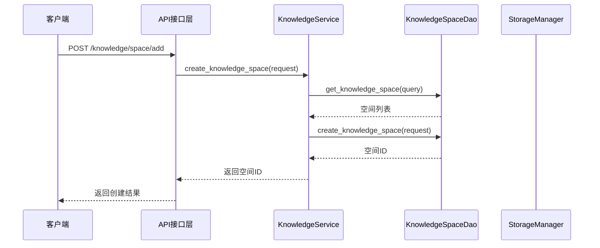

### 5.2 文档上传和同步时序图

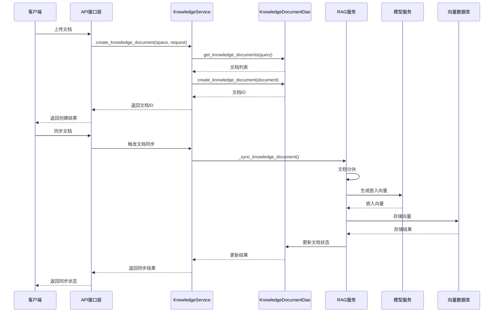

### 5.3 知识检索时序图

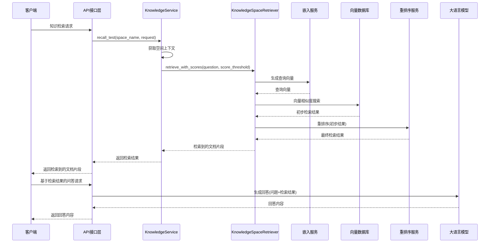

### 5.4 文档摘要生成时序图

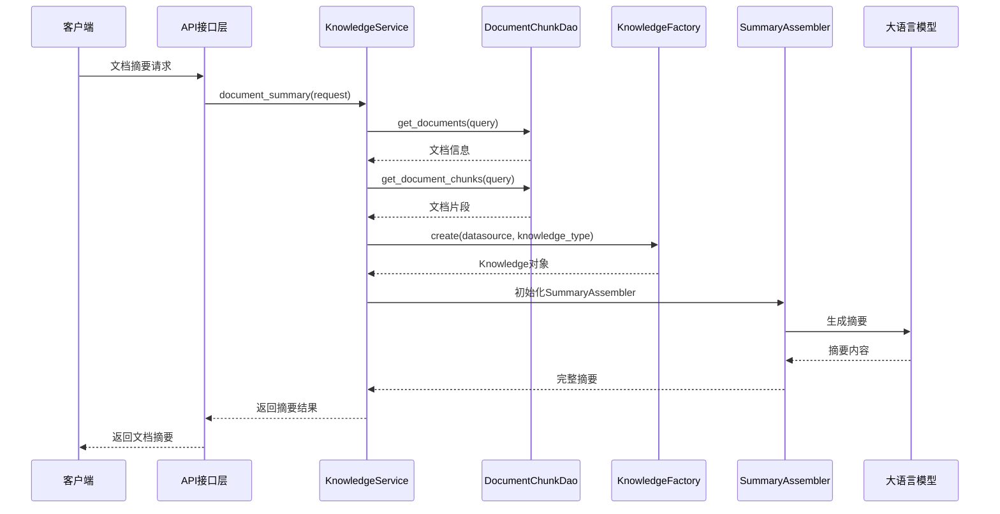

## 6. 核心功能实现细节

### 6.1 知识空间管理

知识空间是知识库的容器，每个知识空间可以包含多个文档。知识空间管理包括创建、查询、更新和删除功能：

```python
def create_knowledge_space(self, request: KnowledgeSpaceRequest):
    # 检查空间名称是否已存在
    query = KnowledgeSpaceEntity(name=request.name)
    spaces = knowledge_space_dao.get_knowledge_space(query)
    if len(spaces) > 0:
        raise Exception(f"space name:{request.name} have already named")
    
    # 创建知识空间
    space_id = knowledge_space_dao.create_knowledge_space(request)
    return space_id
```

### 6.2 文档管理和同步

文档管理包括文档的创建、查询、同步和删除功能。文档同步是将文档内容转换为向量并存储到向量数据库的过程：

```python
async def document_summary(self, request: DocumentSummaryRequest):
    # 获取文档信息
    doc_query = KnowledgeDocumentEntity(id=request.doc_id)
    documents = knowledge_document_dao.get_documents(doc_query)
    
    # 检查文档片段是否存在，不存在则同步
    chunk_entities = document_chunk_dao.get_document_chunks(DocumentChunkEntity(document_id=document.id))
    if len(chunk_entities) == 0:
        # 执行文档同步
        await rag_service._sync_knowledge_document(...)
    
    # 创建Knowledge对象
    knowledge = KnowledgeFactory.create(
        datasource=document.content,
        knowledge_type=KnowledgeType.get_by_value(document.doc_type),
    )
    
    # 生成文档摘要
    assembler = SummaryAssembler(...)  
    summary = await assembler.generate_summary()
    
    return await self._llm_extract_summary(summary, request.conv_uid, request.model_name)
```

### 6.3 知识检索

知识检索使用向量数据库进行语义检索，并支持重排序功能：

```python
async def recall_test(self, space_name, doc_recall_test_request: DocumentRecallTestRequest):
    # 获取空间信息
    space = knowledge_space_dao.get_one({"name": space_name})
    
    # 创建检索器
    knowledge_space_retriever = KnowledgeSpaceRetriever(
        space_id=space.id,
        top_k=top_k,
        system_app=CFG.SYSTEM_APP
    )
    
    # 执行检索
    chunks = await knowledge_space_retriever.aretrieve_with_scores(
        question, score_threshold
    )
    
    # 重排序（如果配置了重排序器）
    if app_config.models.rerankers:
        rerank_embeddings = RerankEmbeddingFactory.get_instance(CFG.SYSTEM_APP).create()
        reranker = RerankEmbeddingsRanker(rerank_embeddings, topk=recall_top_k)
        chunks = reranker.rank(candidates_with_scores=chunks, query=question)
    
    return chunks
```

## 7. 技术架构和依赖关系

### 7.1 技术架构

```
┌─────────────────────────────────────────────────────────────────────────┐
│                              Knowledge包                               │
├─────────┬─────────────────┬────────────────────┬────────────────────────┤
│ API接口层 │ 核心服务层     │ 数据访问层         │ 外部依赖层             │
├─────────┼─────────────────┼────────────────────┼────────────────────────┤
│ api.py  │ service.py      │ KnowledgeSpaceDao  │ dbgpt.rag             │
│         │                 │ KnowledgeDocumentDao │ dbgpt.model          │
│         │                 │ DocumentChunkDao   │ dbgpt.util           │
│         │                 │                    │ dbgpt_serve.rag      │
└─────────┴─────────────────┴────────────────────┴────────────────────────┘
```

### 7.2 核心依赖

- **dbgpt.rag**：提供RAG相关功能，包括知识管理、检索器等
- **dbgpt.model**：提供模型调用功能
- **dbgpt.util**：提供工具函数，如执行器、追踪器等
- **dbgpt_serve.rag**：提供RAG服务的数据库访问层

## 8. 总结

Knowledge 包是 DB-GPT 项目中负责知识管理的核心模块，提供了知识空间、文档和片段的管理功能，支持知识检索、文档摘要生成等功能。该模块采用分层设计，通过 API 接口提供服务，内部使用 RAG 技术实现知识管理和检索。

主要特点包括：

1. **模块化设计**：将知识管理功能划分为空间管理、文档管理、片段管理等模块
2. **统一接口**：提供 RESTful API 接口，方便与其他服务交互
3. **灵活配置**：支持不同的检索策略、嵌入模型和向量数据库
4. **高性能**：使用异步处理和缓存机制提高性能
5. **可扩展**：支持自定义知识类型、检索策略和存储后端

Knowledge 包的设计为 DB-GPT 项目提供了强大的知识管理能力，支持构建基于知识库的智能应用。

# Knowledge包的调用时序图与Service管理分析

## 1. KnowledgeService的管理方式

### 1.1 实例化方式

在DB-GPT项目中，KnowledgeService采用了**全局单例模式**的简化实现：

```python
# api.py 第112行
knowledge_space_service = KnowledgeService()
```

这种方式直接在模块级别创建了一个全局实例，所有API接口共享同一个KnowledgeService实例。

### 1.2 依赖管理

KnowledgeService内部通过多种方式管理依赖：

1. **配置依赖**：
   ```python
   CFG = Config()
   ```

2. **组件依赖**：
   ```python
   @property
   def llm_client(self) -> LLMClient:
       worker_manager = CFG.SYSTEM_APP.get_component(
           ComponentType.WORKER_MANAGER_FACTORY, WorkerManagerFactory
       ).create()
       return DefaultLLMClient(worker_manager, True)
   ```

3. **其他服务依赖**：
   ```python
   @property
   def storage_manager(self):
       return StorageManager.get_instance(CFG.SYSTEM_APP)
   ```

### 1.3 上下文管理

KnowledgeService通过`CFG.SYSTEM_APP`获取系统上下文，实现与其他组件的协作：

```python
@property
def system_app(self):
    return CFG.SYSTEM_APP
```

这种方式确保了KnowledgeService能够访问系统级别的配置和组件。

## 2. 调用时序图分析

### 2.1 知识空间创建时序分析

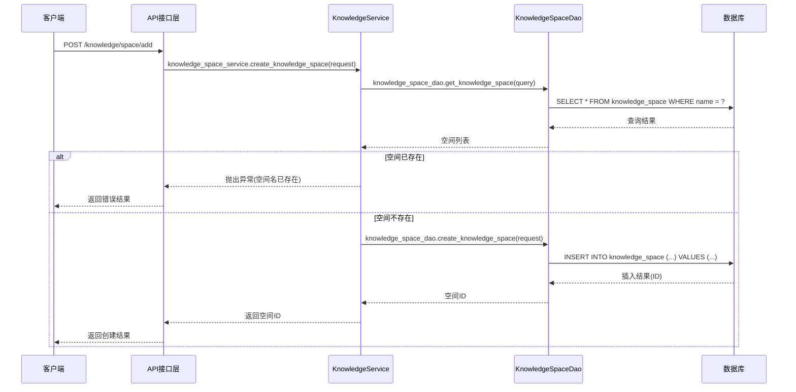

### 2.2 文档上传和同步时序分析

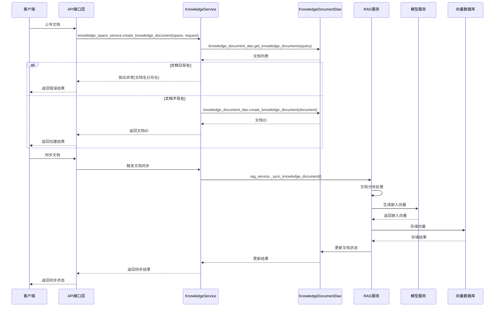

### 2.3 知识检索时序分析

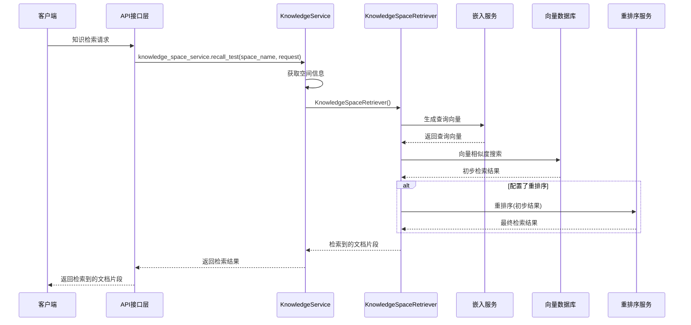

## 3. Service管理的设计特点

### 3.1 轻量级实例化

KnowledgeService采用了简单的实例化方式，没有复杂的单例模式实现，这使得：
- 代码简洁易读
- 易于测试和调试
- 减少了初始化开销

### 3.2 依赖注入的替代方案

虽然没有使用完整的依赖注入框架，但KnowledgeService通过以下方式实现了类似的效果：

1. **属性访问器**：使用`@property`装饰器延迟加载依赖
2. **工厂方法**：通过各种Factory类创建实例
3. **单例获取**：通过`get_instance()`方法获取其他服务的单例

### 3.3 上下文共享

所有服务共享同一个系统上下文`CFG.SYSTEM_APP`，确保了：
- 配置的一致性
- 组件的可复用性
- 服务间的协作能力

## 4. 调用流程的优化建议

### 4.1 异步处理优化

当前的实现中，部分操作是同步的，可以考虑改为异步处理：

```python
# 当前实现
def create_knowledge_space(self, request: KnowledgeSpaceRequest):
    # 同步操作...

# 优化建议
async def create_knowledge_space(self, request: KnowledgeSpaceRequest):
    # 异步操作...
```

### 4.2 缓存机制

可以在KnowledgeService中添加缓存层，减少对数据库的访问：

```python
from functools import lru_cache

class KnowledgeService:
    @lru_cache(maxsize=128)
    def get_knowledge_space(self, space_id: int):
        # 缓存空间信息
        pass
```

### 4.3 事务管理

在复杂操作中添加事务支持，确保数据一致性：

```python
def create_knowledge_space(self, request: KnowledgeSpaceRequest):
    try:
        # 开始事务
        # 执行操作
        # 提交事务
    except Exception:
        # 回滚事务
        raise
```

## 5. 总结

Knowledge包的调用时序和Service管理具有以下特点：

1. **调用时序清晰**：采用分层架构，从API层到Service层再到数据层，流程明确
2. **Service管理简洁**：使用全局实例模式，减少了复杂性
3. **依赖管理灵活**：结合了多种依赖管理方式，确保了组件的可扩展性
4. **上下文共享**：通过系统上下文实现了服务间的协作

这种设计既保持了代码的简洁性，又提供了足够的灵活性和可扩展性，适合DB-GPT项目的知识管理需求。

# DB-GPT初始化包分析

## 1. 概述

initialization包是DB-GPT应用的初始化核心，负责系统组件的注册、服务的初始化和应用配置的加载。它包含多个模块，每个模块负责不同的初始化任务，共同构成了应用启动的完整流程。

## 2. 目录结构

```
initialization/
├── __init__.py              # 模块初始化文件
├── app_initialization.py    # 应用配置初始化
├── db_model_initialization.py  # 数据库模型初始化
├── embedding_component.py   # 嵌入模型组件初始化
├── scheduler.py             # 调度器初始化
└── serve_initialization.py  # 服务应用初始化
```

## 3. 核心模块分析

### 3.1 app_initialization.py

**功能**：负责扫描和注册所有应用配置。

**核心函数**：
```python
def scan_app_configs():
    """Scan and register all app configs."""
    # 使用ModelScanner扫描dbgpt_app.scene模块中的GPTsAppCommonConfig配置
    # ...
```

**工作原理**：
1. 使用`ModelScanner`工具类扫描指定模块
2. 查找所有继承自`GPTsAppCommonConfig`的配置类
3. 注册这些配置类供系统使用

### 3.2 db_model_initialization.py

**功能**：确保所有SQLAlchemy模型都被注册，以便ORM能够正常工作。

**核心内容**：
```python
_MODELS = [
    PluginHubEntity,
    FileServeEntity,
    MyPluginEntity,
    # ... 其他模型实体
]
```

**工作原理**：
1. 导入所有需要的模型实体类
2. 将它们存储在`_MODELS`列表中
3. 确保SQLAlchemy能够发现并注册这些模型

### 3.3 embedding_component.py

**功能**：提供远程嵌入模型和重排序模型的工厂类。

**核心类**：

1. **RemoteEmbeddingFactory**
   ```python
   class RemoteEmbeddingFactory(EmbeddingFactory):
       def create(self, model_name: str = None, embedding_cls: Type = None) -> "Embeddings":
           # 创建并返回RemoteEmbeddings实例
           # ...
   ```

2. **RemoteRerankEmbeddingFactory**
   ```python
   class RemoteRerankEmbeddingFactory(RerankEmbeddingFactory):
       def create(self, model_name: str = None, embedding_cls: Type = None) -> "RerankEmbeddings":
           # 创建并返回RemoteRerankEmbeddings实例
           # ...
   ```

**工作原理**：
1. 从系统应用中获取WorkerManagerFactory组件
2. 创建WorkerManager实例
3. 使用WorkerManager创建远程嵌入或重排序模型

### 3.4 scheduler.py

**功能**：提供默认的调度器实现，用于管理定时任务。

**核心类**：
```python
class DefaultScheduler(BaseComponent):
    def after_start(self):
        # 启动调度器线程
        # ...
    
    def _scheduler(self):
        # 运行调度任务
        while self._scheduler_enable and not self._stop_event.is_set():
            schedule.run_pending()
            time.sleep(self._scheduler_interval_ms / 1000)
```

**工作原理**：
1. 在单独的线程中运行调度器
2. 使用`schedule`库来管理定时任务
3. 定期检查并执行待处理的任务

### 3.5 serve_initialization.py

**功能**：注册所有服务应用，是初始化过程的核心。

**核心函数**：

1. **scan_serve_configs**：扫描所有服务配置
   ```python
def scan_serve_configs():
    # 扫描多个模块中的BaseServeConfig配置
    # ...
   ```

2. **get_config**：获取特定类型的配置
   ```python
def get_config(serve_configs: Dict[str, T], serve_name: str, config_type: Type[T], **default_config) -> T:
    # 获取或创建指定类型的配置
    # ...
   ```

3. **register_serve_apps**：注册所有服务应用
   ```python
def register_serve_apps(system_app: SystemApp, app_config: ApplicationConfig, webserver_host: str, webserver_port: int):
    # 注册PromptServe、ConversationServe、FlowServe等多个服务
    # ...
   ```

**工作原理**：
1. 扫描系统中的所有服务配置
2. 根据配置创建服务实例
3. 将服务实例注册到系统应用中

## 4. 调用时序图

### 4.1 应用初始化时序图

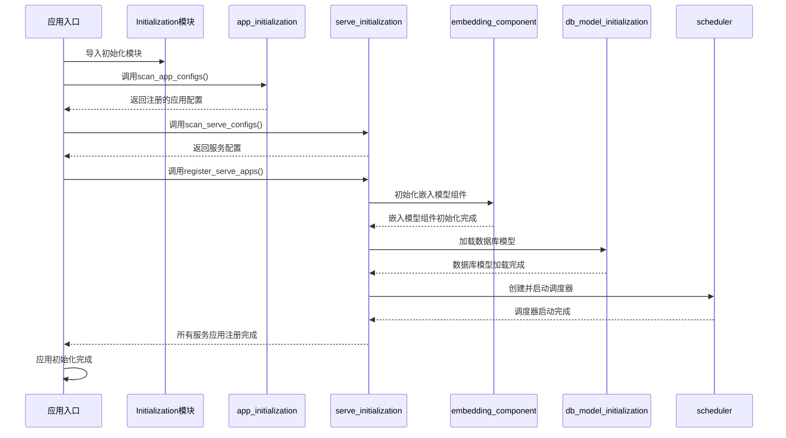

### 4.2 服务注册时序图

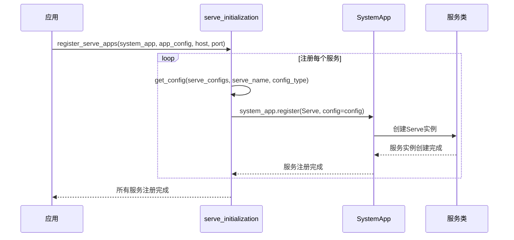

### 4.3 嵌入模型创建时序图

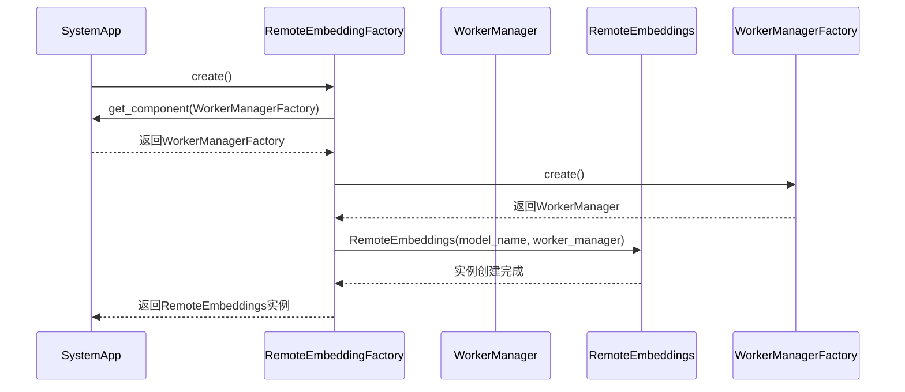

## 5. 使用方式

### 5.1 应用配置初始化

```python
from dbgpt_app.initialization.app_initialization import scan_app_configs

# 扫描并注册所有应用配置
configs = scan_app_configs()
```

### 5.2 服务应用初始化

```python
from dbgpt_app.initialization.serve_initialization import register_serve_apps
from dbgpt.component import SystemApp
from dbgpt_app.config import ApplicationConfig

# 创建系统应用和应用配置
system_app = SystemApp()
app_config = ApplicationConfig()

# 注册所有服务应用
register_serve_apps(system_app, app_config, "localhost", 8000)
```

### 5.3 嵌入模型初始化

```python
from dbgpt_app.initialization.embedding_component import _initialize_embedding_model
from dbgpt.component import SystemApp

# 创建系统应用
system_app = SystemApp()

# 初始化嵌入模型
_initialize_embedding_model(system_app, "default_embedding_model")
```

### 5.4 调度器使用

```python
from dbgpt_app.initialization.scheduler import DefaultScheduler
from dbgpt.component import SystemApp

# 创建系统应用
system_app = SystemApp()

# 创建并启动调度器
scheduler = DefaultScheduler(system_app)
scheduler.after_start()

# 调度器将在后台运行定时任务
```

## 6. 设计特点

1. **模块化设计**：每个初始化任务被分解到不同的模块中，提高了代码的可维护性和可扩展性

2. **组件化架构**：使用组件化思想，通过SystemApp来管理和注册所有组件

3. **配置驱动**：通过配置文件来控制初始化过程，提高了灵活性

4. **延迟加载**：只在需要时才初始化组件，提高了启动性能

5. **可扩展性**：支持动态注册新的服务和组件，方便功能扩展

## 7. 总结

initialization包是DB-GPT应用的初始化核心，负责系统组件的注册、服务的初始化和应用配置的加载。它采用模块化和组件化的设计，通过SystemApp来管理和协调各个组件，确保应用能够顺利启动并正常运行。

该包中的各个模块相互协作，共同构成了应用启动的完整流程，包括应用配置扫描、服务注册、嵌入模型初始化、数据库模型加载和调度器启动等。通过分析这些模块的功能和调用关系，我们可以更好地理解DB-GPT应用的初始化过程和架构设计。

# DB-GPT Operators包分析

## 1. 概述

operators包是DB-GPT应用的核心操作符集合，用于构建工作流。这些操作符提供了代码执行、类型转换、数据源交互、LLM调用、RAG检索和报告生成等功能，是构建DB-GPT应用工作流的基本组件。

## 2. 目录结构

```
operators/
├── __init__.py          # 模块初始化文件
├── code.py              # 代码执行操作符
├── converter.py         # 类型转换操作符
├── datasource.py        # 数据源操作符
├── llm.py               # LLM交互操作符
├── rag.py               # RAG检索操作符
└── report.py            # 报告生成操作符
```

## 3. 核心模块分析

### 3.1 code.py

**功能**：提供在沙箱环境中执行代码的操作符，支持Python和JavaScript。

**核心类**：

1. **CodeMapOperator**
   - 功能：在沙箱环境中执行自定义代码，处理输入字典并返回输出字典
   - 参数：
     - `code`: 要执行的代码（默认提供Python示例）
     - `lang`: 代码语言（Python或JavaScript）
     - `call_name`: 要调用的函数名
   - 工作原理：使用`get_code_server()`获取代码服务器实例，在沙箱环境中执行代码

2. **CodeDictToModelRequestOperator**
   - 功能：在沙箱环境中执行代码，将输入字典转换为ModelRequest对象
   - 参数：与CodeMapOperator类似
   - 工作原理：执行代码生成ModelRequest对象，用于后续LLM调用

### 3.2 converter.py

**功能**：提供各种数据类型之间的转换操作符。

**核心类**：

1. **基本类型转换操作符**：
   - StringToInteger、StringToFloat、StringToBoolean
   - IntegerToString、FloatToString、BooleanToString
   - 功能：在基本数据类型之间进行转换

2. **ModelOutputToDict**
   - 功能：将ModelOutput对象转换为字典
   - 工作原理：调用ModelOutput的to_dict()方法

### 3.3 datasource.py

**功能**：提供与数据库交互的操作符，支持表结构检索、SQL执行和可视化。

**核心类**：

1. **HODatasourceRetrieverOperator**
   - 功能：从数据源检索表结构信息
   - 参数：
     - `datasource`: 数据源对象
     - `prompt_template`: 提示模板
     - `display_type`: 数据展示类型
   - 工作原理：根据用户问题从数据库中检索相关表结构

2. **HODatasourceExecutorOperator**
   - 功能：执行SQL查询并可视化结果
   - 参数：
     - `datasource`: 数据源对象
   - 工作原理：执行SQL查询，将结果转换为可视化图表

3. **HODatasourceDashboardOperator**
   - 功能：执行多个SQL查询并生成仪表板
   - 参数：与HODatasourceExecutorOperator类似
   - 工作原理：执行多个SQL查询，生成包含多个图表的仪表板

4. **HODatasourceStructedOperator**
   - 功能：执行SQL查询并返回结构化数据
   - 参数：与HODatasourceExecutorOperator类似
   - 工作原理：执行SQL查询，返回JSON格式的结构化数据

### 3.4 llm.py

**功能**：提供与LLM交互的操作符，支持多轮对话和流式输出。

**核心类**：

1. **HOContextBody**
   - 功能：封装上下文信息，用于构建LLM提示
   - 属性：
     - `context_key`: 上下文键
     - `context`: 上下文内容

2. **BaseHOLLMOperator**
   - 功能：LLM操作符的基类，提供通用功能
   - 参数：
     - `prompt_template`: 提示模板
     - `model`: 模型名称
     - `history_merge_mode`: 历史消息合并模式
     - `user_message_key`: 用户消息键
     - `history_key`: 历史消息键

3. **HOLLMOperator**
   - 功能：非流式LLM调用操作符
   - 工作原理：构建提示并调用LLM，返回完整响应

4. **HOStreamingLLMOperator**
   - 功能：流式LLM调用操作符
   - 工作原理：构建提示并调用LLM，返回流式响应

### 3.5 rag.py

**功能**：提供RAG（检索增强生成）相关操作符，用于从知识空间检索相关信息。

**核心类**：

1. **HOKnowledgeOperator**
   - 功能：从知识空间检索相关信息
   - 参数：
     - `knowledge_space`: 知识空间名称
     - `context_key`: 上下文键
     - `top_k`: 检索的块数
     - `score_threshold`: 匹配分数阈值
     - `reranker_enabled`: 是否启用重排序
   - 工作原理：使用KnowledgeSpaceRetriever从知识空间检索相关块，支持重排序

### 3.6 report.py

**功能**：提供报告生成相关操作符，用于分析数据和生成报告。

**核心类**：

1. **ReportAnalystOperator**
   - 功能：分析数据并生成报告
   - 参数：
     - `prompt_template`: 提示模板
     - `model`: 模型名称
     - `llm_client`: LLM客户端
   - 工作原理：使用LLM分析数据报告，生成总结报告

2. **StringJoinOperator**
   - 功能：将多个字符串合并为一个字符串
   - 参数：
     - `separator`: 分隔符
   - 工作原理：使用指定分隔符连接多个字符串

## 4. 调用时序图

### 4.1 LLM调用时序图

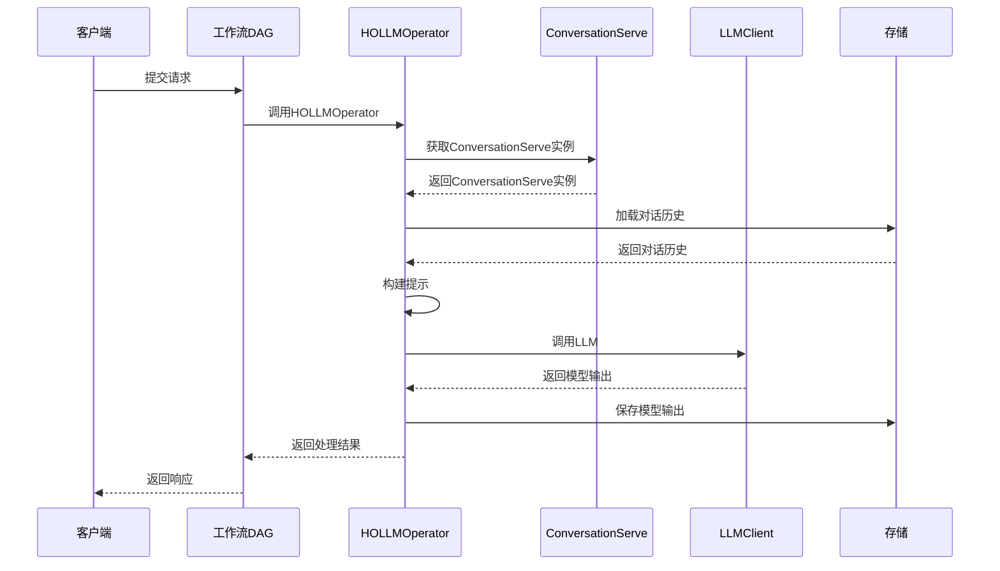

### 4.2 RAG检索时序图

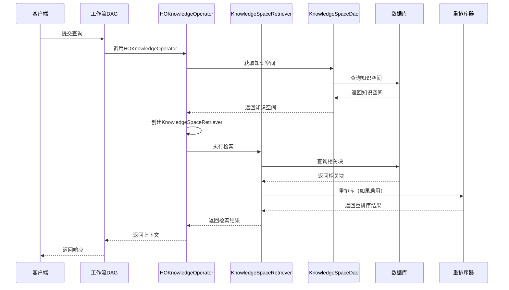

### 4.3 数据源操作时序图

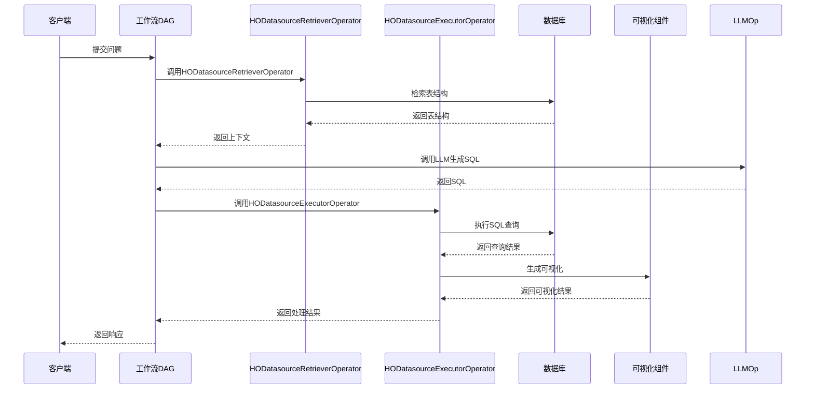

## 5. 使用方式

### 5.1 LLM调用示例

```python
from dbgpt_app.operators.llm import HOLLMOperator
from dbgpt.core.awel import DAG, SimpleCallDataInputSource

# 创建DAG
dag = DAG("test_llm_dag")

# 添加LLM操作符
with dag:
    llm_op = HOLLMOperator(
        prompt_template=ChatPromptTemplate.from_template("You are a helpful assistant. {user_input}"),
        history_merge_mode="none"
    )

# 执行DAG
result = await llm_op.call({
    "messages": "Hello, how are you?",
    "model": "gpt-3.5-turbo"
})
```

### 5.2 RAG检索示例

```python
from dbgpt_app.operators.rag import HOKnowledgeOperator
from dbgpt.core.awel import DAG

# 创建DAG
dag = DAG("test_rag_dag")

# 添加RAG操作符
with dag:
    rag_op = HOKnowledgeOperator(
        knowledge_space="test_space",
        top_k=5,
        score_threshold=0.3
    )

# 执行DAG
result = await rag_op.call("What is DB-GPT?")
```

### 5.3 数据源操作示例

```python
from dbgpt_app.operators.datasource import HODatasourceRetrieverOperator, HODatasourceExecutorOperator
from dbgpt.agent.resource.database import DBResource
from dbgpt.core.awel import DAG

# 创建DAG
dag = DAG("test_datasource_dag")

# 创建数据源
with dag:
    ds_retriever = HODatasourceRetrieverOperator(
        datasource=DBResource.from_uri("sqlite:///test.db"),
        prompt_template="SELECT * FROM {table} LIMIT 10"
    )
    
    ds_executor = HODatasourceExecutorOperator(
        datasource=DBResource.from_uri("sqlite:///test.db")
    )
    
    ds_retriever >> ds_executor

# 执行DAG
result = await ds_retriever.call("Show me the users table")
```

## 6. 设计特点

1. **组件化设计**：每个操作符都是独立的组件，可以灵活组合
2. **统一接口**：所有操作符都继承自BaseOperator，提供一致的接口
3. **可视化支持**：操作符包含metadata，支持可视化配置
4. **模块化扩展**：可以方便地添加新的操作符
5. **异步支持**：所有操作符都支持异步调用
6. **上下文管理**：通过DAGContext管理操作符之间的上下文

## 7. 总结

operators包是DB-GPT应用的核心操作符集合，提供了代码执行、类型转换、数据源交互、LLM调用、RAG检索和报告生成等功能。这些操作符采用组件化设计，支持可视化配置和灵活组合，可以用于构建复杂的工作流。通过分析这些操作符的功能和调用关系，我们可以更好地理解DB-GPT应用的工作原理和架构设计。


