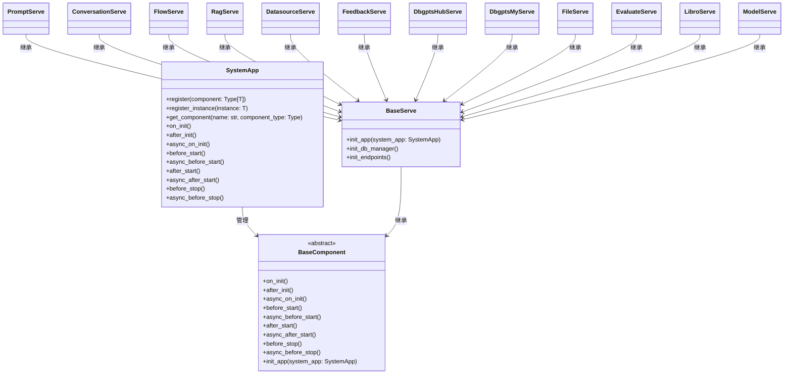
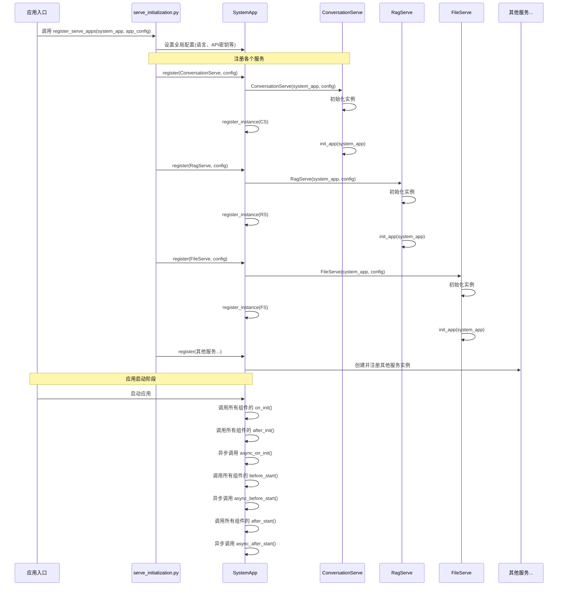
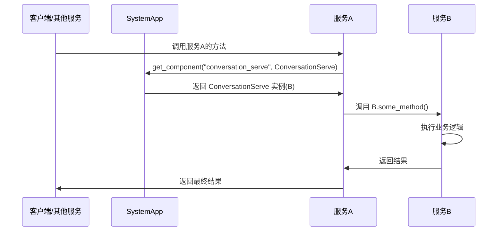
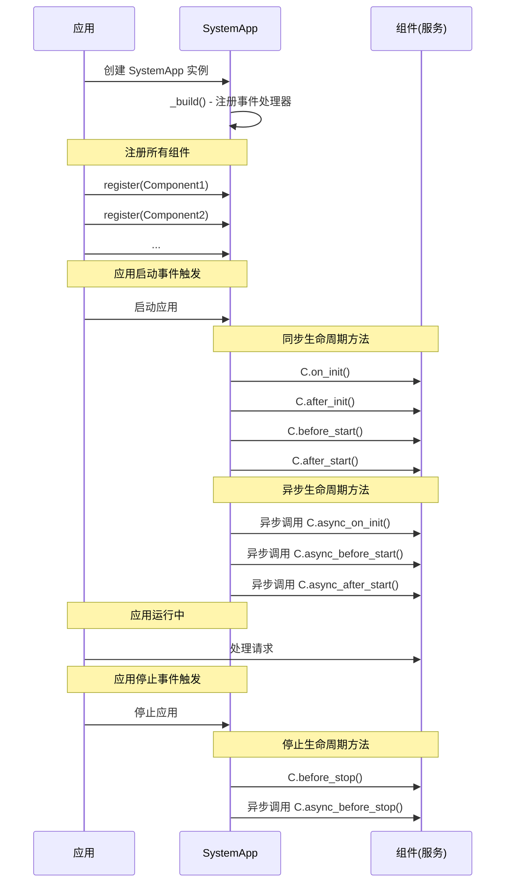
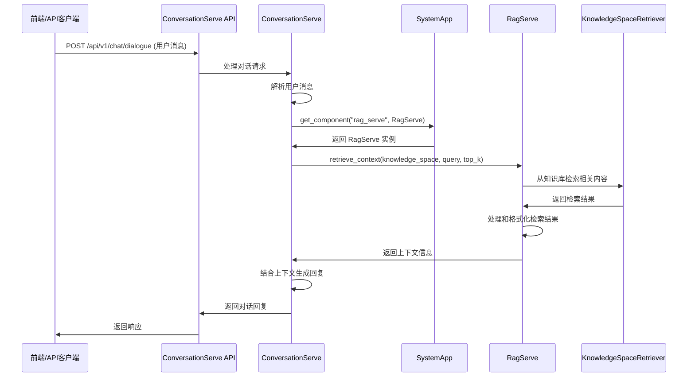
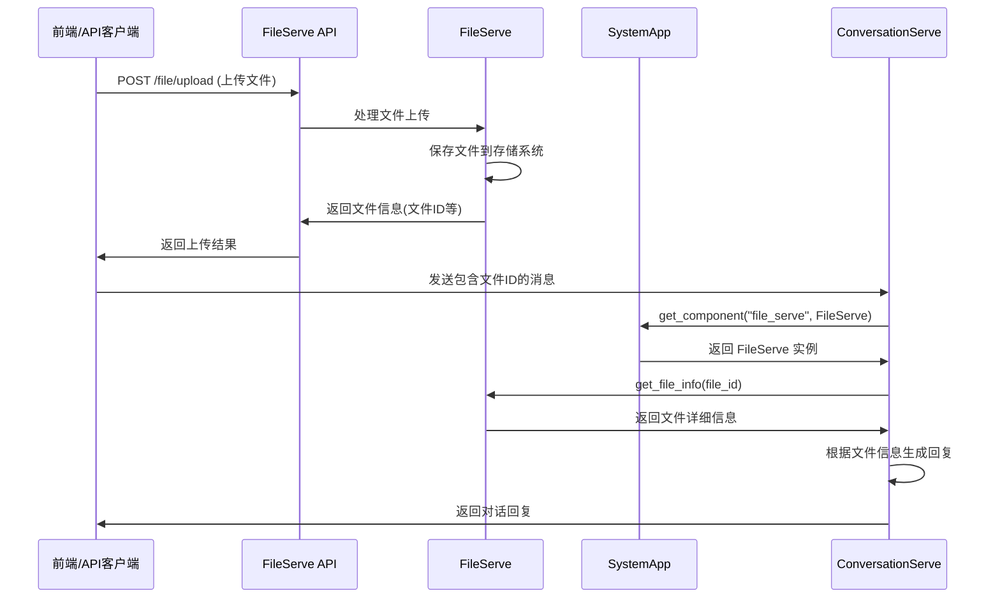

# dbgpt-serve 包分析

## 1. 概述

dbgpt-serve 是 DB-GPT 项目的核心服务层，提供了一套完整的服务框架和各种功能模块，用于构建和管理 DB-GPT 应用的后端服务。它采用组件化设计，支持模块化扩展，为上层应用提供了标准化的 API 接口和服务注册管理机制。

## 2. 目录结构

dbgpt-serve 包位于 `/home/czx/PycharmProjects/DB-GPT/packages/dbgpt-serve/src/dbgpt_serve/`，主要包含以下模块：

```
dbgpt_serve/
├── core/              # 核心服务框架
├── agent/             # 智能体服务
├── conversation/      # 对话历史管理服务
├── datasource/        # 数据源服务
├── dbgpts/            # DB-GPT 应用管理服务
├── evaluate/          # 评估服务
├── feedback/          # 反馈服务
├── file/              # 文件存储服务
├── flow/              # 工作流服务
├── libro/             # Libro 服务
├── model/             # 模型服务
├── prompt/            # 提示词服务
├── rag/               # RAG 服务
└── utils/             # 工具类
```

## 3. 核心架构

### 3.1 核心基类

dbgpt-serve 基于两个核心抽象类构建：

#### BaseServe

`BaseServe` 是所有服务的基类，继承自 `BaseComponent`，提供了以下核心功能：
- 服务初始化和配置
- 数据库管理器的创建和获取
- API 路由的注册
- 组件生命周期管理

```python
class BaseServe(BaseComponent, ABC):
    def __init__(self, system_app: SystemApp, api_prefix: str | List[str], api_tags: List[str], ...):
        # 初始化服务组件
    
    def create_or_get_db_manager(self) -> DatabaseManager:
        # 创建或获取数据库管理器
    
    # 其他核心方法...
```

#### BaseService

`BaseService` 是所有业务服务的基类，提供了以下核心功能：
- 数据访问对象（DAO）的管理
- 配置管理
- DAG 管理器的集成
- 基础 CRUD 操作

```python
class BaseService(BaseComponent, Generic[T, REQ, RES], ABC):
    @property
    @abstractmethod
    def dao(self) -> BaseDao[T, REQ, RES]:
        # 返回数据访问对象
    
    @property
    @abstractmethod
    def config(self) -> BaseServeConfig:
        # 返回配置对象
    
    # 其他核心方法...
```

### 3.2 服务实现模式

每个具体服务都遵循统一的实现模式：

1. **api/**：定义 REST API 接口和数据模型
2. **config.py**：服务配置定义
3. **models/**：数据库模型和适配器
4. **service/**：业务逻辑实现
5. **serve.py**：服务入口点，继承自 BaseServe
6. **dependencies.py**：依赖项定义
7. **tests/**：测试代码

## 4. 主要服务模块

### 4.1 File 服务

File 服务提供文件存储和管理功能，支持多种存储后端：
- 本地文件存储
- 分布式存储
- 其他自定义存储后端

核心功能：
- 文件上传和下载
- 文件元数据管理
- 支持文件哈希验证
- 集成 fsspec 提供统一文件系统接口

```python
class Serve(BaseServe):
    def after_init(self):
        # 初始化文件存储系统
        fs = FileStorageSystem(storage_backends, metadata_storage=storage, check_hash=self._serve_config.check_hash)
        self._file_storage_client = FileStorageClient(system_app=self._system_app, storage_system=fs, ...)
        self._system_app.register_instance(self._file_storage_client)
```

### 4.2 Conversation 服务

Conversation 服务负责对话历史的存储和管理：

核心功能：
- 对话记录的创建、查询和更新
- 消息历史的管理
- 支持多轮对话上下文

```python
class Serve(BaseServe):
    def before_start(self):
        # 初始化对话和消息存储
        self._conv_storage = SQLAlchemyStorage(...)  # 对话存储
        self._message_storage = SQLAlchemyStorage(...)  # 消息存储
```

### 4.3 RAG 服务

RAG（检索增强生成）服务处理知识空间和文档检索：

核心功能：
- 知识空间管理
- 文档上传和处理
- 文档分块和索引
- 语义检索

### 4.4 DBGPTs 服务

DBGPTs 服务管理 DB-GPT 应用生态：

- **hub**：应用市场，提供应用的发现和安装
- **my**：我的应用，管理已安装的应用

核心功能：
- 应用元数据管理
- 应用安装和卸载
- 应用版本控制

### 4.5 Agent 服务

Agent 服务提供智能体的创建和管理功能：

核心功能：
- 智能体配置和部署
- 智能体对话管理
- 智能体能力扩展

### 4.6 Datasource 服务

Datasource 服务管理数据库连接和操作：

核心功能：
- 数据库连接配置
- SQL 执行和结果处理
- 数据源元数据管理

## 5. 技术特点

### 5.1 组件化设计

采用组件化设计，各服务独立部署和扩展，通过 SystemApp 进行组件管理和依赖注入。

### 5.2 统一服务框架

基于 BaseServe 和 BaseService 提供统一的服务实现框架，降低了开发新服务的复杂度。

### 5.3 REST API 接口

所有服务都提供标准化的 REST API 接口，便于前端和其他服务调用。

### 5.4 数据库抽象

通过 SQLAlchemy 提供数据库抽象层，支持多种数据库后端。

### 5.5 模块化扩展

支持模块化扩展，新服务可以基于现有框架快速开发和集成。

## 6. 使用方式

### 6.1 服务注册

每个服务需要在系统初始化时注册：

```python
# 初始化系统应用
system_app = SystemApp()

# 创建并注册服务
file_serve = Serve(system_app, api_prefix="/api/v2/serve/file", api_tags=["FileServe"])
system_app.register(file_serve)

# 启动应用
system_app.init_app()
system_app.start()
```

### 6.2 API 调用

客户端可以通过 REST API 调用服务：

```bash
# 上传文件
curl -X POST http://localhost:5670/api/v2/serve/file/files -F "file=@test.txt"

# 获取对话历史
curl -X GET http://localhost:5670/api/v1/serve/conversation/history?conversation_id=123
```

## 7. 总结

dbgpt-serve 是 DB-GPT 项目的核心服务层，提供了一套完整的服务框架和功能模块。它采用组件化设计，支持模块化扩展，为上层应用提供了标准化的 API 接口和服务注册管理机制。主要功能包括文件存储、对话管理、RAG、智能体、数据源管理等，为构建基于大语言模型的应用提供了坚实的基础。

# dbgpt-serve 子类调用方式与时序图分析

## 1. 核心组件架构

dbgpt-serve 采用了基于组件的架构设计，所有服务类都遵循统一的生命周期管理机制。

### 1.1 组件继承关系


## 2. 服务注册与初始化流程

### 2.1 应用入口初始化流程

应用通过 `serve_initialization.py` 中的 `register_serve_apps` 函数注册所有服务：



### 2.2 服务注册细节

每个服务通过 `system_app.register()` 方法注册，该方法执行以下操作：

1. 创建服务实例：`instance = component(self, *args, **kwargs)`
2. 注册实例：`self.register_instance(instance)`
3. 返回实例：`return instance`

注册实例时，会：
- 检查组件名称是否已存在
- 将实例添加到组件字典：`self.components[name] = instance`
- 调用实例的 `init_app(self)` 方法

## 3. 服务间调用方式

### 3.1 通过 SystemApp 获取服务实例

服务之间通过 `SystemApp` 的 `get_component()` 方法获取对方实例：

```python
# 在服务A中调用服务B
from dbgpt.component import SystemApp
from dbgpt_serve.conversation.serve import Serve as ConversationServe

def some_method(self):
    # 获取 ConversationServe 实例
    conversation_serve = self.system_app.get_component(
        ConversationServe.name, ConversationServe
    )
    # 调用 ConversationServe 的方法
    result = conversation_serve.some_method()
```

### 3.2 服务调用时序图



## 4. 生命周期管理

### 4.1 组件生命周期方法调用顺序

当应用启动时，`SystemApp` 会按以下顺序调用所有注册组件的生命周期方法：



### 4.2 服务初始化具体流程

每个服务在 `init_app()` 方法中执行以下操作：

1. 保存 `system_app` 引用
2. 初始化数据库管理器：`self.init_db_manager()`
3. 初始化 API 端点：`self.init_endpoints()`

以 `ConversationServe` 为例：

```python
def init_app(self, system_app: SystemApp):
    """Initialize with system_app."""
    self.system_app = system_app
    self.init_db_manager()
    self.init_endpoints()
    
    # 初始化对话存储
    self.conv_storage = SqlAlchemyStorage(self.db_manager, ConversationEntity)
    self.message_storage = SqlAlchemyStorage(self.db_manager, MessageEntity)
```

## 5. 典型场景分析

### 5.1 对话服务调用 RAG 服务



### 5.2 文件服务与对话服务协作



## 6. 设计特点

### 6.1 组件化设计
- 所有服务遵循统一的接口和生命周期
- 服务之间通过 SystemApp 解耦
- 便于扩展和维护

### 6.2 依赖注入
- 通过 SystemApp 实现服务实例的依赖注入
- 避免硬编码依赖，提高灵活性

### 6.3 统一生命周期管理
- 所有服务共享相同的启动和停止流程
- 便于管理服务间的依赖关系

### 6.4 REST API 统一接口
- 所有服务通过 FastAPI 提供 REST API
- 统一的 API 设计风格和认证机制

## 7. 总结

dbgpt-serve 中的各个子类通过以下方式进行调用和管理：

1. **注册机制**：所有服务通过 `SystemApp.register()` 方法注册
2. **生命周期管理**：由 `SystemApp` 统一管理所有服务的生命周期
3. **服务间通信**：通过 `SystemApp.get_component()` 获取其他服务实例
4. **API 接口**：通过 FastAPI 提供统一的 REST API 接口

这种设计使得 dbgpt-serve 具有良好的可扩展性、可维护性和灵活性，能够支持复杂的业务场景和服务协作。


