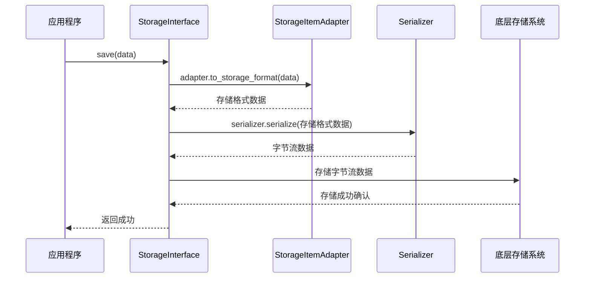
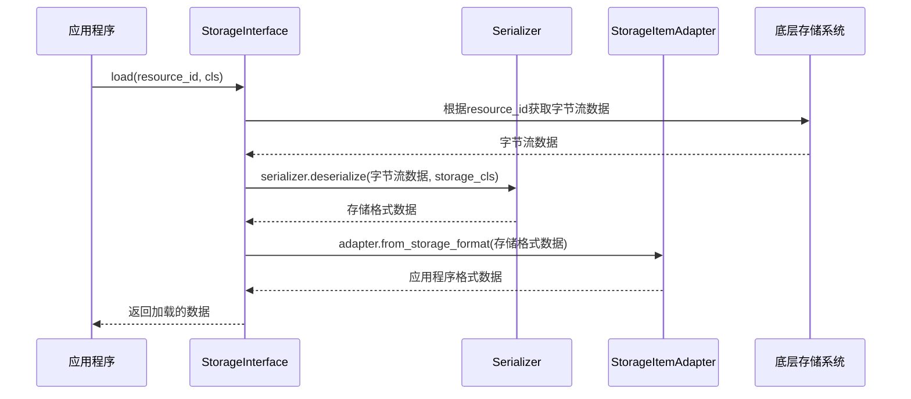
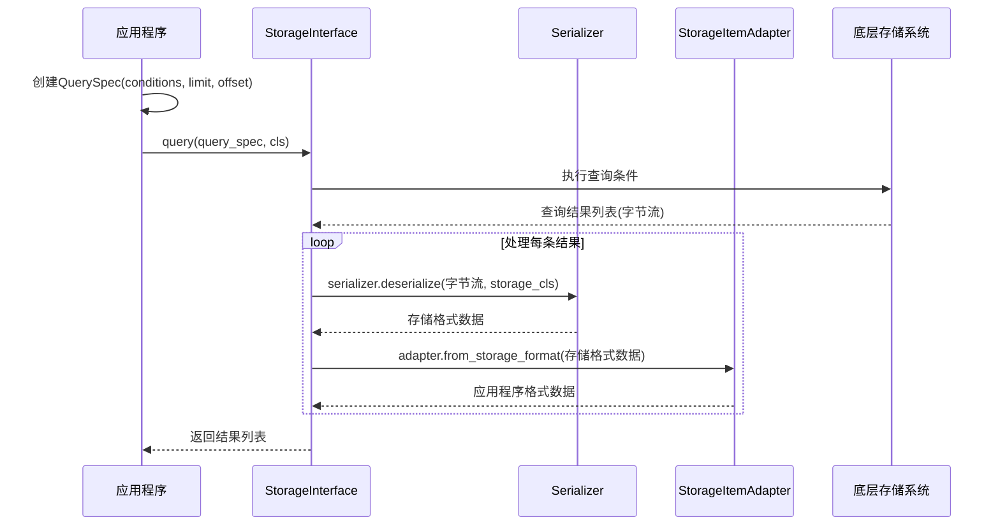
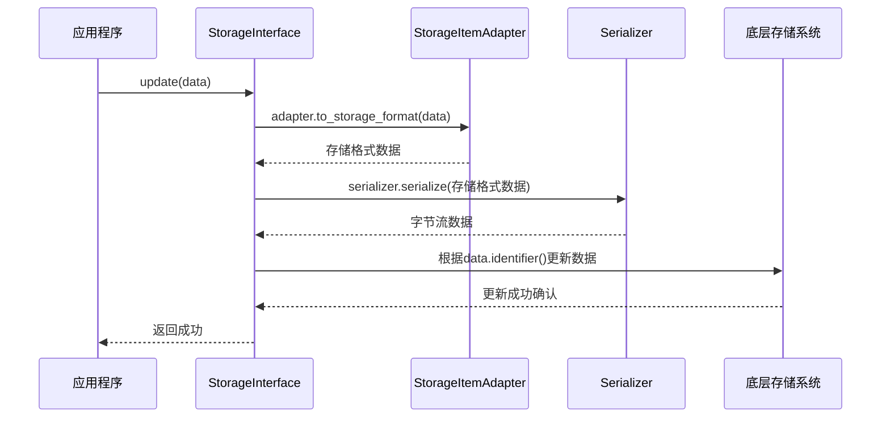
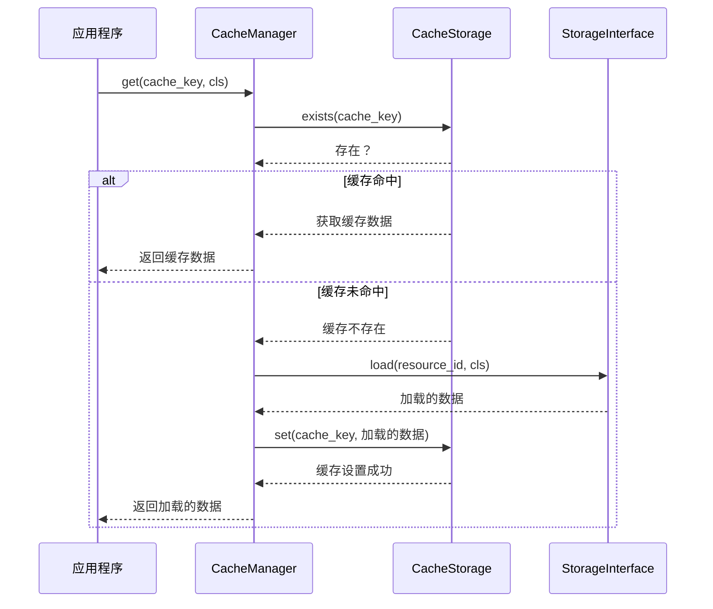
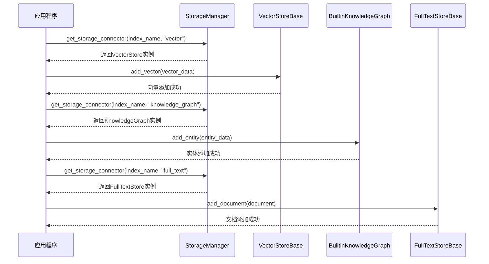
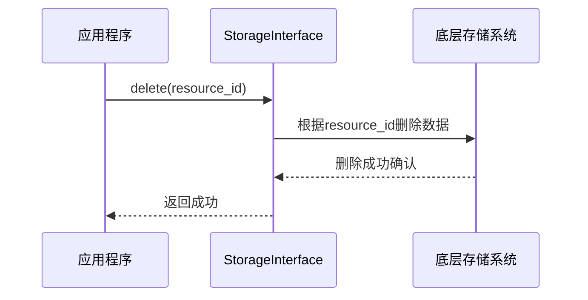

# DB-GPT 存储系统核心类分析

## 1. 存储系统概述

DB-GPT 存储系统是一个模块化、可扩展的存储框架，为不同类型的数据（向量、知识图谱、文本等）提供统一的存储和检索接口。该系统采用了分层架构设计，包括存储接口层、存储实现层、缓存管理层和 RAG 存储管理层等。

## 2. 类结构图

```mermaid
classDiagram
    class StorageInterface {<<interface>>}
    StorageInterface : +save(data: T) void
    StorageInterface : +update(data: T) void
    StorageInterface : +save_or_update(data: T) void
    StorageInterface : +load(resource_id: ID, cls: Type[T]) Optional[T]
    StorageInterface : +delete(resource_id: ID) void
    StorageInterface : +query(spec: QuerySpec, cls: Type[T]) List[T]
    StorageInterface : +count(spec: QuerySpec, cls: Type[T]) int
    StorageInterface : +serializer Serializer
    StorageInterface : +adapter StorageItemAdapter

    class ResourceIdentifier {<<interface>>}
    ResourceIdentifier : +str_identifier() str
    ResourceIdentifier : +__hash__() int
    ResourceIdentifier : +__eq__(other: Any) bool

    class StorageItem {<<interface>>}
    StorageItem : +identifier() ResourceIdentifier
    StorageItem : +merge(other: StorageItem) void

    class StorageItemAdapter {<<interface>>}
    StorageItemAdapter : +to_storage_format(item: T) TDataRepresentation
    StorageItemAdapter : +from_storage_format(data: TDataRepresentation) T
    StorageItemAdapter : +get_query_for_identifier(storage_format: Type[TDataRepresentation], resource_id: ResourceIdentifier, **kwargs) Any

    class DefaultStorageItemAdapter {
        +to_storage_format(item: T) T
        +from_storage_format(data: T) T
        +get_query_for_identifier(storage_format: Type[T], resource_id: ResourceIdentifier, **kwargs) bool
    }

    class QuerySpec {
        +conditions Dict[str, Any]
        +limit Optional[int]
        +offset int
    }

    class InMemoryStorage {
        +__init__(serializer: Optional[Serializer] = None)
        +save(data: T) void
        +update(data: T) void
        +save_or_update(data: T) void
        +load(resource_id: ID, cls: Type[T]) Optional[T]
        +delete(resource_id: ID) void
        +query(spec: QuerySpec, cls: Type[T]) List[T]
        +count(spec: QuerySpec, cls: Type[T]) int
        -_data Dict[str, bytes]
    }

    class CacheStorage {<<interface>>}
    CacheStorage : +get(key: CacheKey[K], cache_config: Optional[CacheConfig] = None) Optional[StorageItem]
    CacheStorage : +set(key: CacheKey[K], value: CacheValue[V], cache_config: Optional[CacheConfig] = None) void
    CacheStorage : +exists(key: CacheKey[K], cache_config: Optional[CacheConfig] = None) bool

    class MemoryCacheStorage {
        +__init__(max_memory_mb: int = 256)
        +get(key: CacheKey[K], cache_config: Optional[CacheConfig] = None) Optional[StorageItem]
        +set(key: CacheKey[K], value: CacheValue[V], cache_config: Optional[CacheConfig] = None) void
        +exists(key: CacheKey[K], cache_config: Optional[CacheConfig] = None) bool
        -cache OrderedDict
        -max_memory int
        -current_memory_usage int
    }

    class DiskCacheStorage {
        +set(key: CacheKey[K], value: CacheValue[V], cache_config: Optional[CacheConfig] = None) void
    }

    class CacheManager {<<interface>>}
    CacheManager : +set(key: CacheKey[K], value: CacheValue[V], cache_config: Optional[CacheConfig] = None)
    CacheManager : +get(key: CacheKey[K], cls: Type[Serializable], cache_config: Optional[CacheConfig] = None) Optional[CacheValue[V]]
    CacheManager : +serializer() Serializer

    class LocalCacheManager {
        +__init__(system_app: SystemApp, serializer: Serializer, storage: CacheStorage)
        +set(key: CacheKey[K], value: CacheValue[V], cache_config: Optional[CacheConfig] = None)
        +get(key: CacheKey[K], cls: Type[Serializable], cache_config: Optional[CacheConfig] = None) Optional[CacheValue[V]]
        +serializer() Serializer
        -_serializer Serializer
        -_storage CacheStorage
    }

    class StorageManager {
        +__init__(system_app: SystemApp)
        +get_storage_connector(index_name: str, storage_type: str, llm_model: Optional[str] = None) IndexStoreBase
        +create_vector_store(index_name) VectorStoreBase
        +create_kg_store(index_name, llm_model: Optional[str] = None) BuiltinKnowledgeGraph
        +create_full_text_store(index_name) FullTextStoreBase
        -_store_cache dict
        -_cache_lock threading.Lock
    }

    class Serializer {<<interface>>}
    Serializer : +serialize(data: Any) bytes
    Serializer : +deserialize(data: bytes, cls: Type[T]) T

    class JsonSerializer {
        +serialize(data: Any) bytes
        +deserialize(data: bytes, cls: Type[T]) T
    }

    StorageInterface <|-- InMemoryStorage
    StorageItemAdapter <|-- DefaultStorageItemAdapter
    CacheStorage <|-- MemoryCacheStorage
    CacheStorage <|-- DiskCacheStorage
    CacheManager <|-- LocalCacheManager
    Serializer <|-- JsonSerializer
    
    StorageInterface *-- Serializer
    StorageInterface *-- StorageItemAdapter
    StorageItem *-- ResourceIdentifier
    LocalCacheManager *-- Serializer
    LocalCacheManager *-- CacheStorage
    StorageManager *-- SystemApp
```

## 3. 类关系说明

### 3.1 继承关系

- `InMemoryStorage` 继承自 `StorageInterface`
- `DefaultStorageItemAdapter` 继承自 `StorageItemAdapter`
- `MemoryCacheStorage` 继承自 `CacheStorage`
- `DiskCacheStorage` 继承自 `CacheStorage`
- `LocalCacheManager` 继承自 `CacheManager`
- `JsonSerializer` 继承自 `Serializer`

### 3.2 组合关系

- `StorageInterface` 包含 `Serializer` 和 `StorageItemAdapter`
- `StorageItem` 包含 `ResourceIdentifier`
- `LocalCacheManager` 包含 `Serializer` 和 `CacheStorage`
- `StorageManager` 包含 `SystemApp`

## 4. 执行流程分析

### 4.1 数据存储流程

1. 应用程序调用存储实现类的 `save` 方法
2. 存储实现类使用 `StorageItemAdapter` 将数据转换为存储格式
3. 使用 `Serializer` 将数据序列化为字节流
4. 将序列化后的数据存储到底层存储介质

### 4.2 数据加载流程

1. 应用程序调用存储实现类的 `load` 方法
2. 根据资源标识符从底层存储介质加载数据
3. 使用 `Serializer` 将字节流反序列化为存储格式
4. 使用 `StorageItemAdapter` 将存储格式转换为应用程序格式
5. 返回加载的数据给应用程序

### 4.3 缓存流程

1. 应用程序调用 `CacheManager` 的 `get` 方法
2. `CacheManager` 检查缓存中是否存在请求的数据
3. 如果存在，返回缓存的数据
4. 如果不存在，从底层存储加载数据，存储到缓存中，然后返回数据

## 5. 技术特点

### 5.1 模块化设计

存储系统采用模块化设计，各组件之间通过接口进行通信，提高了系统的可扩展性和可维护性。

### 5.2 接口抽象

通过定义统一的接口，如 `StorageInterface`、`Serializer` 和 `StorageItemAdapter`，实现了存储实现与应用程序的解耦。

### 5.3 可插拔实现

系统支持多种存储实现、序列化方式和缓存策略，用户可以根据需求选择合适的实现。

### 5.4 缓存机制

内置的缓存机制可以提高数据访问性能，减少对底层存储的访问次数。

### 5.5 多种存储类型支持

支持向量存储、知识图谱存储和全文检索存储等多种存储类型，满足不同应用场景的需求。

## 6. 总结

DB-GPT 存储系统是一个功能强大、设计精良的存储框架，采用了现代化的软件架构设计理念。通过模块化、接口抽象和可插拔实现等技术特点，系统具有良好的扩展性、可维护性和性能。该存储系统为 DB-GPT 的各种功能提供了可靠的数据存储和检索支持，是整个系统的重要组成部分。

## 7. 使用场景分析

### 7.1 数据存储场景

**场景描述**：应用程序需要将数据持久化存储到存储系统中。

**时序图**：


### 7.2 数据加载场景

**场景描述**：应用程序需要从存储系统中加载特定标识符的数据。

**时序图**：


### 7.3 数据查询场景

**场景描述**：应用程序需要根据查询条件从存储系统中检索多条数据。

**时序图**：


### 7.4 数据更新场景

**场景描述**：应用程序需要更新存储系统中已有的数据。

**时序图**：


### 7.5 缓存使用场景

**场景描述**：应用程序通过缓存管理器访问数据，利用缓存提高性能。

**时序图**：


### 7.6 多类型存储使用场景

**场景描述**：应用程序通过StorageManager使用不同类型的存储（向量、知识图谱、全文检索）。

**时序图**：


### 7.7 数据删除场景

**场景描述**：应用程序需要从存储系统中删除特定标识符的数据。

**时序图**：


## 8. 使用场景总结

DB-GPT存储系统支持多种使用场景，满足不同应用需求：

1. **基础数据操作场景**：包括数据的存储、加载、查询、更新和删除，提供了统一的接口和灵活的实现方式。

2. **性能优化场景**：通过缓存机制减少对底层存储的访问，提高数据访问性能，适用于高频访问的场景。

3. **多类型数据处理场景**：支持向量数据、知识图谱数据和全文检索数据等多种数据类型，满足不同应用场景的需求。

4. **可扩展架构场景**：通过接口抽象和模块化设计，支持扩展新的存储实现、序列化方式和缓存策略。

这些使用场景覆盖了大多数数据存储需求，展示了DB-GPT存储系统的灵活性和强大功能。