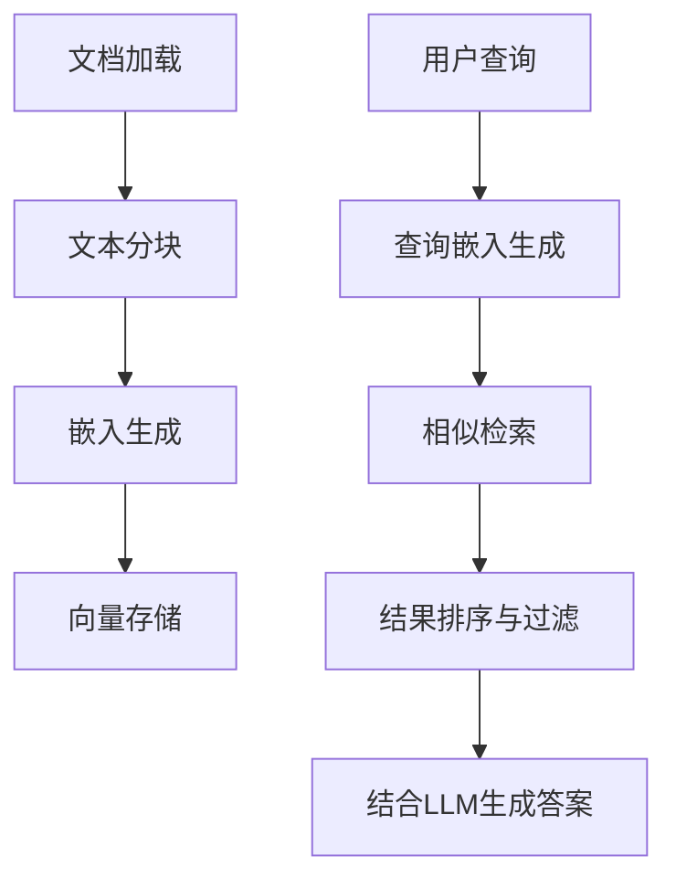
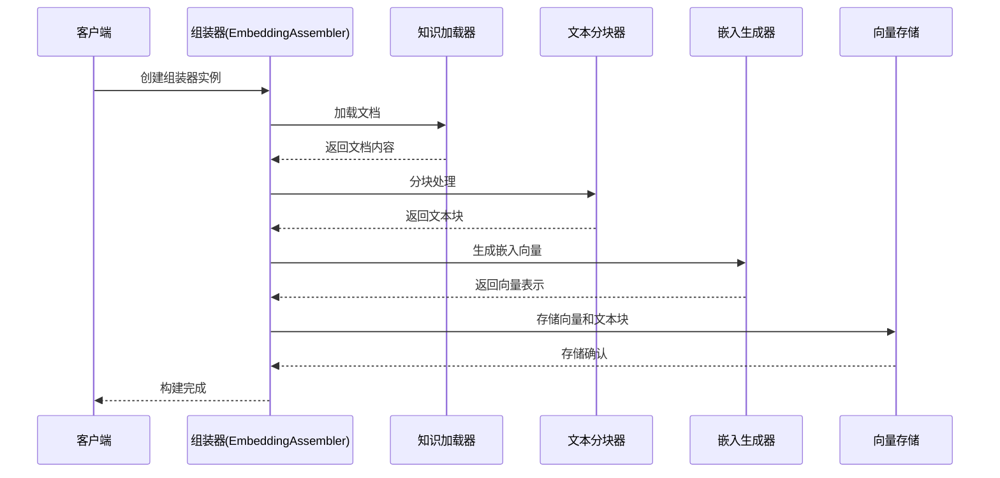
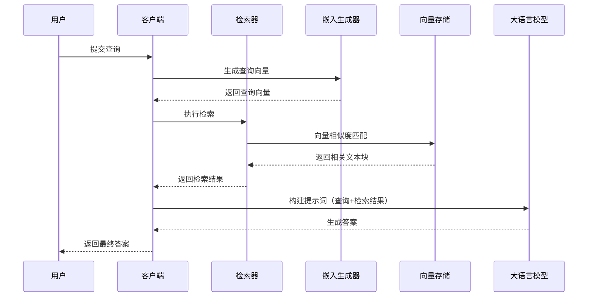
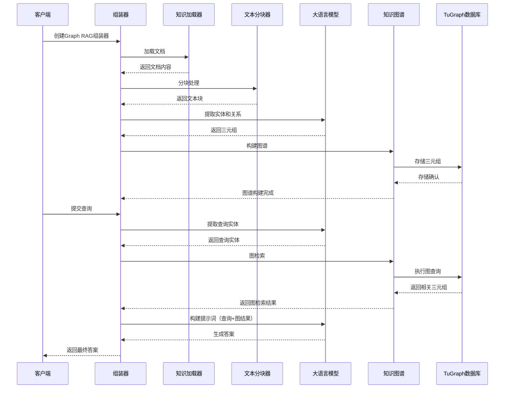
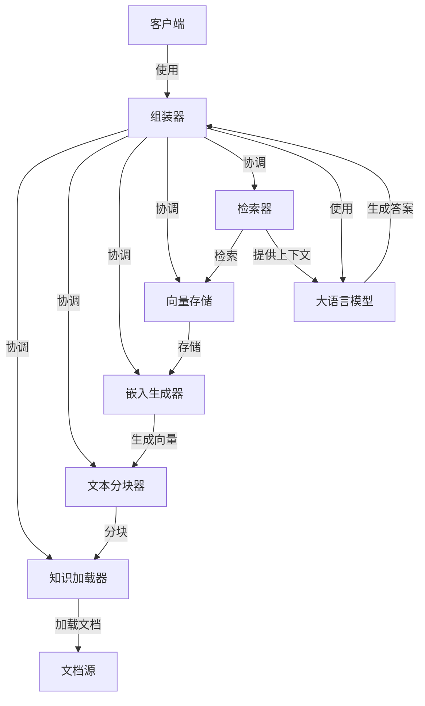
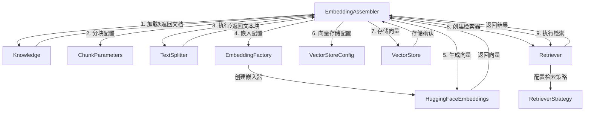
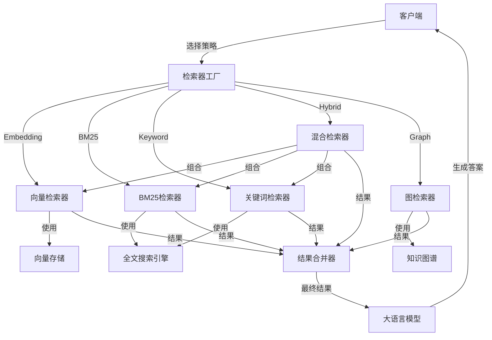
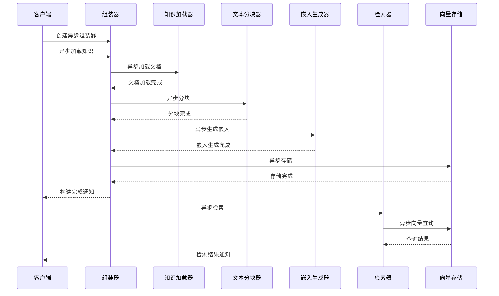

# DB-GPT RAG 架构与实现分析

## 1. 概述

DB-GPT实现了一个名为MS-RAG（Multi-Source Enhanced Retrieval-Augmented Generation Framework）的多源增强检索增强生成框架。该框架采用模块化设计，支持多种文档类型处理、灵活的分块策略、多种嵌入模型和向量存储后端，能够高效地构建知识检索系统。

## 2. 整体架构

DB-GPT的RAG系统采用分层架构设计，主要包含以下核心层次：

```
┌──────────────────────────────────────────────────────────┐
│                     应用层 (Application)                  │
├──────────────────────────────────────────────────────────┤
│                     生成层 (Generation)                   │
├──────────────────────────────────────────────────────────┤
│                     检索层 (Retrieval)                    │
├──────────────────────────────────────────────────────────┤
│                     向量存储层 (Vector Storage)           │
├──────────────────────────────────────────────────────────┤
│                     嵌入生成层 (Embedding)                │
├──────────────────────────────────────────────────────────┤
│                     文本分块层 (Text Splitting)           │
├──────────────────────────────────────────────────────────┤
│                     知识管理层 (Knowledge Management)     │
└──────────────────────────────────────────────────────────┘
```

## 3. 核心组件分析

### 3.1 知识管理层 (Knowledge Management)

知识管理层负责文档的加载、解析和预处理，支持多种文档类型。

#### 3.1.1 核心类

- **Knowledge基类**：定义了知识加载的统一接口
  - `load()`：加载知识文档
  - `extract()`：从文本中提取知识
  - `type()`：获取知识类型
  - `_load()`：子类实现的具体加载逻辑

#### 3.1.2 支持的文档类型

| 文档类型 | 描述 |
|---------|------|
| PDF     | 便携式文档格式 |
| CSV     | 逗号分隔值文件 |
| MARKDOWN | 标记语言文档 |
| PPTX    | PowerPoint文档 |
| DOCX    | Word文档 |
| TXT     | 纯文本文件 |
| HTML    | 网页文件 |
| DATASOURCE | 数据源连接 |
| EXCEL   | Excel表格 |
| DOC     | Word文档(旧格式) |

### 3.2 文本分块层 (Text Splitting)

文本分块层将文档分割成合适大小的块，便于后续的嵌入和检索。

#### 3.2.1 核心类

- **TextSplitter基类**：定义了分块的统一接口
  - `split_text()`：分割文本
  - `create_documents()`：从文本列表创建文档块
  - `split_documents()`：分割文档列表
  - `_merge_splits()`：合并小的分割块

#### 3.2.2 具体实现

| 分块器类型 | 描述 |
|-----------|------|
| CharacterTextSplitter | 基于字符分割 |
| RecursiveCharacterTextSplitter | 递归基于不同分隔符分割 |
| MarkdownHeaderTextSplitter | 基于Markdown标题分割 |
| PageTextSplitter | 基于页面分割 |
| ParagraphTextSplitter | 基于段落分割 |
| SeparatorTextSplitter | 基于自定义分隔符分割 |

#### 3.2.3 分块策略

DB-GPT支持多种分块策略，通过ChunkStrategy枚举定义：

- **CHUNK_BY_SIZE**：按大小分块，默认512个字符，重叠50个字符
- **CHUNK_BY_PAGE**：按页面分块
- **CHUNK_BY_PARAGRAPH**：按段落分块
- **CHUNK_BY_SEPARATOR**：按自定义分隔符分块
- **CHUNK_BY_MARKDOWN_HEADER**：按Markdown标题分块

### 3.3 嵌入生成层 (Embedding)

嵌入生成层将文本块转换为向量表示，支持多种嵌入模型。

#### 3.3.1 核心类

- **Embeddings基类**：定义了嵌入生成的统一接口
- **HuggingFaceEmbeddings**：使用HuggingFace的sentence_transformers生成嵌入

#### 3.3.2 支持的模型

- BGE系列模型
- JINA系列模型
- QWEN系列模型
- 其他sentence_transformers支持的模型

#### 3.3.3 主要参数

| 参数 | 描述 |
|------|------|
| model_name | 模型名称 |
| device | 运行设备（cpu、cuda等） |
| normalize_embeddings | 是否归一化嵌入 |
| multi_process | 是否使用多进程 |
| cache_folder | 模型缓存目录 |

### 3.4 向量存储层 (Vector Storage)

向量存储层负责存储向量数据并提供检索功能，支持多种存储后端。

#### 3.4.1 核心类

- **VectorStoreBase基类**：定义了向量存储的统一接口
  - `vector_name_exists()`：检查向量名称是否存在
  - `filter_by_score_threshold()`：按分数阈值过滤
  - `convert_metadata_filters()`：转换元数据过滤器
  - `_normalization_vectors()`：归一化向量
  - `_default_relevance_score_fn()`：计算相似度分数

#### 3.4.2 支持的存储后端

| 存储后端 | 安装命令 |
|---------|----------|
| Chroma | --extra storage_chroma |
| Milvus | --extra storage_milvus |
| Elasticsearch | --extra storage_elasticsearch |
| OceanBase | --extra storage_obvector |

### 3.5 检索层 (Retrieval)

检索层根据查询检索相关的文本块，支持多种检索策略。

#### 3.5.1 核心类

- **BaseRetriever基类**：定义了检索的统一接口
  - `retrieve()`：同步检索
  - `aretrieve()`：异步检索
  - `retrieve_with_scores()`：带分数阈值的同步检索
  - `aretrieve_with_scores()`：带分数阈值的异步检索

#### 3.5.2 支持的检索策略

通过RetrieverStrategy枚举定义：

- **EMBEDDING/SEMANTIC**：基于语义相似度检索
- **KEYWORD**：基于关键词检索
- **BM25**：基于统计的检索算法，通过逆文档频率和词频计算相关性
- **HYBRID**：混合检索
- **GRAPH**：基于图的检索
- **Tree**：基于树结构的检索
- **Cross-Encoder Rerank**：使用交叉编码器对检索结果进行重排序，提高相关性

### 3.6 图检索增强 (Graph RAG)

DB-GPT支持Graph RAG，通过构建知识图谱来增强检索能力，提高检索的可解释性和准确性。

#### 3.6.1 核心类

- **BuiltinKnowledgeGraph**：基础知识图谱实现
- **CommunitySummaryKnowledgeGraph**：社区摘要知识图谱，支持社区检测和摘要生成

#### 3.6.2 工作流程

1. **知识提取**：从文本中提取实体和关系
2. **图谱构建**：构建实体-关系-实体的三元组图谱
3. **社区检测**：识别图谱中的社区结构
4. **社区摘要**：为每个社区生成摘要
5. **图检索**：基于图谱结构进行检索
6. **答案生成**：结合图谱信息生成答案

#### 3.6.3 支持的图数据库

- **TuGraph**：高性能图数据库，支持大数据容量和低延迟查找

#### 3.6.4 性能特点

与传统GraphRAG相比，DB-GPT的Graph RAG具有以下优势：

| 指标 | DB-GPT | GraphRAG(microsoft) |
|------|--------|---------------------|
| 索引时间 | 170s | 210s |
| 查询时间 | 8s | 40s |
| 总令牌数 | 417565 | 972220 |
| 查询令牌数 | 7432 | 63317 |

## 4. 工作流程

DB-GPT的RAG系统工作流程如下：



1. **文档加载**：通过Knowledge类加载各种类型的文档
2. **文本分块**：使用TextSplitter将文档分割成合适大小的块
3. **嵌入生成**：使用Embeddings将文本块转换为向量
4. **向量存储**：将向量和对应的文本块存储到向量数据库中
5. **查询处理**：接收用户查询，生成查询嵌入
6. **相似检索**：在向量数据库中检索与查询相似的文本块
7. **结果排序与过滤**：根据相似度分数排序并过滤结果
8. **答案生成**：结合检索到的文本块和LLM生成最终答案

## 5. 架构特点

1. **模块化设计**：各组件解耦，便于扩展和维护
2. **多后端支持**：支持多种向量存储后端和嵌入模型
3. **灵活配置**：各组件都支持丰富的参数配置
4. **异步支持**：关键操作支持异步接口，提高性能
5. **可扩展性**：支持自定义知识加载器、分块器、嵌入模型等
6. **多模态支持**：支持多种文档类型的处理
7. **多检索策略**：支持语义、关键词、混合、图等多种检索策略

## 6. 代码示例

### 6.1 嵌入检索示例 (Embedding RAG)

```python
import asyncio
import os

from dbgpt.configs.model_config import MODEL_PATH, PILOT_PATH, ROOT_PATH
from dbgpt.rag.embedding import DefaultEmbeddingFactory
from dbgpt_ext.rag import ChunkParameters
from dbgpt_ext.rag.assembler import EmbeddingAssembler
from dbgpt_ext.rag.knowledge import KnowledgeFactory
from dbgpt_ext.storage.vector_store.chroma_store import ChromaStore, ChromaVectorConfig

# 创建向量数据库连接
def _create_vector_connector():
    config = ChromaVectorConfig(persist_path=PILOT_PATH)
    return ChromaStore(
        config,
        name="embedding_rag_test",
        embedding_fn=DefaultEmbeddingFactory(
            default_model_name=os.path.join(MODEL_PATH, "text2vec-large-chinese")
        ).create(),
    )

async def main():
    # 加载文档
    file_path = os.path.join(ROOT_PATH, "docs/docs/awel/awel.md")
    knowledge = KnowledgeFactory.from_file_path(file_path)
    
    # 创建嵌入组装器
    assembler = EmbeddingAssembler.load_from_knowledge(
        knowledge=knowledge,
        chunk_parameters=ChunkParameters(chunk_strategy="CHUNK_BY_SIZE"),
        index_store=_create_vector_connector(),
    )
    
    # 持久化知识
    assembler.persist()
    
    # 检索
    retriever = assembler.as_retriever(3)
    chunks = await retriever.aretrieve_with_scores("what is awel talk about", 0.3)
    print(f"embedding rag example results:{chunks}")

if __name__ == "__main__":
    asyncio.run(main())
```

### 6.2 BM25检索示例

```python
import asyncio
import os

from dbgpt.configs.model_config import ROOT_PATH
from dbgpt_ext.rag import ChunkParameters
from dbgpt_ext.rag.assembler.bm25 import BM25Assembler
from dbgpt_ext.rag.knowledge import KnowledgeFactory
from dbgpt_ext.storage.vector_store.elastic_store import ElasticsearchStoreConfig

# 创建Elasticsearch配置
def _create_es_config():
    return ElasticsearchStoreConfig(
        uri="localhost",
        port="9200",
        user="elastic",
        password="dbgpt",
    )

async def main():
    # 加载文档
    file_path = os.path.join(ROOT_PATH, "docs/docs/awel/awel.md")
    knowledge = KnowledgeFactory.from_file_path(file_path)
    
    # 创建BM25组装器
    assembler = BM25Assembler.load_from_knowledge(
        knowledge=knowledge,
        es_config=_create_es_config(),
        chunk_parameters=ChunkParameters(chunk_strategy="CHUNK_BY_SIZE"),
    )
    
    # 持久化知识
    assembler.persist()
    
    # 检索
    retriever = assembler.as_retriever(3)
    chunks = retriever.retrieve_with_scores("what is awel talk about", 0.3)
    print(f"bm25 rag example results:{chunks}")

if __name__ == "__main__":
    asyncio.run(main())
```

### 6.3 交叉编码器重排序示例

```python
import asyncio
import os

from dbgpt.configs.model_config import MODEL_PATH, PILOT_PATH, ROOT_PATH
from dbgpt.rag.embedding import DefaultEmbeddingFactory
from dbgpt.rag.retriever.rerank import CrossEncoderRanker
from dbgpt_ext.rag import ChunkParameters
from dbgpt_ext.rag.assembler import EmbeddingAssembler
from dbgpt_ext.rag.knowledge import KnowledgeFactory
from dbgpt_ext.storage.vector_store.chroma_store import ChromaStore, ChromaVectorConfig

# 创建向量数据库连接
def _create_vector_connector():
    config = ChromaVectorConfig(persist_path=PILOT_PATH)
    return ChromaStore(
        config,
        name="embedding_rag_test",
        embedding_fn=DefaultEmbeddingFactory(
            default_model_name=os.path.join(MODEL_PATH, "text2vec-large-chinese")
        ).create(),
    )

async def main():
    # 加载文档
    file_path = os.path.join(ROOT_PATH, "docs/docs/awel/awel.md")
    knowledge = KnowledgeFactory.from_file_path(file_path)
    
    # 创建嵌入组装器
    assembler = EmbeddingAssembler.load_from_knowledge(
        knowledge=knowledge,
        chunk_parameters=ChunkParameters(chunk_strategy="CHUNK_BY_MARKDOWN_HEADER"),
        index_store=_create_vector_connector(),
    )
    
    # 持久化知识
    assembler.persist()
    
    # 检索
    retriever = assembler.as_retriever(3)
    query = "what is awel talk about"
    chunks = await retriever.aretrieve_with_scores(query, 0.3)
    
    print("before rerank results:")
    for i, chunk in enumerate(chunks):
        print(f"----{i + 1}.chunk content:{chunk.content}\n score:{chunk.score}")
    
    # 交叉编码器重排序
    cross_encoder_model = os.path.join(MODEL_PATH, "bge-reranker-base")
    rerank = CrossEncoderRanker(topk=3, model=cross_encoder_model)
    new_chunks = rerank.rank(chunks, query=query)
    
    print("after cross-encoder rerank results:")
    for i, chunk in enumerate(new_chunks):
        print(f"----{i + 1}.chunk content:{chunk.content}\n score:{chunk.score}")

if __name__ == "__main__":
    asyncio.run(main())
```

### 6.4 Graph RAG示例

```python
import os

from dbgpt.configs.model_config import ROOT_PATH
from dbgpt.core import HumanPromptTemplate, ModelMessage, ModelRequest
from dbgpt.model.proxy.llms.chatgpt import OpenAILLMClient
from dbgpt.rag.retriever import RetrieverStrategy
from dbgpt_ext.rag import ChunkParameters
from dbgpt_ext.rag.assembler import EmbeddingAssembler
from dbgpt_ext.rag.knowledge import KnowledgeFactory
from dbgpt_ext.storage.graph_store.tugraph_store import TuGraphStoreConfig
from dbgpt_ext.storage.knowledge_graph.knowledge_graph import BuiltinKnowledgeGraph

# 初始化LLM客户端
llm_client = OpenAILLMClient()
model_name = "gpt-4o-mini"

# 创建知识图谱连接
knowledge_graph = BuiltinKnowledgeGraph(
    config=TuGraphStoreConfig(),
    name="graph_rag_test",
    embedding_fn=None,
    llm_client=llm_client,
    llm_model=model_name,
)

# 加载知识
file_path = os.path.join(ROOT_PATH, "examples/test_files/graphrag-mini.md")
knowledge = KnowledgeFactory.from_file_path(file_path)

# 创建分块参数
chunk_parameters = ChunkParameters(chunk_strategy="CHUNK_BY_SIZE")

# 创建嵌入组装器
assembler = await EmbeddingAssembler.aload_from_knowledge(
    knowledge=knowledge,
    chunk_parameters=chunk_parameters,
    index_store=knowledge_graph,
    retrieve_strategy=RetrieverStrategy.GRAPH,
)

# 持久化知识
await assembler.apersist()

# 检索
retriever = assembler.as_retriever(1)
question = "What's the relationship between TuGraph and DB-GPT ?"
chunks = await retriever.aretrieve_with_scores(question, score_threshold=0.3)

# 生成答案
if chunks:
    rag_template = "Based on the following [Context] {context}, answer [Question] {question}."
    template = HumanPromptTemplate.from_template(rag_template)
    messages = template.format_messages(context=chunks[0].content, question=question)
    model_messages = ModelMessage.from_base_messages(messages)
    request = ModelRequest(model=model_name, messages=model_messages)
    response = await llm_client.generate(request=request)
    print(response.text)
```

## 7. 总结

DB-GPT的RAG系统采用了分层架构设计，支持多源数据输入、多种分块策略、灵活的嵌入模型、多样化的向量存储后端和丰富的检索策略。系统通过组件化设计实现了高扩展性和灵活性，同时提供了完整的RAG流程支持，从文档加载到答案生成。

核心特点包括：

1. **模块化设计**：各组件解耦，便于扩展和替换
2. **多源数据支持**：支持多种文档格式和数据源
3. **灵活的分块策略**：支持按大小、页面、段落等多种分块方式
4. **多样化的向量存储**：支持Chroma、Milvus、Elasticsearch等多种后端
5. **多种检索策略**：支持语义检索、关键词检索、BM25检索、混合检索等
6. **重排序机制**：支持交叉编码器重排序，提高检索结果质量
7. **异步支持**：提供异步API，提高性能
8. **Graph RAG支持**：通过知识图谱增强检索能力，减少LLM推理幻觉

## 8. 检索策略对比

| 检索策略 | 技术原理 | 优点 | 缺点 | 适用场景 |
|---------|---------|------|------|---------|
| **Embedding** | 语义相似度 | 理解上下文语义，支持自然语言查询 | 计算成本高，对长文本效果一般 | 自然语言问答 |
| **BM25** | 词频统计 | 计算速度快，对短文本效果好 | 不理解上下文语义 | 关键词精确检索 |
| **Keyword** | 关键词匹配 | 实现简单，性能高 | 不理解语义，容易漏检 | 精确关键词查询 |
| **Hybrid** | 多策略结合 | 结合多种策略优点，提高召回率 | 实现复杂，资源消耗大 | 综合要求高的场景 |
| **GRAPH** | 知识图谱 | 理解实体关系，减少幻觉 | 构建复杂，维护成本高 | 需要关系推理的场景 |
| **Tree** | 层次结构 | 保持文档结构信息 | 检索算法复杂 | 需要上下文结构的场景 |


# DB-GPT RAG 执行时序图与交互图分析

## 1. 概述

本文档通过时序图和交互图可视化DB-GPT RAG系统的执行流程和组件交互，帮助理解各模块之间的协作关系和数据流向。

## 2. 核心组件回顾

在分析时序和交互之前，先回顾DB-GPT RAG系统的核心组件：

| 组件 | 描述 |
|------|------|
| Knowledge | 知识加载器，负责从各种数据源加载文档 |
| TextSplitter | 文本分块器，将文档分割成合适大小的块 |
| Embeddings | 嵌入生成器，将文本转换为向量表示 |
| VectorStore | 向量存储，存储向量数据并提供检索功能 |
| Retriever | 检索器，根据查询获取相关文档块 |
| Assembler | 组装器，协调各组件完成RAG流程 |
| LLM | 大语言模型，用于生成最终答案 |
| KnowledgeGraph | 知识图谱（可选），用于Graph RAG增强检索 |

## 3. RAG执行时序图

### 3.1 知识构建阶段时序图

知识构建阶段涉及文档加载、分块、嵌入生成和向量存储的完整流程：



### 3.2 检索与生成阶段时序图

检索与生成阶段展示用户查询到最终答案生成的完整流程：



### 3.3 Graph RAG执行时序图

Graph RAG流程展示知识图谱构建和基于图的检索增强：



## 4. 组件交互图

### 4.1 核心组件交互图

展示RAG系统核心组件之间的静态关系和交互模式：



### 4.2 组装器内部交互图

展示组装器内部各组件的详细交互：



### 4.3 多检索策略交互图

展示不同检索策略的组件交互差异：



## 5. 关键交互流程分析

### 5.1 知识构建流程

1. **初始化阶段**：客户端创建组装器实例，配置知识源、分块参数、嵌入模型和向量存储
2. **知识加载**：知识加载器从指定源加载文档，支持多种格式（PDF、Markdown、Word等）
3. **文本分块**：文本分块器根据配置的策略将文档分割成合适大小的块
4. **嵌入生成**：嵌入生成器将文本块转换为向量表示
5. **向量存储**：向量和对应的文本块存储到向量数据库中
6. **检索器创建**：组装器创建检索器实例，用于后续查询

### 5.2 查询处理流程

1. **查询接收**：客户端接收用户查询
2. **向量生成**：嵌入生成器将查询转换为向量
3. **相似检索**：检索器在向量数据库中查找最相似的文本块
4. **结果过滤**：根据相似度分数过滤结果
5. **提示词构建**：将查询和检索结果构建为LLM的提示词
6. **答案生成**：LLM基于提示词生成最终答案
7. **结果返回**：客户端将答案返回给用户

### 5.3 Graph RAG增强流程

1. **实体关系提取**：LLM从文本块中提取实体和关系，构建三元组
2. **图谱构建**：将三元组存储到图数据库中，构建知识图谱
3. **图检索**：基于查询中的实体在知识图谱中查找相关的实体和关系
4. **关系推理**：利用图谱中的关系进行推理，增强上下文理解
5. **结果融合**：将图检索结果与向量检索结果融合
6. **增强生成**：LLM基于融合后的上下文生成更准确的答案

## 6. 异步交互模式

DB-GPT RAG系统支持异步交互模式，提高系统性能和响应速度：



## 7. 总结

通过时序图和交互图，我们可以清晰地看到DB-GPT RAG系统的执行流程和组件交互：

1. **模块化设计**：各组件职责明确，通过组装器协调工作
2. **灵活的扩展点**：支持多种文档格式、分块策略、嵌入模型和向量存储
3. **多样化的检索策略**：提供语义检索、BM25、关键词、混合和图检索等多种选择
4. **异步支持**：关键操作支持异步接口，提高系统性能
5. **Graph RAG增强**：通过知识图谱提升检索的准确性和可解释性

这些图表帮助我们更好地理解DB-GPT RAG系统的内部工作机制，为系统的使用、扩展和优化提供了可视化参考。

# DB-GPT RAG 核心技术与实现方法分析

## 1. 概述

DB-GPT的RAG（Retrieval-Augmented Generation）系统实现了一个名为MS-RAG的多源增强检索增强生成框架。本文档将深入分析该系统的核心技术和实现方法，包括分块策略、嵌入生成、向量存储、检索算法和Graph RAG等关键技术点。

## 2. 核心技术体系

DB-GPT RAG系统的核心技术体系包括以下几个关键部分：

```
┌──────────────────────────────────────────────────────────┐
│                     文本分块技术                          │
├──────────────────────────────────────────────────────────┤
│                     嵌入生成技术                          │
├──────────────────────────────────────────────────────────┤
│                     向量存储技术                          │
├──────────────────────────────────────────────────────────┤
│                     检索算法技术                          │
├──────────────────────────────────────────────────────────┤
│                     重排序技术                            │
├──────────────────────────────────────────────────────────┤
│                     Graph RAG技术                        │
└──────────────────────────────────────────────────────────┘
```

## 3. 文本分块技术

### 3.1 核心实现

文本分块是RAG系统的第一步，负责将长文档分割成合适大小的块，便于后续的嵌入和检索。DB-GPT实现了多种分块策略，通过`TextSplitter`基类统一接口：

```python
class TextSplitter(ABC):
    """文本分块器基类"""
    
    @abstractmethod
    def split_text(self, text: str) -> List[str]:
        """分割文本"""
        pass
    
    @abstractmethod
    def create_documents(self, texts: List[str]) -> List[Document]:
        """从文本列表创建文档块"""
        pass
    
    @abstractmethod
    def split_documents(self, documents: List[Document]) -> List[Document]:
        """分割文档列表"""
        pass
```

### 3.2 分块策略

DB-GPT支持多种分块策略，通过`ChunkStrategy`枚举定义：

| 策略类型 | 实现类 | 描述 | 适用场景 |
|---------|-------|------|---------|
| **CHUNK_BY_SIZE** | `RecursiveCharacterTextSplitter` | 按大小分块，默认512字符，重叠50字符 | 通用场景 |
| **CHUNK_BY_PAGE** | `PageTextSplitter` | 按页面分块 | PDF文档 |
| **CHUNK_BY_PARAGRAPH** | `ParagraphTextSplitter` | 按段落分块 | 结构化文本 |
| **CHUNK_BY_SEPARATOR** | `SeparatorTextSplitter` | 按自定义分隔符分块 | 特殊格式文档 |
| **CHUNK_BY_MARKDOWN_HEADER** | `MarkdownHeaderTextSplitter` | 按Markdown标题分块 | Markdown文档 |

### 3.3 实现特点

1. **递归分块算法**：`RecursiveCharacterTextSplitter`使用递归策略，尝试按不同分隔符（换行、句子、单词）分割文本，确保分块的语义完整性
2. **重叠机制**：分块之间保留一定重叠（默认50字符），避免重要信息被分割到两个块中
3. **自适应调整**：根据文本类型和内容自动选择合适的分块策略
4. **元数据保留**：分块时保留原始文档的元数据（如页码、标题等），便于后续检索和引用

## 4. 嵌入生成技术

### 4.1 核心实现

嵌入生成是将文本转换为向量表示的过程，DB-GPT通过`Embeddings`基类和`HuggingFaceEmbeddings`实现：

```python
class HuggingFaceEmbeddings(Embeddings):
    """使用HuggingFace的sentence_transformers生成嵌入"""
    
    def __init__(self, model_name: str, device: str = "cpu", normalize_embeddings: bool = True):
        self.model_name = model_name
        self.device = device
        self.normalize_embeddings = normalize_embeddings
        self.model = SentenceTransformer(self.model_name, device=self.device)
    
    def embed_documents(self, texts: List[str]) -> List[List[float]]:
        """生成文档嵌入"""
        embeddings = self.model.encode(texts, normalize_embeddings=self.normalize_embeddings)
        return embeddings.tolist()
    
    def embed_query(self, text: str) -> List[float]:
        """生成查询嵌入"""
        embedding = self.model.encode(text, normalize_embeddings=self.normalize_embeddings)
        return embedding.tolist()
```

### 4.2 关键技术点

1. **模型选择**：支持BGE、JINA、QWEN等多种embedding模型，可根据需要选择不同模型
2. **设备优化**：支持CPU、GPU等不同设备运行，自动选择最佳运行设备
3. **多GPU处理**：支持多GPU并行处理，提高大规模文档嵌入的效率
4. **向量归一化**：默认对嵌入向量进行归一化处理，提高检索精度
5. **批处理优化**：对文本进行批量处理，提高嵌入生成效率

### 4.3 实现优势

1. **高性能**：使用sentence_transformers库的优化实现，生成嵌入的速度快
2. **高精度**：支持多种高质量的嵌入模型，生成的向量具有较好的语义表示能力
3. **灵活性**：支持自定义模型、设备和参数，适应不同场景需求
4. **可扩展性**：易于集成新的嵌入模型和优化方法

## 5. 向量存储技术

### 5.1 核心实现

向量存储负责存储向量数据并提供检索功能，DB-GPT通过`VectorStoreBase`基类实现统一接口：

```python
class VectorStoreBase(IndexStoreBase, ABC):
    """向量存储基类"""
    
    @abstractmethod
    def load_document(self, documents: List[Document], **kwargs) -> List[str]:
        """加载文档到向量存储"""
        pass
    
    @abstractmethod
    def retrieve(self, query: str, topk: int, **kwargs) -> List[Document]:
        """检索相关文档"""
        pass
    
    @abstractmethod
    def retrieve_with_scores(self, query: str, topk: int, **kwargs) -> List[Tuple[Document, float]]:
        """带分数的检索"""
        pass
```

### 5.2 支持的存储后端

| 存储后端 | 实现类 | 特点 | 适用场景 |
|---------|-------|------|---------|
| **Chroma** | `ChromaStore` | 轻量级，易于部署 | 开发和测试环境 |
| **Milvus** | `MilvusStore` | 高性能，支持大规模数据 | 生产环境，大数据量 |
| **Elasticsearch** | `ElasticStore` | 支持全文搜索和向量检索 | 需要混合检索的场景 |
| **OceanBase** | `ObVectorStore` | 分布式，高可用 | 企业级生产环境 |

### 5.3 核心技术点

1. **元数据过滤**：支持基于元数据的过滤，提高检索精度
2. **向量索引**：使用高效的向量索引算法（如HNSW），提高检索速度
3. **相似度计算**：支持余弦相似度、欧氏距离等多种相似度计算方法
4. **批量操作**：支持批量加载和检索，提高处理效率
5. **事务支持**：部分存储后端支持事务，确保数据一致性

## 6. 检索算法技术

### 6.1 核心实现

DB-GPT支持多种检索策略，通过`RetrieverStrategy`枚举定义：

```python
class RetrieverStrategy(str, Enum):
    EMBEDDING = "embedding"
    SEMANTIC = "semantic"  # 与EMBEDDING相同
    KEYWORD = "keyword"
    BM25 = "bm25"
    HYBRID = "hybrid"
    GRAPH = "graph"
    Tree = "tree"
```

### 6.2 主要检索算法

#### 6.2.1 语义检索（Embedding/Semantic）

**技术原理**：将查询和文档转换为向量表示，计算向量之间的相似度
**实现方法**：使用HuggingFaceEmbeddings生成向量，通过向量存储的相似度检索功能实现
**优势**：理解上下文语义，支持自然语言查询
**缺点**：计算成本高，对长文本效果一般

#### 6.2.2 BM25检索

**技术原理**：基于词频统计的检索算法，通过逆文档频率（IDF）和词频（TF）计算相关性
**实现方法**：使用Elasticsearch的BM25算法实现
**优势**：计算速度快，对短文本效果好
**缺点**：不理解上下文语义

#### 6.2.3 关键词检索

**技术原理**：基于关键词匹配的检索算法
**实现方法**：使用Elasticsearch的全文搜索功能实现
**优势**：实现简单，性能高
**缺点**：不理解语义，容易漏检

#### 6.2.4 混合检索

**技术原理**：结合多种检索策略的优点，提高召回率
**实现方法**：同时使用语义检索和关键词/BM25检索，融合检索结果
**优势**：结合多种策略优点，提高检索效果
**缺点**：实现复杂，资源消耗大

#### 6.2.5 Graph检索

**技术原理**：基于知识图谱的检索算法，通过实体关系推理提高检索精度
**实现方法**：构建知识图谱，基于图结构进行检索
**优势**：理解实体关系，减少幻觉
**缺点**：构建复杂，维护成本高

### 6.3 重排序技术

DB-GPT支持使用交叉编码器对检索结果进行重排序，提高检索结果的质量：

```python
class CrossEncoderRanker(Rerank):
    """使用交叉编码器对检索结果进行重排序"""
    
    def __init__(self, topk: int, model: str):
        self.topk = topk
        self.model = CrossEncoder(model)
    
    def rank(self, chunks: List[Document], query: str) -> List[Document]:
        """对检索结果进行重排序"""
        pairs = [[query, chunk.content] for chunk in chunks]
        scores = self.model.predict(pairs)
        
        # 按分数排序
        scored_chunks = list(zip(chunks, scores))
        scored_chunks.sort(key=lambda x: x[1], reverse=True)
        
        # 返回topk结果
        return [chunk for chunk, score in scored_chunks[:self.topk]]
```

## 7. Graph RAG技术

### 7.1 核心实现

DB-GPT的Graph RAG通过构建知识图谱来增强检索能力，核心实现包括：

```python
class BuiltinKnowledgeGraph(VectorStoreBase):
    """基础知识图谱实现"""
    
    def __init__(self, config: TuGraphStoreConfig, name: str, embedding_fn: Embeddings, llm_client: BaseLLMClient, llm_model: str):
        self.config = config
        self.name = name
        self.embedding_fn = embedding_fn
        self.llm_client = llm_client
        self.llm_model = llm_model
    
    async def load_document(self, documents: List[Document], **kwargs) -> List[str]:
        """加载文档并构建知识图谱"""
        # 1. 实体和关系提取
        # 2. 三元组构建
        # 3. 图谱存储
        pass
    
    async def retrieve(self, query: str, topk: int, **kwargs) -> List[Document]:
        """基于图谱的检索"""
        # 1. 查询实体提取
        # 2. 图查询
        # 3. 结果处理
        pass
```

### 7.2 关键技术点

1. **实体关系提取**：使用LLM从文本中提取实体和关系，构建三元组
2. **知识图谱构建**：将三元组存储到图数据库中，构建知识图谱
3. **社区检测**：识别图谱中的社区结构，发现相关实体集合
4. **社区摘要**：为每个社区生成摘要，提高检索效率
5. **图检索算法**：基于图谱结构进行检索，发现实体之间的关系

### 7.3 实现优势

1. **减少幻觉**：通过知识图谱的实体关系约束，减少LLM生成的幻觉
2. **提高可解释性**：检索结果可以追溯到具体的实体和关系，提高结果的可解释性
3. **增强推理能力**：通过实体关系推理，提高对复杂查询的处理能力
4. **高性能**：与传统GraphRAG相比，查询时间从40秒减少到8秒，查询令牌数从63317减少到7432

## 8. 实现方法的特点

### 8.1 模块化设计

DB-GPT RAG系统采用模块化设计，各组件之间通过统一接口交互，便于扩展和替换：

1. **松耦合**：组件之间通过接口交互，降低耦合度
2. **可插拔**：支持自定义组件，如自定义分块器、嵌入模型等
3. **可配置**：通过配置参数调整组件行为，适应不同场景需求

### 8.2 异步支持

系统提供异步API，提高性能和响应速度：

```python
async def aretrieve(self, query: str, topk: int, **kwargs) -> List[Document]:
    """异步检索相关文档"""
    pass

async def aretrieve_with_scores(self, query: str, topk: int, **kwargs) -> List[Tuple[Document, float]]:
    """异步带分数的检索"""
    pass
```

### 8.3 多源数据支持

支持多种数据源和文档格式：

| 数据源类型 | 支持格式 |
|-----------|---------|
| 文件 | PDF、CSV、MARKDOWN、PPTX、DOCX、TXT、HTML、EXCEL、DOC |
| 数据库 | MySQL、PostgreSQL、SQLite等 |
| 网页 | HTTP/HTTPS网页 |

### 8.4 性能优化

1. **批处理**：对文本、嵌入和检索进行批处理，提高处理效率
2. **缓存机制**：缓存模型和结果，减少重复计算
3. **并行处理**：支持多线程和多进程并行处理，提高系统吞吐量
4. **索引优化**：使用高效的索引结构，提高检索速度

## 9. 技术创新点

1. **多策略分块**：支持多种分块策略，适应不同类型的文档
2. **混合检索**：结合语义检索和关键词/BM25检索，提高检索效果
3. **交叉编码器重排序**：使用交叉编码器对检索结果进行重排序，提高检索精度
4. **Graph RAG增强**：通过知识图谱增强检索能力，减少LLM推理幻觉
5. **高性能实现**：与传统GraphRAG相比，查询时间和令牌消耗显著减少

## 10. 应用场景

DB-GPT RAG系统的核心技术和实现方法使其适用于多种应用场景：

1. **问答系统**：构建基于文档的问答系统，提供准确的答案
2. **知识管理**：实现企业知识的有效管理和检索
3. **文档检索**：快速检索和定位文档中的相关信息
4. **数据分析**：结合数据和文档，提供数据分析和洞察
5. **教育辅导**：基于教材和资料，提供个性化的教育辅导

## 11. 总结

DB-GPT的RAG系统通过创新的技术设计和实现方法，构建了一个高效、灵活、可扩展的多源增强检索增强生成框架。核心技术包括多策略分块、高性能嵌入生成、多样化向量存储、多种检索算法和Graph RAG增强等。系统采用模块化设计，支持异步操作和多源数据，具有高性能和高可扩展性，适用于多种企业级应用场景。

通过对这些核心技术和实现方法的深入理解，可以更好地使用和扩展DB-GPT的RAG系统，为各种应用场景提供高质量的知识检索和生成服务。

