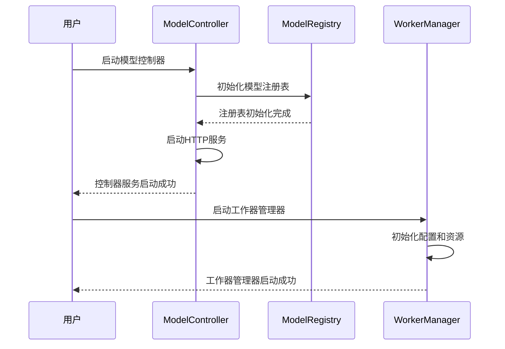
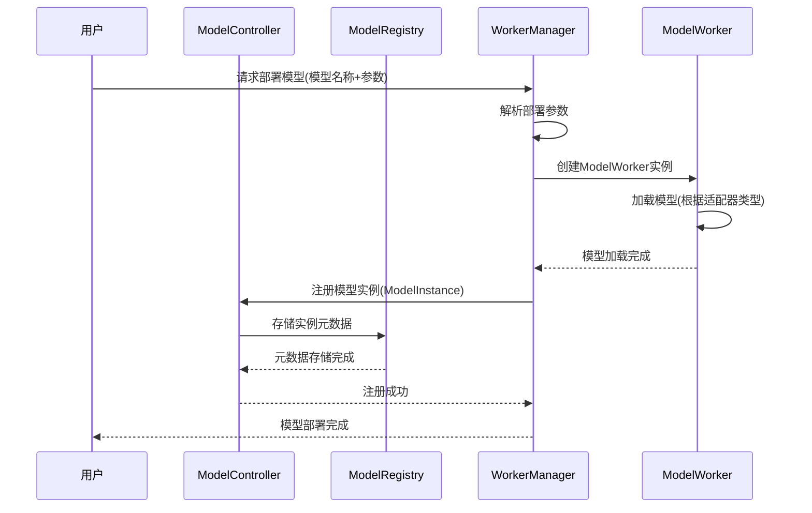
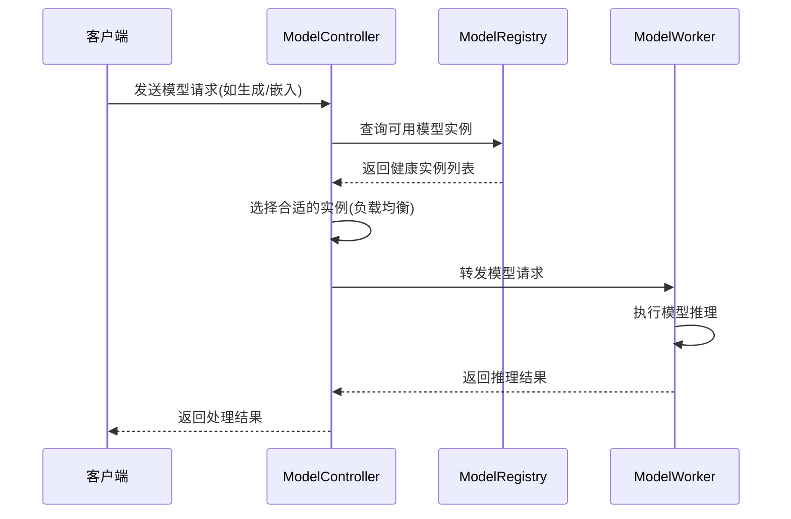
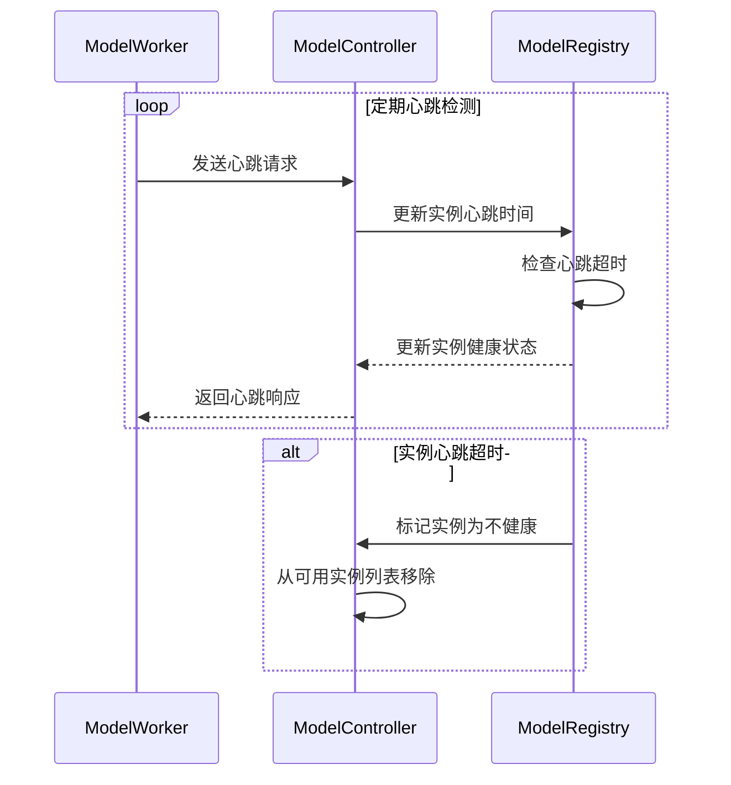
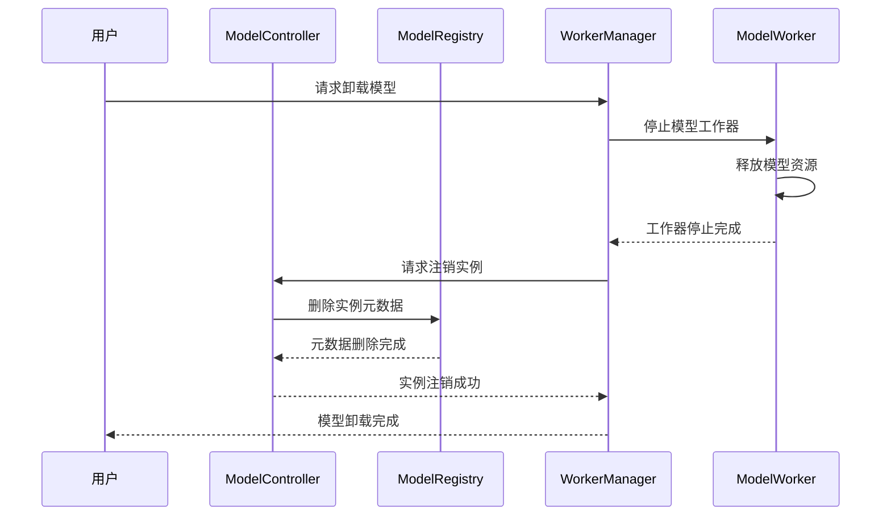
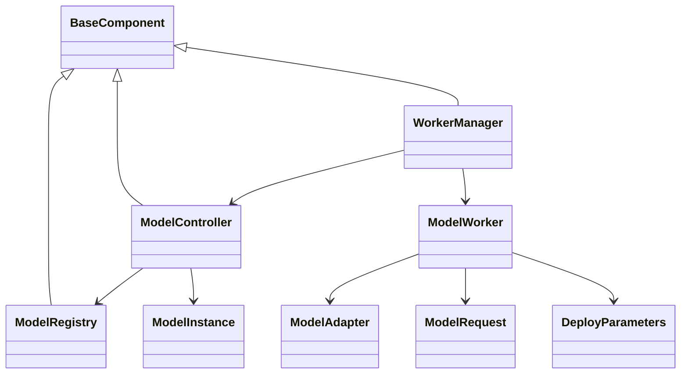

          
我需要先在代码库中搜索smmf相关的内容，确定它是否存在于当前项目中，以及它的位置和功能。
        
            
toolName: search_codebase
            
status: success
          
query: 搜索smmf相关的代码和实现
          
我需要在代码库中搜索SMMF的具体实现代码，特别是在model相关的目录中，因为文档提到SMMF主要与模型管理和部署有关。
        
            
toolName: search_by_regex
            
status: success
          
query: SMMF
          
我需要搜索SMMF的核心实现代码，特别是文档中提到的Model Controller、Model Worker等关键组件。
        
            
toolName: search_codebase
            
status: success
          
query: 搜索Model Controller、Model Worker等SMMF核心组件的实现
          
我需要查看ModelControllerAdapter的实现，以及model/cluster/controller目录下的其他文件，以了解SMMF的完整架构。
        
            
toolName: view_files
            
status: success
          
            
filePath: /home/czx/PycharmProjects/DB-GPT/packages/dbgpt-core/src/dbgpt/model/cluster/controller/controller.py
/home/czx/PycharmProjects/DB-GPT/packages/dbgpt-core/src/dbgpt/model/cluster/controller/__init__.py
          
我需要查看model/cluster目录的完整结构，以了解SMMF的整体架构设计。
        
            
toolName: view_folder
            
status: success
          
/home/czx/PycharmProjects/DB-GPT/packages/dbgpt-core/src/dbgpt/model/cluster
          
我需要查看model/cluster/base.py文件，了解ModelInstance等核心数据结构的定义，这是理解SMMF架构的关键。
        
            
toolName: view_files
            
status: success
          
            
filePath: /home/czx/PycharmProjects/DB-GPT/packages/dbgpt-core/src/dbgpt/model/cluster/base.py
          
我已经收集了足够的信息来理解SMMF的实现，现在可以为用户提供一个全面的分析。## SMMF (Service-oriented Multi-model Management Framework) 实现分析

### 1. 架构概述
SMMF 是 DB-GPT 实现的服务导向多模型管理框架，采用 **Master-Worker** 架构设计，主要包含以下核心组件：

### 2. 核心组件实现

#### 2.1 Model Controller (模型控制器)
- **定位**：作为 SMMF 的中心协调者，负责模型实例的管理和请求路由
- **核心实现**：
  - `BaseModelController` 抽象基类定义核心接口（注册/注销实例、获取实例列表、心跳检测）
  - `LocalModelController` 实现本地模式的控制器
  - `_RemoteModelController` 实现远程模式的控制器（支持 HTTP 通信）
  - `ModelControllerAdapter` 提供统一的控制器访问接口
- **关键功能**：
  - 维护模型实例的注册表
  - 通过心跳机制监控实例健康状态
  - 提供 RESTful API 接口（`/api/controller/models` 等）

#### 2.2 Model Worker (模型工作器)
- **定位**：负责实际的模型加载、推理和响应
- **核心实现**：
  - `ModelWorker` 抽象基类定义工作器核心接口（模型加载、生成、嵌入等）
  - `DefaultModelWorker` 实现 LLM 模型的工作器
  - `EmbeddingsModelWorker` 实现 Embedding 模型的工作器
  - `RemoteModelWorker` 实现远程工作器代理
- **支持模型类型**：
  - LLM (大语言模型)
  - Text2Vec (文本嵌入模型)
  - Rerank (重排序模型)

#### 2.3 Model Registry (模型注册表)
- **定位**：存储模型实例的元数据和健康状态
- **核心实现**：
  - `ModelRegistry` 抽象基类定义注册表接口
  - `EmbeddedModelRegistry` 实现嵌入式注册表
  - `StorageModelRegistry` 实现基于数据库的注册表
- **关键功能**：
  - 实例元数据存储
  - 心跳超时检测
  - 健康状态管理

#### 2.4 Worker Manager (工作器管理器)
- **定位**：负责工作器的生命周期管理
- **核心实现**：
  - `WorkerManager` 抽象基类定义管理器接口
  - 实现工作器的启动、停止、扩展等功能
- **关键功能**：
  - 模型部署参数解析
  - 工作器实例化和初始化
  - 资源管理和监控

### 3. 模型适配器系统
SMMF 通过适配器模式支持多种推理框架：
- `vllm_adapter.py`：vLLM 推理框架适配器
- `hf_adapter.py`：Hugging Face Transformers 适配器
- `llama_cpp_adapter.py`：Llama.cpp 推理框架适配器
- `mlx_adapter.py`：MLX（Apple Silicon）推理框架适配器
- `base.py`：适配器基类，统一接口定义

### 4. 通信协议
- **RESTful API**：Controller 和 Worker 之间通过 HTTP 接口通信
- **模型请求格式**：
  - `PromptRequest`：LLM 生成请求
  - `EmbeddingsRequest`：嵌入生成请求
  - `CountTokenRequest`：token 计数请求
  - `ModelMetadataRequest`：模型元数据请求

### 5. 工作流程
1. **模型部署**：
   - Worker 启动时加载指定模型
   - Worker 向 Controller 注册自身信息

2. **服务发现**：
   - Controller 维护所有注册的 Worker 实例
   - 通过心跳机制监控 Worker 健康状态

3. **请求处理**：
   - 客户端向 Controller 请求模型服务
   - Controller 根据模型名称和健康状态路由到合适的 Worker
   - Worker 执行模型推理并返回结果

### 6. 关键特性
- **多模型支持**：支持 LLaMA2、Baichuan、ChatGLM 等开源模型及 OpenAI、文心等代理模型
- **多框架兼容**：支持 vLLM、TGI、TensorRT 等高性能推理框架
- **可扩展性**：支持多模型实例、多云部署、自动扩缩容
- **可观测性**：提供完整的监控和追踪能力
- **轻量级**：模块化设计，易于集成和扩展

### 7. 核心文件结构
```
dbgpt/model/cluster/
├── controller/       # 模型控制器实现
├── worker/          # 模型工作器实现
├── registry.py      # 模型注册表接口
├── base.py          # 基础数据结构定义
└── client.py        # 客户端接口
```

SMMF 通过组件化、接口抽象和适配器模式，实现了灵活、可扩展的多模型管理框架，为 DB-GPT 提供了强大的模型服务能力。
 # SMMF (Service-oriented Multi-model Management Framework) 运行和执行时序图

## 1. 系统启动与初始化阶段



## 2. 模型部署与Worker注册阶段



## 3. 模型服务请求处理阶段



## 4. 心跳检测与健康管理阶段



## 5. 模型卸载与实例注销阶段



## 核心组件交互说明

### 组件职责
- **ModelController**: 作为中心协调者，处理模型实例注册、请求路由和健康监控
- **WorkerManager**: 负责模型工作器的生命周期管理，包括创建、启动、停止和扩展
- **ModelWorker**: 实际执行模型推理的组件，支持不同类型的模型(LLM、Text2Vec、Rerank)
- **ModelRegistry**: 存储和管理模型实例的元数据和健康状态

### 关键数据结构
- **ModelInstance**: 表示一个模型实例，包含模型名称、地址、端口、健康状态等信息
- **PromptRequest**: LLM生成请求的数据结构
- **EmbeddingsRequest**: 嵌入生成请求的数据结构
- **ModelMetadata**: 模型元数据信息

### 核心API接口
- `register_instance`: 注册模型实例
- `deregister_instance`: 注销模型实例
- `get_all_instances`: 获取模型实例列表
- `send_heartbeat`: 发送心跳请求
- `generate`: 生成文本
- `embeddings`: 生成嵌入

## SMMF架构特点

1. **服务化设计**: 各组件通过RESTful API通信，支持分布式部署
2. **动态扩展**: 支持动态添加/移除模型实例，实现自动扩缩容
3. **多模型支持**: 支持多种类型的模型(LLM、Text2Vec、Rerank)
4. **健康监控**: 通过心跳机制实时监控模型实例健康状态
5. **灵活适配**: 通过适配器模式支持多种推理框架(vLLM、HF、Llama.cpp等)

这些时序图展示了SMMF框架在不同运行阶段的组件交互流程，帮助理解其工作原理和执行逻辑。  

# SMMF (Service-oriented Multi-model Management Framework) 关键类分析

## 1. 核心控制类

### 1.1 ModelController 相关类

#### `BaseModelController`
- **职责**：模型控制器抽象基类，定义模型实例管理的核心接口
- **核心方法**：
  - `register_instance()`：注册模型实例
  - `deregister_instance()`：注销模型实例
  - `get_all_instances()`：获取模型实例列表
  - `send_heartbeat()`：发送心跳请求
- **设计特点**：
  - 继承自 `BaseComponent`，遵循组件化设计原则
  - 使用异步接口设计，支持高并发场景

#### `LocalModelController`
- **职责**：本地模式的控制器实现
- **核心方法**：
  - 实现 `BaseModelController` 的所有抽象方法
  - 通过本地 `ModelRegistry` 管理实例
- **设计特点**：
  - 轻量级实现，适合单节点部署
  - 与 `EmbeddedModelRegistry` 配合使用

#### `_RemoteModelController`
- **职责**：远程模式的控制器实现
- **核心方法**：
  - 通过 HTTP API 与远程控制器通信
  - 实现控制器的所有核心功能
- **设计特点**：
  - 支持分布式部署
  - 实现了负载均衡和故障转移

#### `ModelControllerAdapter`
- **职责**：控制器适配器，提供统一的控制器访问接口
- **核心方法**：
  - 包装实际的控制器实现（本地或远程）
  - 提供一致的接口调用方式
- **设计特点**：
  - 采用适配器设计模式
  - 简化客户端代码，无需关心具体控制器类型

### 1.2 ModelRegistry 相关类

#### `ModelRegistry`
- **职责**：模型注册表抽象基类，定义实例元数据管理接口
- **核心方法**：
  - `register_instance()`：注册实例元数据
  - `deregister_instance()`：注销实例元数据
  - `get_all_instances()`：获取模型实例列表
  - `get_all_model_instances()`：获取所有模型实例
  - `send_heartbeat()`：更新实例心跳
- **设计特点**：
  - 支持不同的存储后端实现
  - 提供健康状态管理
  - 使用异步接口设计，支持高并发

#### `EmbeddedModelRegistry`
- **职责**：嵌入式注册表实现，使用内存存储
- **核心方法**：
  - 实现 `ModelRegistry` 的所有抽象方法
  - 提供心跳检测机制
- **设计特点**：
  - 内置心跳线程检测实例健康状态
  - 轻量级，无需外部存储依赖
  - 适合单节点部署场景

#### `StorageModelRegistry`
- **职责**：基于存储接口的注册表实现，支持持久化存储
- **核心方法**：
  - 实现 `ModelRegistry` 的所有抽象方法
  - 提供 `from_url()` 方法创建数据库存储实例
  - 实现心跳检查线程
- **设计特点**：
  - 支持多种存储后端（通过 `StorageInterface` 抽象）
  - 提供数据库连接池配置
  - 支持自动创建数据库表
  - 适合分布式部署场景

### 1.3 存储相关类

#### `ModelInstanceIdentifier`
- **职责**：模型实例标识符，用于唯一标识一个模型实例
- **核心属性**：
  - `model_name`：模型名称
  - `host`：主机地址
  - `port`：端口号
- **设计特点**：
  - 使用自定义分隔符构建字符串标识符
  - 提供 `to_dict()` 方法转换为字典

#### `ModelInstanceStorageItem`
- **职责**：模型实例存储项，用于存储实例元数据
- **核心属性**：
  - 包含 `ModelInstance` 的所有属性
  - 提供序列化和反序列化方法
- **核心方法**：
  - `from_model_instance()`：从 `ModelInstance` 创建存储项
  - `to_model_instance()`：转换为 `ModelInstance`
  - `merge()`：合并存储项
  - `to_dict()`：转换为字典
- **设计特点**：
  - 实现 `StorageItem` 接口
  - 支持心跳时间的自动转换（timestamp <-> datetime）

## 2. 工作器管理类

### 2.1 WorkerManager 相关类

#### `WorkerManager`
- **职责**：工作器管理器抽象基类，定义工作器生命周期管理接口
- **核心方法**：
  - `start()`：启动管理器
  - `stop()`：停止管理器
  - `get_model_instances()`：获取模型实例
  - `model_startup()`：启动模型工作器
- **设计特点**：
  - 支持同步和异步接口
  - 管理多个工作器实例

#### `LocalWorkerManager`
- **职责**：本地模式的工作器管理器实现
- **核心方法**：
  - 创建和管理本地工作器实例
  - 处理模型部署请求
- **设计特点**：
  - 支持多种模型类型（LLM、Text2Vec、Rerank）
  - 使用线程池管理工作器执行

#### `RemoteWorkerManager`
- **职责**：远程模式的工作器管理器实现
- **核心方法**：
  - 与远程控制器通信管理工作器
  - 转发请求到远程工作器
- **设计特点**：
  - 支持分布式工作器集群
  - 实现远程工作器的代理访问

#### `WorkerManagerFactory`
- **职责**：工作器管理器工厂类，负责创建管理器实例
- **核心方法**：
  - `create()`：创建工作器管理器实例
- **设计特点**：
  - 采用工厂设计模式
  - 支持不同类型的管理器创建

## 3. 模型工作器类

### 3.1 ModelWorker 相关类

#### `ModelWorker`
- **职责**：模型工作器抽象基类，定义模型交互接口
- **核心方法**：
  - `load_worker()`：加载模型
  - `start()`：启动工作器
  - `stop()`：停止工作器
  - `generate_stream()`：生成流式文本
  - `embeddings()`：生成文本嵌入
- **设计特点**：
  - 支持异步操作
  - 支持不同类型的模型

#### `DefaultModelWorker`
- **职责**：LLM模型的默认工作器实现
- **核心方法**：
  - 实现文本生成功能
  - 支持流式输出
  - 提供token计数功能
- **设计特点**：
  - 支持多种LLM模型
  - 使用适配器模式适配不同推理框架

#### `EmbeddingsModelWorker`
- **职责**：文本嵌入模型的工作器实现
- **核心方法**：
  - 实现文本嵌入生成
  - 支持文档和查询嵌入
- **设计特点**：
  - 统一接口支持不同的嵌入模型

#### `RerankerModelWorker`
- **职责**：重排序模型的工作器实现
- **核心方法**：
  - 实现文本重排序功能
- **设计特点**：
  - 继承自 `EmbeddingsModelWorker`
  - 专门处理重排序请求

## 4. 模型适配器类

### 4.1 核心适配器

#### `LLMModelAdapter`
- **职责**：LLM模型适配器抽象基类
- **核心方法**：
  - `supported_models()`：获取支持的模型列表
  - `model_param_class()`：获取模型参数类
  - `parse_max_length()`：解析模型最大上下文长度
- **设计特点**：
  - 统一不同LLM框架的接口
  - 支持动态加载模型

#### 具体适配器实现
- **`VLLMModelAdapter`**：vLLM推理框架适配器
- **`HFModelAdapter`**：Hugging Face Transformers适配器
- **`LlamaCppModelAdapter`**：Llama.cpp推理框架适配器
- **`MLXModelAdapter`**：MLX推理框架适配器

- **设计特点**：
  - 每个适配器对应一种推理框架
  - 实现统一的接口，方便扩展

## 5. 数据模型类

### 5.1 ModelInstance
- **职责**：表示一个模型实例的数据结构
- **核心属性**：
  - `model_name`：模型名称
  - `host`：主机地址
  - `port`：端口号
  - `healthy`：健康状态
  - `last_heartbeat`：最后心跳时间
- **设计特点**：
  - 使用Pydantic模型定义
  - 包含健康状态管理字段

### 5.2 ModelRequest 相关类

#### `PromptRequest`
- **职责**：LLM生成请求的数据结构
- **核心属性**：
  - `model`：模型名称
  - `messages`：对话消息列表
  - `prompt`：提示文本
  - `temperature`：温度参数
  - `max_new_tokens`：最大新生成token数

#### `EmbeddingsRequest`
- **职责**：嵌入生成请求的数据结构
- **核心属性**：
  - `model`：模型名称
  - `input`：输入文本列表
  - `query`：查询文本（用于重排序）

### 5.3 部署参数类

#### `LLMDeployModelParameters`
- **职责**：LLM模型部署参数
- **核心属性**：
  - `name`：模型名称
  - `path`：模型路径
  - `provider`：模型提供商
  - `context_length`：上下文长度

#### `EmbeddingDeployModelParameters`
- **职责**：嵌入模型部署参数
- **核心属性**：
  - `name`：模型名称
  - `path`：模型路径
  - `provider`：模型提供商

## 6. 设计模式与架构特点

### 6.1 设计模式
- **适配器模式**：模型适配器适配不同的推理框架
- **工厂模式**：WorkerManagerFactory创建不同类型的工作器管理器
- **代理模式**：RemoteModelWorker代理远程工作器访问
- **观察者模式**：心跳检测机制监控实例健康状态

### 6.2 架构特点
- **组件化设计**：所有核心类继承自BaseComponent
- **异步支持**：广泛使用异步接口，支持高并发
- **可扩展性**：支持不同的存储后端和推理框架
- **服务化**：通过RESTful API提供服务接口
- **健康管理**：内置心跳检测和健康状态管理

## 7. 类之间的关系



## 8. 核心流程分析

### 8.1 模型部署流程
1. 用户通过WorkerManager请求部署模型
2. WorkerManager解析部署参数
3. 创建对应的ModelWorker实例
4. ModelWorker通过适配器加载模型
5. WorkerManager将模型实例注册到ModelController
6. ModelController将实例元数据存储到ModelRegistry

### 8.2 请求处理流程
1. 客户端向ModelController发送请求
2. ModelController从ModelRegistry获取健康实例
3. 选择合适的实例并转发请求
4. ModelWorker处理请求并返回结果
5. ModelController将结果返回给客户端

### 8.3 健康管理流程
1. ModelWorker定期向ModelController发送心跳
2. ModelController更新实例心跳时间
3. ModelRegistry检测实例心跳超时
4. 更新实例健康状态
5. 根据健康状态调整请求路由

## 9. 总结

SMMF通过精心设计的类层次结构和接口定义，实现了一个灵活、可扩展的多模型管理框架。核心类之间的职责清晰，采用了多种设计模式提高代码质量和可维护性。主要特点包括：

1. **组件化设计**：所有核心类遵循组件化原则，便于集成和扩展
2. **多模型支持**：支持LLM、Text2Vec、Rerank等多种模型类型
3. **多框架适配**：通过适配器模式支持不同的推理框架
4. **分布式部署**：支持本地和远程模式，适合不同规模的部署需求
5. **健康管理**：内置心跳检测和健康状态管理，提高系统可靠性
6. **异步接口**：广泛使用异步接口，支持高并发场景

这些设计特点使得SMMF能够高效地管理和调度多种模型，为DB-GPT提供强大的模型服务能力。

# SMMF (Service-oriented Multi-model Management Framework) 技术栈深入分析

## 1. 核心架构设计技术

### 1.1 Master-Worker 分布式架构
- **技术实现**：采用经典的主从架构设计，Controller 作为 Master 节点管理和调度 Worker 节点
- **核心组件**：
  - **Controller**：负责模型实例注册、心跳管理、请求路由和负载均衡
  - **Worker**：负责具体的模型推理任务执行
- **设计优势**：
  - 实现计算资源的弹性扩展
  - 提高系统可用性和容错能力
  - 便于水平扩展以支持更多模型实例

### 1.2 组件化设计模式
- **技术实现**：基于 `BaseComponent` 类实现所有核心组件的统一管理
- **核心特性**：
  - 组件生命周期管理（初始化、启动、停止）
  - 依赖注入机制
  - 统一的组件接口
- **应用场景**：
  - ModelController、ModelRegistry、WorkerManager 等核心组件均继承自 BaseComponent
  - 实现组件的模块化和可插拔性

### 1.3 服务化架构
- **技术实现**：通过 RESTful API 提供服务接口，采用 OpenAI SDK 兼容标准
- **核心特性**：
  - 统一的 API 接口设计
  - 支持多种客户端访问
  - 服务发现和负载均衡
- **应用场景**：
  - 提供与 OpenAI 兼容的模型推理接口
  - 支持多模型统一调用

## 2. 模型推理框架技术

### 2.1 vLLM 推理框架
- **技术特点**：
  - 基于 PagedAttention 技术实现高效的内存管理
  - 支持高并发请求处理
  - 低延迟的文本生成
- **SMMF 集成方式**：
  - 通过 `VLLMDeployModelParameters` 定义部署参数
  - 提供 `VLLMModelAdapter` 适配器实现
- **核心参数**：
  ```python
  @dataclass
  class VLLMDeployModelParameters(LLMDeployModelParameters):
      provider: str = "vllm"
      device: Optional[str] = "auto"
      concurrency: Optional[int] = 100
      trust_remote_code: Optional[bool] = True
  ```
- **应用场景**：需要高性能推理的大规模模型部署

### 2.2 Hugging Face Transformers 框架
- **技术特点**：
  - 最广泛使用的开源模型推理框架
  - 支持几乎所有主流开源模型
  - 灵活的模型加载和推理选项
- **SMMF 集成方式**：
  - 通过 `HFLLMDeployModelParameters` 定义部署参数
  - 提供 `HFModelAdapter` 适配器实现
- **核心参数**：
  ```python
  @dataclass
  class HFLLMDeployModelParameters(LLMDeployModelParameters):
      provider: str = "hf"
      quantization: Optional[BaseHFQuantization] = None
      low_cpu_mem_usage: Optional[bool] = None
      num_gpus: Optional[int] = None
      torch_dtype: Optional[str] = None
      attn_implementation: Optional[str] = None
  ```
- **应用场景**：需要灵活性和广泛模型支持的场景

### 2.3 Llama.cpp 推理框架
- **技术特点**：
  - 轻量级 C++ 实现，支持 CPU 和 GPU 推理
  - 针对小内存设备优化
  - 支持 4-bit、8-bit 量化
- **SMMF 集成方式**：
  - 通过 `LlamaCppModelAdapter` 实现集成
  - 支持本地模型文件加载
- **应用场景**：资源受限环境下的模型部署，如边缘设备或低成本服务器

### 2.4 MLX 推理框架
- **技术特点**：
  - Apple Silicon 优化的推理框架
  - 针对 M1/M2/M3 芯片进行深度优化
  - 支持自动微分和张量计算
- **SMMF 集成方式**：
  - 通过 `MLXModelAdapter` 实现集成
  - 利用 Apple 设备的神经网络引擎
- **应用场景**：在 Apple 设备上的高性能模型推理

### 2.5 Fschat 推理框架
- **技术特点**：
  - FastChat 官方推理框架
  - 支持多轮对话和模型微调
  - 与 Hugging Face 生态系统兼容
- **SMMF 集成方式**：
  - 通过 `FschatAdapter` 实现集成
  - 支持 FastChat 模型格式
- **应用场景**：需要 FastChat 特定功能的场景

## 3. 通信与接口技术

### 3.1 RESTful API 设计
- **技术特点**：
  - 基于 HTTP 协议的轻量级通信
  - 无状态设计，便于水平扩展
  - 清晰的资源导向接口
- **核心接口**：
  - 健康检查接口
  - 模型实例管理接口
  - 心跳更新接口
  - 模型推理接口（兼容 OpenAI）
- **实现方式**：
  - 使用 FastAPI 框架实现高性能 API 服务
  - 采用 Pydantic 进行数据验证和序列化

### 3.2 OpenAI 兼容协议
- **技术特点**：
  - 完全兼容 OpenAI SDK
  - 支持相同的 API 端点和请求格式
  - 降低客户端迁移成本
- **核心接口**：
  - `/api/v1/chat/completions`：对话补全接口
  - `/api/v1/completions`：文本补全接口
  - `/api/v1/embeddings`：文本嵌入接口
- **实现优势**：
  - 现有 OpenAI 客户端代码可直接使用
  - 支持多种语言的客户端库

### 3.3 数据交换格式
- **技术特点**：
  - 使用 JSON 作为标准数据格式
  - 轻量级且易于解析
  - 跨平台兼容性好
- **核心数据模型**：
  - `PromptRequest`：对话生成请求
  - `EmbeddingsRequest`：嵌入生成请求
  - `ModelInstance`：模型实例元数据
- **序列化机制**：
  - 使用 Pydantic 进行数据模型定义和序列化
  - 支持自动类型转换和验证

## 4. 存储与持久化技术

### 4.1 模型注册表存储
- **内存存储**（EmbeddedModelRegistry）：
  - 技术特点：使用 Python 字典存储，轻量级无依赖
  - 应用场景：单节点部署或开发测试环境
  - 核心实现：内置心跳检测线程，定期检查实例健康状态

- **数据库存储**（StorageModelRegistry）：
  - 技术特点：基于 SQLAlchemy ORM，支持多种数据库后端
  - 支持的数据库：SQLite、MySQL、PostgreSQL 等
  - 核心实现：
    ```python
    @classmethod
    def from_url(
        cls, db_url: str, db_name: str, engine_args: Optional[Dict[str, Any]] = None, **kwargs
    ) -> "StorageModelRegistry":
        # 创建数据库连接和存储实例
        db: DatabaseManager = initialize_db(db_url, db_name, engine_args)
        storage = SQLAlchemyStorage(db, ModelInstanceEntity, ModelInstanceItemAdapter())
        return cls(storage, **kwargs)
    ```
  - 应用场景：分布式部署或需要持久化存储的生产环境

### 4.2 自定义存储接口
- **技术特点**：
  - 定义统一的 `StorageInterface` 抽象接口
  - 支持不同存储后端的插拔式实现
  - 提供查询、保存、更新、删除等基本操作
- **核心方法**：
  - `query()`：查询存储项
  - `save()`：保存存储项
  - `update()`：更新存储项
  - `delete()`：删除存储项
- **设计优势**：
  - 解耦存储逻辑和业务逻辑
  - 便于扩展新的存储后端

## 5. 并发与异步技术

### 5.1 异步编程模型
- **技术特点**：
  - 使用 Python async/await 语法
  - 基于事件循环的非阻塞 I/O
  - 提高系统吞吐量和并发能力
- **核心应用**：
  - API 接口处理
  - 模型实例管理
  - 心跳检测
- **实现示例**：
  ```python
  async def register_instance(self, instance: ModelInstance) -> bool:
      # 异步注册实例逻辑
      model_name = instance.model_name.strip()
      host = instance.host.strip()
      port = instance.port
      _, exist_ins = await self._get_instances_by_model(model_name, host, port)
      # ...
  ```

### 5.2 线程池与并发控制
- **技术特点**：
  - 使用 ThreadPoolExecutor 管理线程
  - 控制并发请求数量
  - 避免资源耗尽
- **核心应用**：
  - 模型推理任务执行
  - 存储操作异步化
- **实现示例**：
  ```python
  await blocking_func_to_async(
      self._executor, self._storage.save, new_inst
  )
  ```

### 5.3 并发请求处理
- **技术特点**：
  - 支持高并发的模型推理请求
  - 实现请求队列和负载均衡
  - 动态调整资源分配
- **核心参数**：
  - vLLM 配置中的 `concurrency` 参数控制并发请求数
  - 工作器实例的权重配置用于负载均衡

## 6. 模型适配与扩展技术

### 6.1 适配器设计模式
- **技术特点**：
  - 统一不同模型和框架的接口
  - 实现模型与推理逻辑的解耦
  - 支持新模型和框架的快速集成
- **核心适配器**：
  - `LLMModelAdapter`：LLM 模型适配器基类
  - 各种推理框架的具体实现
- **实现示例**：
  ```python
  class LLMModelAdapter(ABC):
      @classmethod
      @abstractmethod
      def supported_models(cls) -> List[str]:
          """获取支持的模型列表"""
          pass
  
      @classmethod
      @abstractmethod
      def model_param_class(cls) -> Type[LLMDeployModelParameters]:
          """获取模型参数类"""
          pass
  ```

### 6.2 动态模型加载
- **技术特点**：
  - 支持运行时动态加载模型
  - 按需加载模型资源
  - 节省系统资源
- **实现方式**：
  - 通过模型路径或名称动态创建模型实例
  - 使用懒加载机制延迟模型初始化
  - 支持模型卸载和资源释放

### 6.3 模型参数管理
- **技术特点**：
  - 使用 dataclass 定义模型参数
  - 支持参数验证和默认值
  - 提供参数元数据和帮助信息
- **核心参数类**：
  - `LLMDeployModelParameters`：LLM 部署参数基类
  - 各推理框架的扩展参数类
- **实现示例**：
  ```python
  @dataclass
  class VLLMDeployModelParameters(LLMDeployModelParameters):
      provider: str = "vllm"
      path: Optional[str] = field(
          default=None,
          metadata={"help": _("The path of the model")},
      )
      device: Optional[str] = field(
          default="auto",
          metadata={"help": _("Device to run model")},
      )
  ```

## 7. 健康管理与监控技术

### 7.1 心跳检测机制
- **技术特点**：
  - 定期发送心跳信息
  - 实时监控实例健康状态
  - 自动处理故障实例
- **核心实现**：
  ```python
  def _heartbeat_checker(self):
      while True:
          all_instances = self._storage.query(QuerySpec(conditions={}))
          for instance in all_instances:
              if datetime.now() - instance.last_heartbeat > timedelta(seconds=self.heartbeat_timeout_secs):
                  instance.healthy = False
                  self._storage.update(instance)
          time.sleep(self.heartbeat_interval_secs)
  ```
- **设计优势**：
  - 及时发现故障实例
  - 提高系统可用性
  - 自动调整请求路由

### 7.2 健康状态管理
- **技术特点**：
  - 维护实例的健康状态
  - 支持手动和自动状态切换
  - 基于健康状态进行负载均衡
- **核心状态**：
  - `healthy`：实例是否健康
  - `enabled`：实例是否启用
  - `check_healthy`：是否检查健康状态
- **应用场景**：
  - 故障自动转移
  - 实例维护和升级

## 8. 部署与运维技术

### 8.1 按需依赖安装
- **技术特点**：
  - 模块化的依赖管理
  - 用户可按需安装所需依赖
  - 减少不必要的资源占用
- **核心依赖组**：
  - `[core]`：核心功能依赖
  - `[vllm]`：vLLM 推理框架依赖
  - `[llama_cpp]`：Llama.cpp 依赖
  - `[openai]`：OpenAI 代理依赖
  - `[torch]`：PyTorch 相关依赖
- **安装方式**：
  ```bash
  pip install -e ".[vllm]"  # 安装 vLLM 相关依赖
  pip install -e ".[llama_cpp]"  # 安装 Llama.cpp 相关依赖
  ```

### 8.2 多环境支持
- **技术特点**：
  - 支持不同操作系统（Linux、macOS、Windows）
  - 支持不同硬件平台（x86、ARM、Apple Silicon）
  - 支持不同部署模式（本地、分布式、云环境）
- **核心适配**：
  - 硬件检测和自动适配
  - 操作系统特定功能处理
  - 环境变量配置管理

### 8.3 自动扩缩容
- **技术特点**：
  - 根据负载自动调整实例数量
  - 支持水平扩展和收缩
  - 基于资源使用率的智能决策
- **实现方式**：
  - 监控系统负载和资源使用情况
  - 动态创建和销毁模型实例
  - 调整实例权重和路由策略

## 9. 安全与可靠性技术

### 9.1 实例认证与授权
- **技术特点**：
  - 模型实例注册认证
  - API 请求授权机制
  - 访问控制和权限管理
- **实现方式**：
  - 使用 API Key 进行身份验证
  - 支持请求签名和加密
  - 实现基于角色的访问控制

### 9.2 故障恢复机制
- **技术特点**：
  - 自动检测和处理故障
  - 实现请求重试和超时处理
  - 提供降级策略和熔断机制
- **核心策略**：
  - 实例故障自动转移
  - 请求队列和背压机制
  - 服务降级和优雅降级

### 9.3 数据安全
- **技术特点**：
  - 敏感数据加密传输
  - 访问日志和审计
  - 数据隐私保护
- **实现方式**：
  - HTTPS 加密通信
  - 访问日志记录
  - 敏感信息脱敏处理

## 10. 技术栈总结与优势分析

### 10.1 核心技术栈

| 技术类别 | 具体技术 | 应用场景 |
|---------|---------|---------|
| 核心架构 | Master-Worker、组件化、服务化 | 系统整体架构 |
| 推理框架 | vLLM、HF Transformers、Llama.cpp、MLX、Fschat | 模型推理执行 |
| 通信协议 | RESTful API、OpenAI 兼容 | 服务接口和客户端通信 |
| 存储技术 | 内存存储、SQLAlchemy、自定义存储接口 | 模型实例元数据管理 |
| 并发控制 | 异步编程、线程池、并发限制 | 高并发请求处理 |
| 设计模式 | 适配器、工厂、代理、观察者 | 代码组织和扩展 |
| 部署运维 | 按需依赖、多环境支持、自动扩缩容 | 系统部署和维护 |

### 10.2 技术优势分析

1. **多模型支持**：
   - 支持数十种开源和商用模型
   - 统一接口访问不同模型
   - 快速集成新模型

2. **高性能推理**：
   - 集成多种高性能推理框架
   - 针对不同硬件平台优化
   - 支持模型量化和加速技术

3. **高可用性设计**：
   - 心跳检测和故障自动转移
   - 多实例部署和负载均衡
   - 完善的健康管理机制

4. **可扩展性**：
   - 组件化设计便于扩展
   - 适配器模式支持新框架集成
   - 支持水平扩展和自动扩缩容

5. **易用性**：
   - OpenAI 兼容接口降低使用门槛
   - 按需依赖安装减少复杂性
   - 完善的文档和示例

6. **轻量级**：
   - 核心功能依赖少
   - 可按需扩展功能
   - 资源占用低

## 11. 技术发展趋势与展望

### 11.1 未来技术方向

1. **更广泛的模型支持**：
   - 持续集成最新的开源模型
   - 支持更多的商用模型 API
   - 扩展多模态模型支持

2. **性能优化**：
   - 更高效的推理算法
   - 硬件加速技术深度整合
   - 内存使用优化

3. **分布式能力增强**：
   - 更强大的集群管理功能
   - 跨节点模型并行
   - 多云部署支持

4. **可观测性提升**：
   - 更详细的性能监控
   - 分布式追踪支持
   - 告警和自动修复

5. **安全性增强**：
   - 更完善的访问控制
   - 模型安全防护
   - 数据隐私保护

### 11.2 技术创新点

1. **自适应推理优化**：
   - 根据输入动态调整推理参数
   - 智能选择最优推理框架
   - 自动模型量化和优化

2. **智能资源调度**：
   - 基于负载预测的资源分配
   - 动态调整实例数量
   - 资源使用成本优化

3. **模型联邦学习**：
   - 支持分布式模型训练
   - 保护数据隐私
   - 实现模型协同优化

## 12. 结论

SMMF 通过整合多种先进技术，构建了一个功能强大、性能优异、易于扩展的多模型管理框架。其核心技术优势在于：

1. **灵活的架构设计**：基于组件化和服务化架构，实现了高度的模块化和可扩展性
2. **多框架集成**：支持几乎所有主流的模型推理框架，满足不同场景的需求
3. **高性能实现**：通过集成 vLLM 等高性能推理框架，提供卓越的模型推理性能
4. **易用性设计**：兼容 OpenAI API，降低客户端使用门槛
5. **可靠性保障**：完善的健康管理和故障恢复机制，确保系统稳定运行

SMMF 不仅解决了当前多模型管理的复杂性问题，还为未来的技术发展提供了良好的扩展基础，是 DB-GPT 项目的核心技术支柱之一。