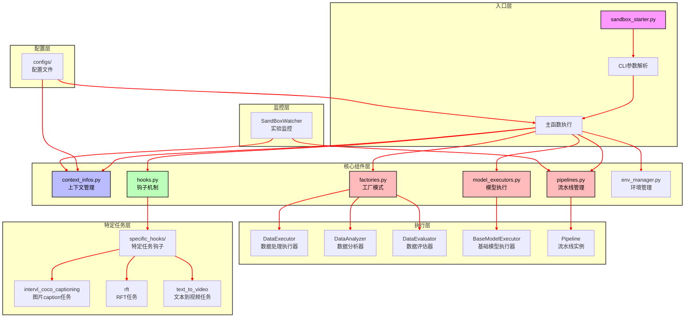
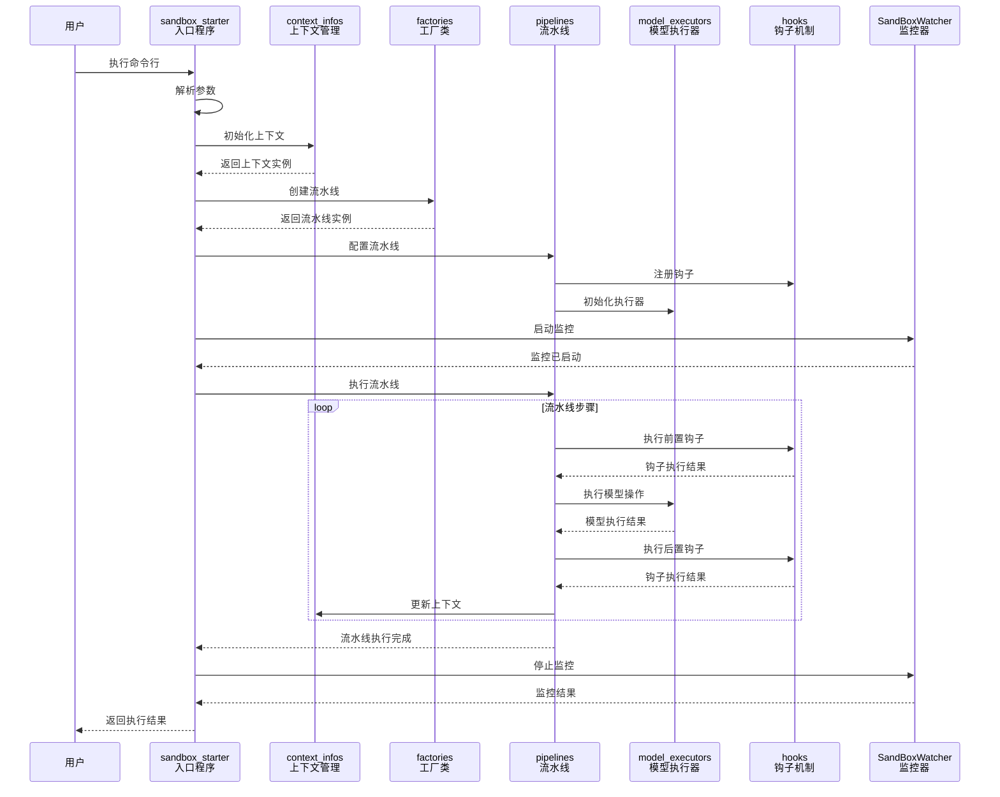
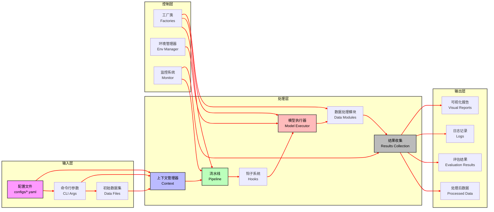

# Data-Juicer Sandbox 架构图表

## 1. 系统架构图

### 1.1 架构图说明

该系统架构图展示了Data-Juicer Sandbox的整体结构，采用分层设计，从入口层到执行层形成了完整的数据流和控制流。各层次之间职责明确，通过清晰的依赖关系实现了模块间的低耦合高内聚。

**核心设计理念**：
- 分层架构：入口层、核心组件层、执行层、特定任务层、配置层和监控层
- 工厂模式：统一创建各类执行器和处理器
- 钩子机制：支持特定任务的扩展
- 上下文管理：全局状态统一管理

**主要组件关系**：
- 入口层接收用户命令并启动主流程
- 核心组件层提供基础框架和服务
- 执行层负责具体任务的执行
- 特定任务层针对不同应用场景提供定制化实现
- 配置层提供系统配置和参数
- 监控层全程监控系统运行状态

## 2. 组件交互图

### 2.1 交互图说明

该交互图展示了Data-Juicer Sandbox中各核心组件在执行过程中的详细交互流程。从用户发起命令到系统返回执行结果，完整呈现了组件间的调用关系和数据流转。

**交互流程分析**：

1. **初始化阶段**：
   - 用户执行命令行，入口程序解析参数
   - 初始化上下文管理器，创建全局状态
   - 通过工厂模式创建流水线实例

2. **配置阶段**：
   - 配置流水线参数
   - 注册钩子函数
   - 初始化模型执行器
   - 启动监控系统

3. **执行阶段**：
   - 流水线开始执行，进入循环处理
   - 依次调用前置钩子、模型执行器和后置钩子
   - 持续更新上下文状态

4. **完成阶段**：
   - 流水线执行完成
   - 停止监控系统
   - 收集执行结果并返回给用户

**关键交互点**：
- 上下文管理器贯穿整个流程，提供全局状态管理
- 钩子机制在流水线执行前后提供扩展点
- 监控系统实时收集执行数据

## 3. 数据流图

### 3.1 数据流图说明

该数据流图展示了Data-Juicer Sandbox中数据从输入到输出的完整处理流程。数据在不同层次间流动，经过处理、转换和评估，最终产生结果。

**数据处理流程**：

1. **输入层**：
   - 配置文件：定义系统行为和参数
   - 命令行参数：用户指定的运行选项
   - 初始数据集：待处理的原始数据

2. **处理层**：
   - 上下文管理器：整合输入资源，提供统一访问接口
   - 流水线：按顺序执行数据处理步骤
   - 钩子系统：在关键节点插入自定义处理逻辑
   - 模型执行器：调用外部模型进行推理或训练
   - 数据处理模块：执行具体的数据操作
   - 结果收集：汇总处理结果

3. **控制层**：
   - 工厂类：创建和管理各种执行器实例
   - 环境管理器：配置和维护运行环境
   - 监控系统：跟踪数据处理状态和性能指标

4. **输出层**：
   - 处理后数据：经过清洗、转换或增强的数据
   - 评估结果：模型性能或数据质量的评估报告
   - 日志记录：系统运行的详细日志
   - 可视化报告：直观展示处理结果和性能指标

**数据流动特点**：
- 单向流动为主，辅以控制流反馈
- 分层处理，每一层有明确的数据处理职责
- 模块化设计，便于扩展和维护

## 4. 组件详细说明

### 4.1 入口层
- **sandbox_starter.py**: 项目的入口点，负责解析命令行参数并启动整个流程
- **CLI参数解析**: 使用Typer库处理命令行输入，支持各种配置选项

### 4.2 核心组件层
- **context_infos.py**: 管理作业、流水线和系统上下文信息，提供全局状态访问
- **hooks.py**: 实现钩子机制，支持在流水线执行的不同阶段插入自定义逻辑
- **factories.py**: 使用工厂模式创建各种执行器、分析器和评估器实例
- **model_executors.py**: 封装模型执行逻辑，支持异步执行和结果处理
- **pipelines.py**: 管理流水线的创建、配置和执行过程
- **env_manager.py**: 处理环境配置和依赖管理

### 4.3 执行层
- **DataExecutor**: 执行数据处理操作，如清洗、转换和增强
- **DataAnalyzer**: 分析数据质量和特征
- **DataEvaluator**: 评估模型性能和数据质量
- **BaseModelExecutor**: 基础模型执行器，支持各种模型的统一接口
- **Pipeline**: 流水线实例，包含一系列按顺序执行的操作

### 4.4 特定任务层
- **intervl_coco_captioning**: 处理图片 caption 任务的钩子实现
- **rft**: 处理 RFT (Reinforced Fine-Tuning) 任务的钩子实现
- **text_to_video**: 处理文本到视频生成任务的钩子实现

### 4.5 配置层
- **配置文件**: YAML格式的配置文件，定义流水线、模型和任务参数

### 4.6 监控层
- **SandBoxWatcher**: 监控流水线执行过程，收集指标和日志