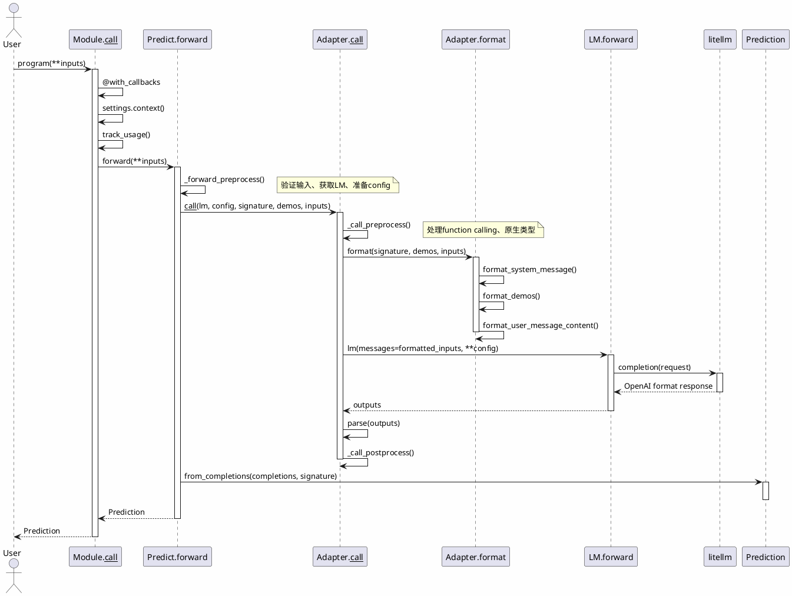

# DSPy 执行流程详解

> 本文档详细分析 DSPy（Declarative Self-improving Python）的执行流程，帮助开发者理解其内部工作机制。

## 目录

- [一、整体架构概览](#一整体架构概览)
- [二、详细执行流程](#二详细执行流程)
- [三、三个核心阶段](#三三个核心阶段)
- [四、关键源码文件参考](#四关键源码文件参考)
- [五、调用关系详解](#五调用关系详解)
- [六、总结](#六总结)

---

## 一、整体架构概览

DSPy 的设计理念是**"写代码而不是写字符串"**。它通过模块化设计将传统的 Prompt 工程转化为可编程的组件。

### 核心组件关系图

```
┌─────────────────────────────────────────────────────────────────┐
│                        用户代码                                   │
│  class MyProgram(dspy.Module):                                  │
│      def __init__(self):                                        │
│          self.predict = dspy.Predict("question -> answer")      │
│      def forward(self, question):                                │
│          return self.predict(question=question)                 │
└─────────────────────────────────────────────────────────────────┘
                              │
                              ▼
┌─────────────────────────────────────────────────────────────────┐
│                      Module (模块层)                            │
│  - dspy.Module: 基类，管理子模块和调用历史                         │
│  - dspy.Predict: 最基础的预测模块                                 │
│  - dspy.ChainOfThought: 思维链模块                               │
│  - dspy.ReAct: ReAct代理模块                                     │
└─────────────────────────────────────────────────────────────────┘
                              │
                              ▼
┌─────────────────────────────────────────────────────────────────┐
│                   Adapter (适配器层)                             │
│  - ChatAdapter: 默认聊天适配器                                   │
│  - JSONAdapter: JSON格式适配器                                   │
│  - XMLAdapter: XML格式适配器                                     │
│  负责将Signature转换为LM可处理的格式，并解析LM响应                  │
└─────────────────────────────────────────────────────────────────┘
                              │
                              ▼
┌─────────────────────────────────────────────────────────────────┐
│                    LM (语言模型层)                               │
│  - dspy.LM: 统一封装各种LLM API (OpenAI, Anthropic等)             │
│  - 通过litellm支持100+模型                                       │
└─────────────────────────────────────────────────────────────────┘
                              │
                              ▼
┌─────────────────────────────────────────────────────────────────┐
│                  Teleprompter (优化器层)                          │
│  - BootstrapFewShot: Few-Shot引导优化                            │
│  - MIPROv2: 多保真度提示优化                                      │
│  - Gepa: 基于梯度的提示优化                                       │
│  用于自动优化提示和参数                                            │
└─────────────────────────────────────────────────────────────────┘
```

### 组件职责说明

| 组件层 | 职责 | 示例 |
|--------|------|------|
| **Module** | 定义程序的执行逻辑和流程 | `dspy.ChainOfThought`, `dspy.ReAct` |
| **Adapter** | 格式化输入、解析输出，适配不同LLM接口 | `ChatAdapter`, `JSONAdapter` |
| **LM** | 封装LLM API调用，统一接口 | `dspy.LM("openai/gpt-4o")` |
| **Teleprompter** | 自动优化提示和程序参数 | `BootstrapFewShot`, `MIPROv2` |

---

## 二、详细执行流程

### 1. 初始化阶段

```python
import dspy

# 配置语言模型
dspy.configure(lm=dspy.LM("openai/gpt-4o-mini"))

# 创建程序
program = dspy.ChainOfThought("question -> answer")
```

**源码追踪**：[primitives/module.py#L23-L48](file:///home/project/dspy/dspy/primitives/module.py#L23-L48)

- `ProgramMeta` 元类确保每个模块正确初始化
- `Module._base_init()` 设置基础属性（`callbacks`, `history`等）

```python
class Module(BaseModule, metaclass=ProgramMeta):
    def _base_init(self):
        self._compiled = False
        self.callbacks = []
        self.history = []
```

### 2. 调用阶段 (`__call__`)

当你调用 `program(question="...")` 时，执行流程如下：

#### Step 1: Module.__call__ 被触发

**源码**：[primitives/module.py#L89-L106](file:///home/project/dspy/dspy/primitives/module.py#L89-L106)

```python
@with_callbacks
def __call__(self, *args, **kwargs) -> Prediction:
    caller_modules = settings.caller_modules or []
    caller_modules.append(self)
    
    with settings.context(caller_modules=caller_modules):
        if settings.track_usage:
            with track_usage() as usage_tracker:
                output = self.forward(*args, **kwargs)
            tokens = usage_tracker.get_total_tokens()
            self._set_lm_usage(tokens, output)
            return output
        return self.forward(*args, **kwargs)
```

**关键点**：
- `@with_callbacks` 装饰器支持回调钩子
- `settings.context` 管理线程本地状态
- `track_usage` 跟踪 API 使用量

#### Step 2: 调用 forward 方法

```python
# 对于 dspy.ChainOfThought
class ChainOfThought(Module):
    def __init__(self, signature, **config):
        super().__init__()
        extended_signature = signature.prepend(name="reasoning", ...)
        self.predict = dspy.Predict(extended_signature, **config)
    
    def forward(self, **kwargs):
        return self.predict(**kwargs)
```

### 3. Predict 执行核心

#### Step 3: Predict.forward

**源码**：[predict/predict.py#L224-L241](file:///home/project/dspy/dspy/predict/predict.py#L224-L241)

```python
def forward(self, **kwargs):
    # 预处理：获取LM、签名、demos等
    lm, config, signature, demos, kwargs = self._forward_preprocess(**kwargs)
    
    # 获取适配器（默认ChatAdapter）
    adapter = settings.adapter or ChatAdapter()
    
    # 调用适配器执行
    completions = adapter(
        lm, 
        lm_kwargs=config, 
        signature=signature, 
        demos=demos, 
        inputs=kwargs
    )
    
    # 后处理：转换为Prediction对象
    return self._forward_postprocess(completions, signature, **kwargs)
```

#### Predict._forward_preprocess 详解

```python
def _forward_preprocess(self, **kwargs):
    # 1. 提取配置参数
    signature = ensure_signature(kwargs.pop("signature", self.signature))
    demos = kwargs.pop("demos", self.demos)
    config = {**self.config, **kwargs.pop("config", {})}
    
    # 2. 获取LM实例
    lm = kwargs.pop("lm", self.lm) or settings.lm
    
    # 3. 处理温度和生成数量
    temperature = config.get("temperature") or lm.kwargs.get("temperature")
    num_generations = config.get("n") or lm.kwargs.get("n") or 1
    
    # 4. 填充默认值
    for k, v in signature.input_fields.items():
        if k not in kwargs and v.default is not PydanticUndefined:
            kwargs[k] = v.default
    
    return lm, config, signature, demos, kwargs
```

### 4. Adapter 格式化和解析

#### Step 4: Adapter.__call__

**源码**：[adapters/base.py#L58-L74](file:///home/project/dspy/dspy/adapters/base.py#L58-L74)

Adapter 负责两件事：
1. **format()**: 将输入转换为 LM 可理解的格式
2. **parse()**: 解析 LM 响应为结构化输出

```python
class Adapter:
    def __call__(self, lm, lm_kwargs, signature, demos, inputs):
        # 1. 预处理：处理原生功能（函数调用等）
        signature = self._call_preprocess(lm, lm_kwargs, signature, inputs)
        
        # 2. 格式化输入
        messages = self.format(signature, demos, inputs)
        
        # 3. 调用 LM
        completions = lm(messages=messages, **lm_kwargs)
        
        # 4. 解析输出
        return self._call_postprocess(signature, original_signature, completions, lm, lm_kwargs)
```

#### ChatAdapter 格式化示例

**源码**：[adapters/chat_adapter.py](file:///home/project/dspy/dspy/adapters/chat_adapter.py)

生成的提示结构：

```
All interactions will be structured in the following way...

Your input fields are:
- question: str  # 用户的问题

Your output fields are:
- answer: str  # 期望的答案

[[ ## answer ## ]]

In adhering to this structure, your objective is: 
回答以下问题...

[[ ## completed ## ]]
```

### 5. LM 调用

#### Step 5: LM.forward

**源码**：[clients/lm.py#L160-L195](file:///home/project/dspy/dspy/clients/lm.py#L160-L195)

```python
def forward(self, prompt=None, messages=None, **kwargs):
    # 1. 准备消息
    messages = messages or [{"role": "user", "content": prompt}]
    kwargs = {**self.kwargs, **kwargs}
    
    # 2. 根据model_type选择调用方式
    if self.model_type == "chat":
        completion = litellm_completion
    elif self.model_type == "text":
        completion = litellm_text_completion
    elif self.model_type == "responses":
        completion = litellm_responses_completion
    
    # 3. 处理缓存
    completion = request_cache(completion)
    
    # 4. 调用litellm
    results = completion(
        request=dict(model=self.model, messages=messages, **kwargs),
        num_retries=self.num_retries,
    )
    
    return results
```

### 6. Prediction 返回

#### Step 6: Prediction.from_completions

**源码**：[primitives/prediction.py#L32-L38](file:///home/project/dspy/dspy/primitives/prediction.py#L32-L38)

```python
@classmethod
def from_completions(cls, list_or_dict, signature=None):
    obj = cls()
    obj._completions = Completions(list_or_dict, signature=signature)
    obj._store = {k: v[0] for k, v in obj._completions.items()}
    return obj
```

---

## 三、三个核心阶段

根据官方文档，完整使用 DSPy 需要经历三个阶段：

### 1️⃣ Programming（编程阶段）

**目标**：定义任务和初始 pipeline

**关键步骤**：
1. 定义 `Signature`（输入输出规范）
2. 组合 `Module`（Predict、ChainOfThought 等）
3. 手动测试几个例子

```python
import dspy

# 定义签名
signature = dspy.Signature("question -> answer")

# 简单程序
class SimpleProgram(dspy.Module):
    def __init__(self):
        self.predict = dspy.Predict(signature)
    
    def forward(self, question):
        return self.predict(question=question)

# RAG 程序示例
class RAG(dspy.Module):
    def __init__(self, k=3):
        self.retrieve = dspy.Retrieve(k=k)
        self.generate = dspy.ChainOfThought("context, question -> answer")
    
    def forward(self, question):
        context = self.retrieve(question).passages
        return self.generate(context=context, question=question)
```

### 2️⃣ Evaluation（评估阶段）

**目标**：建立可靠的评价体系

**关键步骤**：
1. 收集开发集
2. 定义评估指标（metric）
3. 运行评估获取基线

```python
# 定义评估指标
def evaluate_metric(example, pred, trace=None):
    return pred.answer.lower() == example.answer.lower()

# 创建评估器
evaluate = Evaluate(
    devset=dev_examples,
    metric=evaluate_metric,
    num_threads=4,
)

# 运行评估
results = evaluate(program)
```

### 3️⃣ Optimization（优化阶段）

**目标**：自动优化提示和参数

**关键组件**：Teleprompter（优化器）

```python
from dspy.teleprompt import BootstrapFewShotWithRandomSearch

# 创建优化器
optimizer = BootstrapFewShotWithRandomSearch(
    metric=evaluate_metric,
    max_bootstrapped_demos=4,
    max_labeled_demos=8,
)

# 编译优化
optimized_program = optimizer.compile(
    student=program,
    trainset=train_examples,
    teacher=teacher_program,  # 可选：教师程序提供示例
)
```

#### 常用优化器对比

| 优化器 | 适用场景 | 特点 |
|--------|----------|------|
| `BootstrapFewShot` | 小数据集 | 基于Few-Shot引导，简单高效 |
| `BootstrapFewShotWithRandomSearch` | 快速迭代 | 自动尝试不同超参数组合 |
| `MIPROv2` | 中等数据集 | 多保真度提示优化 |
| `GEPA` | 大数据集 | 基于梯度的提示优化 |
| `BootstrapFinetune` | 需要微调 | 优化LM权重 |

---

## 四、关键源码文件参考

| 组件 | 文件路径 | 核心功能 |
|------|----------|----------|
| Module 基类 | [primitives/module.py](file:///home/project/dspy/dspy/primitives/module.py) | 模块管理、调用分发 |
| Predict | [predict/predict.py](file:///home/project/dspy/dspy/predict/predict.py) | 核心预测逻辑 |
| ChatAdapter | [adapters/chat_adapter.py](file:///home/project/dspy/dspy/adapters/chat_adapter.py) | 格式化/解析 |
| JSONAdapter | [adapters/json_adapter.py](file:///home/project/dspy/dspy/adapters/json_adapter.py) | JSON格式适配 |
| LM | [clients/lm.py](file:///home/project/dspy/dspy/clients/lm.py) | LLM调用封装 |
| Signature | [signatures/signature.py](file:///home/project/dspy/dspy/signatures/signature.py) | 输入输出定义 |
| Teleprompter 基类 | [teleprompt/teleprompt.py](file:///home/project/dspy/dspy/teleprompt/teleprompt.py) | 优化器基类 |
| Prediction | [primitives/prediction.py](file:///home/project/dspy/dspy/primitives/prediction.py) | 结果封装 |
| Example | [primitives/example.py](file:///home/project/dspy/dspy/primitives/example.py) | 样本数据定义 |

---

## 五、调用关系详解

### 5.1 核心调用链

DSPy 的调用关系遵循严格的层次结构，以下是完整的调用链：

```
┌─────────────────────────────────────────────────────────────────────────────┐
│                           用户调用入口                                       │
│                                                                             │
│  result = program(question="What is 2+2?")                                  │
│           │                                                                 │
│           ▼                                                                 │
│  ┌─────────────────────────────────────────────────────────────────────┐    │
│  │ Module.__call__(self, *args, **kwargs)                              │    │
│  │   - @with_callbacks 装饰器 → 触发所有注册的 callbacks               │    │
│  │   - settings.context(caller_modules=[...]) → 设置线程上下文           │    │
│  │   - track_usage() → 跟踪 API 使用量                                 │    │
│  └─────────────────────────────────────────────────────────────────────┘    │
│           │                                                                 │
│           ▼                                                                 │
│  ┌─────────────────────────────────────────────────────────────────────┐    │
│  │ self.forward(*args, **kwargs)  ← 用户自定义逻辑                     │    │
│  │   - 对于 ChainOfThought: 调用 self.predict(**kwargs)                │    │
│  │   - 对于自定义模块: 执行用户定义的执行流程                           │    │
│  └─────────────────────────────────────────────────────────────────────┘    │
└─────────────────────────────────────────────────────────────────────────────┘
```

### 5.2 Predict 内部调用流程

```
Predict.forward()
      │
      ├─── _forward_preprocess(**kwargs)
      │         │
      │         ├── 1. 提取 new_signature (可选)
      │         ├── 2. 提取 demos (示例数据)
      │         ├── 3. 合并 config (LM参数)
      │         ├── 4. 获取 LM 实例
      │         │         │
      │         │         └── settings.lm 兜底
      │         ├── 5. 处理 temperature 和 n (生成数量)
      │         ├── 6. 填充默认值
      │         ├── 7. 类型检查和警告
      │         └── 8. 返回: (lm, config, signature, demos, kwargs)
      │
      ├─── adapter.__call__(lm, config, signature, demos, inputs)
      │         │
      │         ├── Adapter._call_preprocess()
      │         │         │
      │         │         ├── 检查 use_native_function_calling
      │         │         ├── 处理 function calling (Tool -> litellm格式)
      │         │         ├── 处理原生响应类型 (Citations, Reasoning)
      │         │         └── 返回处理后的 signature
      │         │
      │         ├── Adapter.format() → messages[]
      │         │         │
      │         │         ├── format_system_message()
      │         │         │         │
      │         │         │         ├── format_field_description()
      │         │         │         ├── format_field_structure()
      │         │         │         └── format_task_description()
      │         │         │
      │         │         ├── format_demos() → few-shot examples
      │         │         ├── format_conversation_history() (可选)
      │         │         └── format_user_message_content() → 最终输入
      │         │
      │         ├── lm(messages=inputs, **config) → LM 调用
      │         │         │
      │         │         ├── LM._get_cached_completion_fn() → 缓存处理
      │         │         ├── litellm_completion / litellm_text_completion
      │         │         └── 返回 OpenAI 格式的响应
      │         │
      │         └── Adapter._call_postprocess()
      │                   │
      │                   ├── 遍历每个输出
      │                   ├── Adapter.parse() → 提取字段
      │                   ├── 处理 tool_calls (如果存在)
      │                   └── 处理自定义类型 (Citations, Reasoning)
      │
      └─── _forward_postprocess(completions, signature)
                │
                ├── 记录到 settings.trace (调试追踪)
                └── 返回 Prediction 对象
```

### 5.3 Adapter.format() 消息构建流程

```
Adapter.format(signature, demos, inputs)
      │
      ▼
┌─────────────────────────────────────────────────────────────┐
│ System Message (第一条消息)                                   │
├─────────────────────────────────────────────────────────────┤
│ ┌───────────────────────────────────────────────────────┐   │
│ │ format_system_message(signature)                      │   │
│ │                                                       │   │
│ │ ┌─────────────────────────────────────────────────┐   │   │
│ │ │ 1. format_field_description()                   │   │   │
│ │ │    ↓                                            │   │   │
│ │ │ "Your input fields are:\n"                      │   │   │
│ │ │ "- question: str\n"                              │   │   │
│ │ │ "Your output fields are:\n"                      │   │   │
│ │ │ "- answer: str"                                  │   │   │
│ │ └─────────────────────────────────────────────────┘   │   │
│ │                                                       │   │
│ │ ┌─────────────────────────────────────────────────┐   │   │
│ │ │ 2. format_field_structure()                     │   │   │
│ │ │    ↓                                            │   │   │
│ │ │ "All interactions will be structured in the    │   │   │
│ │ │ following way, with the appropriate values      │   │   │
│ │ │ filled in.\n\n"                                  │   │   │
│ │ │ "[[ ## question ## ]]\n"                        │   │   │
│ │ │ "[[ ## answer ## ]]\n"                          │   │   │
│ │ │ "[[ ## completed ## ]]"                          │   │   │
│ │ └─────────────────────────────────────────────────┘   │   │
│ │                                                       │   │
│ │ ┌─────────────────────────────────────────────────┐   │   │
│ │ │ 3. format_task_description()                    │   │   │
│ │ │    ↓                                            │   │   │
│ │ │ "In adhering to this structure, your objective   │   │   │
│ │ │ is: {signature.instructions}"                    │   │   │
│ │ └─────────────────────────────────────────────────┘   │   │
│ └───────────────────────────────────────────────────────┘   │
└─────────────────────────────────────────────────────────────┘
      │
      ▼
┌─────────────────────────────────────────────────────────────┐
│ Few-shot Demo Messages (可选，多个)                            │
├─────────────────────────────────────────────────────────────┤
│ ┌───────────────────────────────────────────────────────┐   │
│ │ format_demos(signature, demos)                        │   │
│ │                                                       │   │
│ │ For each demo in demos:                               │   │
│ │   ┌─────────────────────────────────────────────┐    │   │
│ │   │ user:                                        │    │   │
│ │   │   format_user_message_content(              │    │   │
│ │   │       signature,                            │    │   │
│ │   │       inputs=demo,                           │    │   │
│ │   │       prefix="Input:",                       │    │   │
│ │   │       suffix="\n\nOutput:"                  │    │   │
│ │   │   )                                          │    │   │
│ │   └─────────────────────────────────────────────┘    │   │
│ │   ┌─────────────────────────────────────────────┐    │   │
│ │   │ assistant:                                  │    │   │
│ │   │   "[[ ## answer ## ]]\n" + demo["answer"]  │    │   │
│ │   └─────────────────────────────────────────────┘    │   │
│ └───────────────────────────────────────────────────────┘   │
└─────────────────────────────────────────────────────────────┘
      │
      ▼
┌─────────────────────────────────────────────────────────────┐
│ Current Input Message (最后一条)                               │
├─────────────────────────────────────────────────────────────┤
│ ┌───────────────────────────────────────────────────────┐   │
│ │ {"role": "user", "content": "..."}                     │   │
│ │                                                       │   │
│ │ format_user_message_content(                         │   │
│ │     signature,                                        │   │
│ │     inputs,  # 当前输入                               │   │
│ │     prefix="Input:",                                  │   │
│ │     suffix="\n\nOutput:",                             │   │
│ │     main_request=True                                 │   │
│ │ )                                                    │   │
│ └───────────────────────────────────────────────────────┘   │
└─────────────────────────────────────────────────────────────┘
```

### 5.4 LM 调用层次

```
LM (用户接口层)
    │
    ├── lm(messages=..., **kwargs)
    │
    ▼
BaseLM.forward()
    │
    ├── 1. 合并 kwargs: {**self.kwargs, **kwargs}
    ├── 2. 缓存检查: request_cache
    │
    ▼
LM.forward()
    │
    ├── 3. 根据 model_type 选择 completion 函数
    │         │
    │         ├── "chat" → litellm_completion
    │         ├── "text" → litellm_text_completion
    │         └── "responses" → litellm_responses_completion
    │
    ├── 4. 获取缓存函数: _get_cached_completion_fn()
    │         │
    │         └── request_cache() 包装
    │
    ├── 5. 调用 litellm
    │         │
    │         └── completion(
    │                 request=dict(model=..., messages=..., **kwargs),
    │                 num_retries=self.num_retries,
    │                 cache={"no-cache": True, "no-store": True},
    │             )
    │
    ├── 6. 截断检查: _check_truncation()
    │
    └── 7. 使用量追踪: settings.usage_tracker.add_usage()

返回: OpenAI 格式的 completion 对象
```

### 5.5 Callback 调用时机

```
@with_callbacks 装饰器会自动在以下时机触发 callbacks：

Module.__call__
      │
      ├─── on_module_start  ←  before forward()
      │
      ├─── forward()
      │         │
      │         └── Predict.forward()
      │                   │
      │                   ├─── on_lm_start  ←  before LM call
      │                   │
      │                   ├─── LM call (litellm)
      │                   │
      │                   └─── on_lm_end    ←  after LM call
      │
      └─── on_module_end   ←  after forward()
```

### 5.6 Settings 全局配置流动

```
dspy.configure(lm=..., adapter=...)
      │
      ▼
settings.configure(lm=..., adapter=...)
      │
      ├─── main_thread_config 更新
      ├─── config_owner_thread_id 锁定
      └─── 通知所有等待的线程

      │
      ▼
程序执行时...
      │
      ├─── settings.lm  →  获取全局 LM
      ├─── settings.adapter  →  获取全局 Adapter
      ├─── settings.trace  →  获取追踪列表
      └─── settings.context(...)  →  设置线程本地覆盖
```

### 5.7 Teleprompter 优化流程中的调用

```
optimizer.compile(student, trainset=...)
      │
      ├─── Teleprompter.compile()
      │         │
      │         ├── 1. 准备训练数据
      │         ├── 2. 初始化教师模型 (如果提供)
      │         ├── 3. 循环优化
      │         │         │
      │         │         ├── student.forward() ← 运行学生程序
      │         │         │         │
      │         │         │         ├── Module.__call__
      │         │         │         └── Predict.forward → LM 调用
      │         │         │
      │         │         ├── metric(example, pred)  ← 评估
      │         │         │
      │         │         └── 更新提示/参数
      │         │
      │         └── 4. 返回优化后的 student
      │
      ▼
compiled_student
      │
      └─── 与普通 Module 相同的调用流程
```

### 5.8 完整调用时序图 (PlantUML 风格)



---

## 六、关键源码文件参考

DSPy 的执行流程是一个**层层递进**的设计：

### 架构优势

1. **模块化设计**
   - 可以轻松切换不同的 LLM
   - 可以组合不同的模块
   - 代码可复用、可测试、可解释

2. **适配器模式**
   - 隔离不同 LLM 的接口差异
   - 支持多种输出格式（JSON、XML、Chat）
   - 可扩展以支持新的 LLM

3. **声明式编程**
   - 用代码代替字符串
   - 清晰的输入输出定义
   - 自动化的优化流程

### 执行流程总结

| 阶段 | 入口 | 主要职责 |
|------|------|----------|
| 调用 | `Module.__call__` | 回调、上下文、追踪 |
| 预处理 | `Predict._forward_preprocess` | LM选择、签名验证、参数处理 |
| 格式化 | `Adapter.format` | 构建提示词 |
| 调用 | `LM.forward` | LLM API 调用 |
| 解析 | `Adapter.parse` | 提取结构化输出 |
| 后处理 | `Predict._forward_postprocess` | Trace记录、结果封装 |

### 下一步

- 查看 [DSPy 官方文档](https://dspy.ai/)
- 阅读 [快速开始教程](docs/docs/tutorials/build_ai_program/index.md)
- 探索 [优化器文档](docs/docs/learn/optimization/overview.md)

---

*本文档基于 DSPy v2.x 源码分析生成*