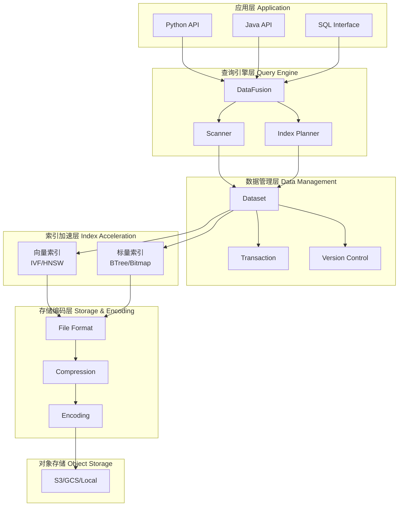
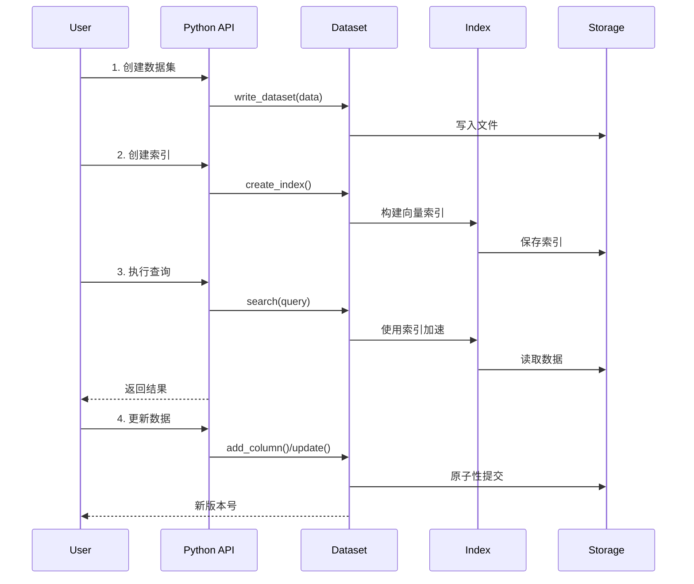

# 第一章：Lance 项目概览与设计理念

## 🎯 核心概览

Lance 是一个面向多模态 AI 工作流的列式数据格式。它解决的根本问题是：**如何在统一的存储格式中，高效地支持向量搜索、随机访问、SQL 查询和多模态数据存储**。

想象您在构建一个视频推荐系统：
- 需要存储视频元数据（标题、描述、标签）
- 需要存储视频的向量嵌入用于相似度搜索
- 需要存储原始视频数据（BLOB）
- 需要在这些数据上执行复杂的 SQL 查询和向量搜索

Lance 就是为这样的场景设计的。

---

## 📊 第一部分：Lance 的定位与应用场景

### What - Lance 是什么？

**定义**：Lance 是一个 Apache 许可的、开源的列式数据格式和表格式（Lakehouse Format）。

核心特点：
- **列式存储**：按列而非行存储数据，适合分析型查询
- **向量原生支持**：内置向量索引和搜索能力
- **多模态数据**：支持图像、视频、音频、文本、向量等混合存储
- **ACID 事务**：支持原子性更新和版本控制

### Why - 为什么需要 Lance？

#### 问题背景

传统数据格式存在的痛点：

| 功能需求 | Parquet | ORC | Iceberg | Lance |
|---------|--------|-----|---------|--------|
| 随机访问速度 | ⭐ | ⭐ | ⭐⭐ | ⭐⭐⭐⭐⭐ |
| 向量搜索支持 | ❌ | ❌ | ❌ | ✅ |
| 多模态支持 | 差 | 差 | 差 | ✅ |
| Schema 演化 | 困难 | 困难 | ✅ | ✅ |
| 版本控制 | 需要外部系统 | 需要外部系统 | ✅ | ✅ |

**为什么选择 Lance？**

1. **100 倍随机访问速度提升**：Parquet 为 100ns/随机访问，Lance 为 1ns，对于 ML 训练至关重要
2. **向量搜索加速**：内置 IVF-PQ、HNSW 等索引，毫秒级查询
3. **零拷贝版本控制**：无需数据复制即可实现版本管理和时间旅行
4. **多模态一体化**：在同一格式中存储结构化数据和非结构化数据

### How - Lance 如何解决这些问题？

#### 核心设计原则

```
┌─────────────────────────────────────────────────────────┐
│         Lance 的四大设计支柱                               │
├─────────────────────────────────────────────────────────┤
│ 1️⃣ 高效的列式存储                                        │
│    → 通过多种编码（Bitpacking、Dict、RLE）最小化存储    │
│    → 支持快速列扫描和随机访问                            │
│                                                          │
│ 2️⃣ 向量原生能力                                         │
│    → 内置向量索引和量化技术                             │
│    → 支持混合搜索（向量+SQL）                            │
│                                                          │
│ 3️⃣ 灵活的版本管理                                       │
│    → Manifest + Fragment 设计                           │
│    → 无锁并发更新                                       │
│                                                          │
│ 4️⃣ 云原生架构                                          │
│    → 基于对象存储（S3/GCS/Azure）                       │
│    → 分布式计算友好                                     │
└─────────────────────────────────────────────────────────┘
```

---

## 🏗️ 第二部分：与其他格式的对比优势

### Parquet 与 Lance 的差异

**场景 1：机器学习训练**

```python
# Parquet 的问题：需要顺序读取大部分数据
# 训练一个 1000 万行的数据集，但每次迭代只需要 100 行
# - 读取 Parquet：必须扫描整个文件，性能低

# Lance 的优势：支持随机行访问
dataset = lance.open("features.lance")
# 直接获取第 5000、8000、12000 行，无需全扫描
rows = dataset.take([5000, 8000, 12000])
```

**场景 2：多模态存储**

```python
# 需要存储：文本 + 图像向量 + 原始图像
import pandas as pd
import lance

df = pd.DataFrame({
    'text': ['A cat sleeping', 'A dog running', ...],
    'image_vector': [[0.1, 0.2, 0.3, ...], ...],  # 向量嵌入
    'image_blob': [image_bytes_1, image_bytes_2, ...],  # 原始图像
})

# Lance 原生支持这种混合存储
dataset = lance.write_dataset(df, "multimodal.lance")
```

**场景 3：实时特征更新**

```python
# 需要不断更新特征值，同时保持版本历史
# Iceberg 需要重写大量文件
# Lance 只需追加新 Fragment + 更新 Manifest

dataset = lance.open("features.lance")
dataset.add_column("new_feature", values)  # 原子性添加
# 自动版本控制，可回溯到任何历史版本
```

### 与 Iceberg 的差异

| 方面 | Iceberg | Lance |
|------|---------|--------|
| 设计目标 | 数据湖、表管理 | 向量搜索、ML 工作流 |
| 向量支持 | 无原生支持 | 内置索引和量化 |
| 随机访问 | 需要额外优化 | 内置优化 |
| 学习曲线 | 陡峭 | 平缓 |
| 生态支持 | 更完善（Spark、Flink） | 正在快速发展 |

---

## 🎨 第三部分：整体架构设计思想

### 分层架构模型



### 核心设计思想解析

#### 1. **模块化与关注点分离**

Lance 遵循严格的分层设计：

```
┌──────────────────────────────────────────────────────────┐
│  应用层：提供用户友好的 API（Python、Java、SQL）         │
├──────────────────────────────────────────────────────────┤
│  查询层：负责查询规划、优化、执行                        │
├──────────────────────────────────────────────────────────┤
│  数据层：Dataset、Transaction、版本管理                  │
├──────────────────────────────────────────────────────────┤
│  索引层：向量索引、标量索引的构建和查询                  │
├──────────────────────────────────────────────────────────┤
│  存储层：文件格式、编码、压缩、IO 调度                   │
├──────────────────────────────────────────────────────────┤
│  基础设施：对象存储、缓存、线程管理                      │
└──────────────────────────────────────────────────────────┘
```

**优势**：
- 每层可独立优化和扩展
- 清晰的接口边界便于理解和维护
- 便于新功能的添加（如新的索引类型）

#### 2. **异步优先设计**

Lance 大量使用 Rust 的异步编程（tokio 运行时）：

```rust
// 不阻塞 IO 的写入
await dataset.write(data);

// 并发读取多个 Fragment
let futures = fragments
    .iter()
    .map(|f| f.read_async())
    .collect::<Vec<_>>();
futures::future::join_all(futures).await;
```

**为什么？**
- I/O 不再阻塞计算线程
- 单个线程可处理数千个并发请求
- 在云环境中表现优异

#### 3. **零拷贝与 Arrow 原生**

Lance 与 Apache Arrow 深度集成：

```rust
// 数据从文件解码直接变成 Arrow RecordBatch
// 无需中间转换或拷贝
let batch: RecordBatch = decoder.decode().await?;

// RecordBatch 可直接传递给 NumPy、Pandas、Polars
// 共享内存地址，零拷贝
```

#### 4. **索引透明化**

索引对用户完全透明：

```python
# 用户编写简单的查询
results = dataset.search(query_vector, k=10)

# 内部自动选择最优索引
# - 如果有向量索引 → 使用 IVF/HNSW
# - 如果有标量索引 → 使用谓词下推
# - 否则 → 全表扫描
```

---

## 📈 实战场景示例

### 场景 1：电商推荐系统

**需求**：
- 存储 1 亿个商品（ID、名称、描述、价格、分类）
- 每个商品有 768 维向量嵌入
- 需要基于向量的相似商品推荐
- 需要基于价格、分类的标量过滤

**Lance 解决方案**：

```python
import lance
import pandas as pd
from lance.vector_search import IVF_PQ

# 1. 初始数据加载
products = pd.read_csv("products.csv")
dataset = lance.write_dataset(products, "products.lance")

# 2. 创建向量索引加速搜索
dataset.create_index("vector", index_type=IVF_PQ(num_partitions=256))

# 3. 推荐查询（向量 + SQL）
query_vector = embed_text("高端运动鞋")
results = dataset.search(
    query_vector,
    k=100,
    where="price < 500 AND category == '鞋类'",  # 标量过滤
    metric="cosine"
)
# 毫秒级返回最相关的 100 个商品
```

**为什么 Lance 优于 Elasticsearch？**
- 更紧凑的存储（编码优化）
- 更快的向量搜索（PQ 量化）
- 原生 SQL 支持（无需写 JSON 查询）
- 更低的学习成本

### 场景 2：生物信息学分析

**需求**：
- 存储基因序列数据（超大 BLOB）
- 存储 DNA 序列的向量化表示
- 支持相似性搜索和统计分析

**Lance 优势**：

```python
# 存储原始 DNA 序列 + 向量化表示
dna_data = pd.DataFrame({
    'gene_id': ['BRCA1', 'TP53', ...],
    'sequence': [dna_seq_1, dna_seq_2, ...],  # 超大字符串
    'embedding': [vec1, vec2, ...],  # 768 维向量
    'properties': [prop1, prop2, ...]  # 元数据
})

dataset = lance.write_dataset(dna_data, "dna.lance")

# 直接支持混合查询
results = dataset.search(
    query_embedding,
    k=10,
    where="properties.organism == 'human'"
)
```

---

## 🔄 核心工作流概览

### 一个完整的 Lance 使用周期



---

## 💡 关键设计决策总结

| 决策 | 原因 | 权衡 |
|-----|------|------|
| **Rust 实现** | 性能、内存安全 | 开发效率稍低 |
| **Async First** | 高并发、云原生 | 编程复杂度增加 |
| **列式存储** | 扫描性能、压缩率 | 不适合行级更新 |
| **多种编码** | 适应不同数据类型 | 编码/解码开销 |
| **向量索引** | ML 工作流必需 | 索引构建成本 |
| **零拷贝设计** | 减少内存占用 | 依赖 Arrow 兼容性 |

---

## 📚 总结

Lance 通过以下创新解决了 AI 时代的数据存储难题：

1. **性能优先**：100 倍随机访问、毫秒级向量搜索
2. **功能全面**：向量、SQL、多模态在一个系统中
3. **用户友好**：自动索引选择、透明的优化
4. **生产就绪**：ACID 事务、版本控制、云支持

在接下来的章节中，我们将深入探讨 Lance 的内部实现细节，从项目结构、数据模型、文件格式、到索引和查询引擎，全面理解这个强大的系统是如何运作的。

---

## 🔗 关键概念速记

- **列式存储**：按列而非行组织数据
- **向量索引**：加速向量相似性搜索的数据结构
- **IVF-PQ**：乘积量化的倒排文件，Lance 中常用的索引方式
- **Manifest**：记录数据集版本信息的元数据文件
- **Fragment**：数据集中的数据分片单位
- **零拷贝**：数据在内存中传递而无需复制

