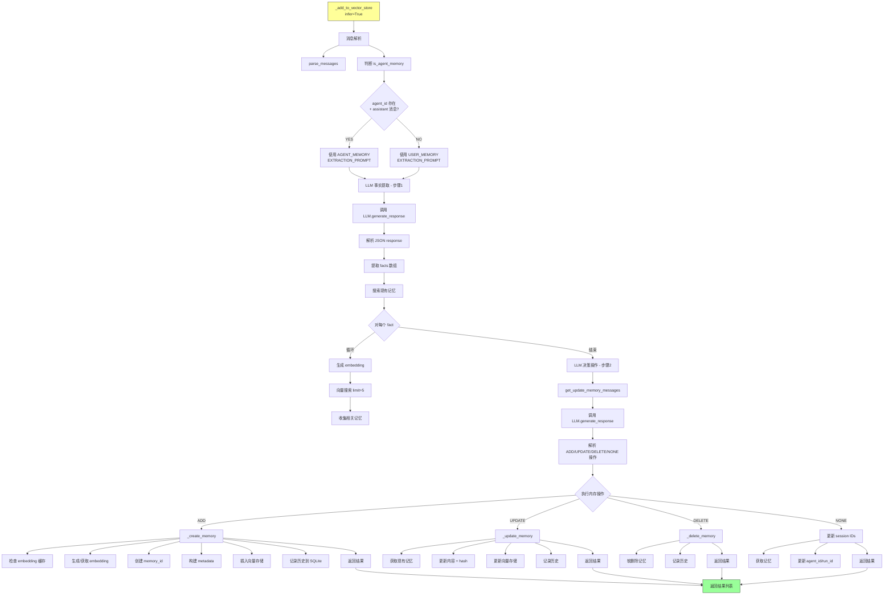
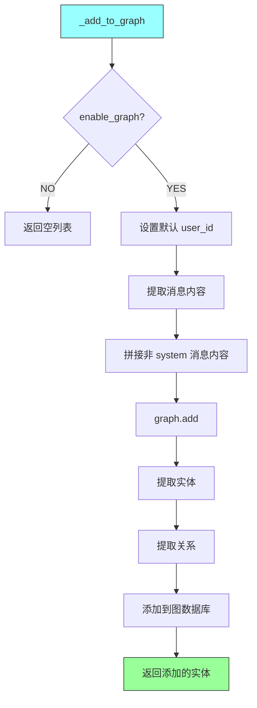
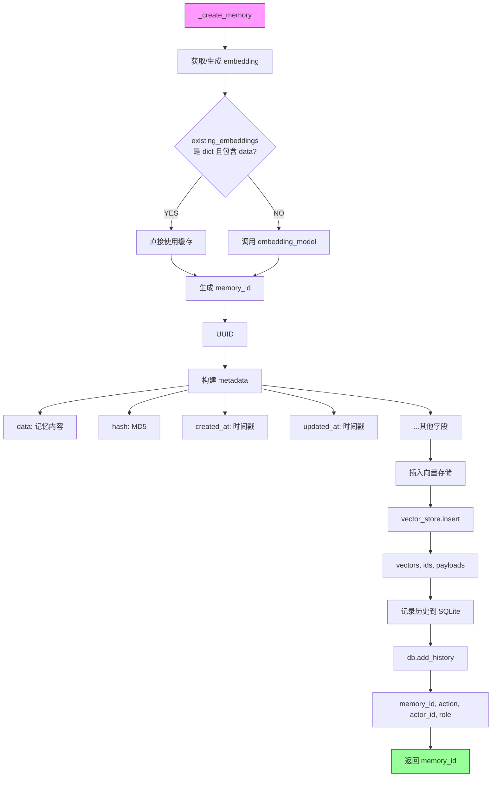
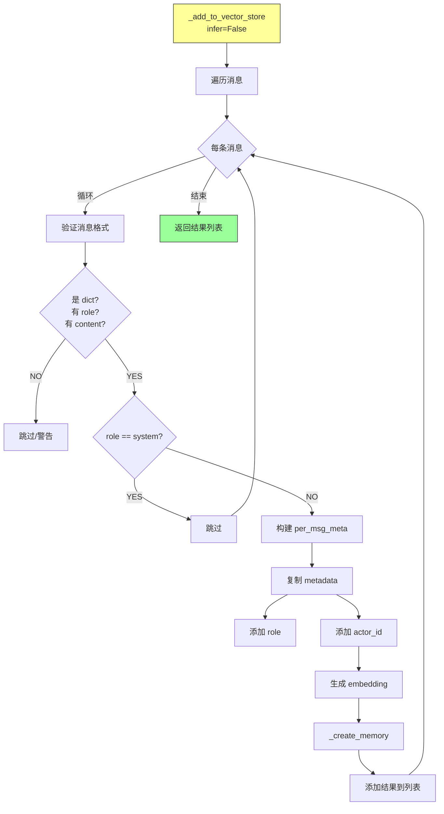
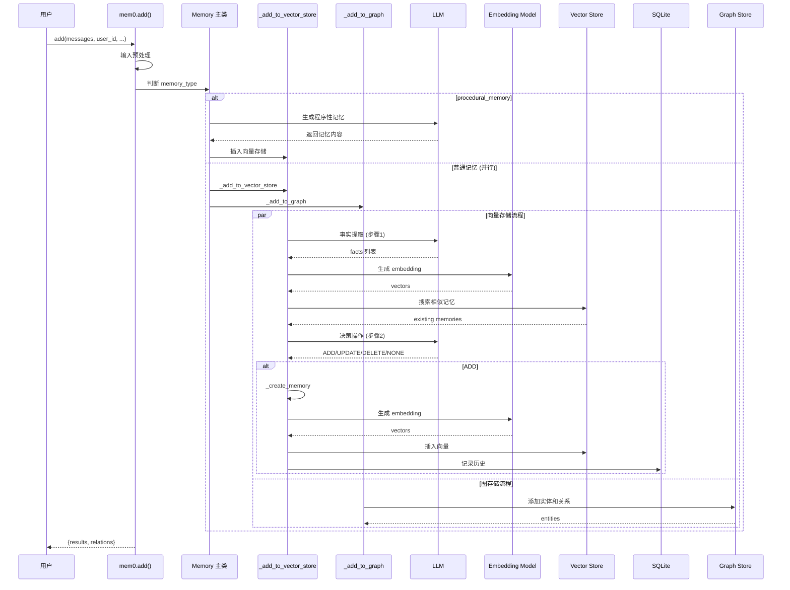
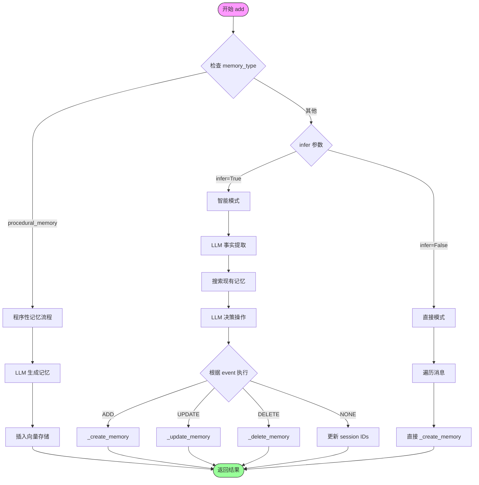
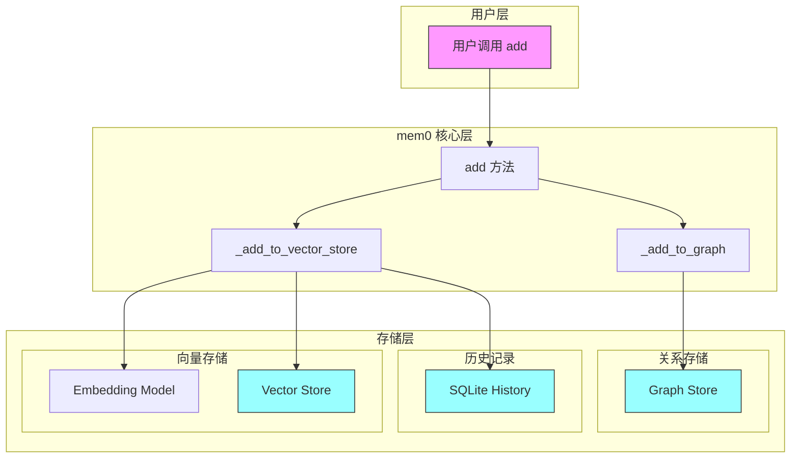

# mem0 add() 操作完整流程图

## 总体架构流程

```mermaid
flowchart TD
    A[mem0.add 入口] --> B{输入预处理}
    
    B --> B1[验证 memory_type]
    B --> B2[转换消息格式 str/dict → list[dict]]
    B --> B3[构建 metadata 和 filters]
    B --> B4[解析视觉消息 enable_vision]
    
    B --> C{memory_type ==<br/>'procedural_memory'?}
    
    C -->|YES| D[_create_procedural_memory]
    C -->|NO| E[并行执行]
    
    D --> D1[LLM 生成程序性记忆]
    D1 --> D2[插入向量存储]
    D2 --> D3[返回结果]
    
    E --> E1[_add_to_vector_store]
    E --> E2[_add_to_graph]
    
    E1 --> F[返回结果]
    E2 --> F
    
    F --> G[{results, relations}]
    
    style A fill:#f9f,stroke:#333
    style G fill:#9f9,stroke:#333
```

## 详细流程：_add_to_vector_store (infer=True)



## 详细流程：_add_to_graph



## 核心操作：_create_memory



## 简化流程：infer=False



## 完整时序图



## 流程决策图



## 存储层级关系

